# SpringBoot3-场景整合

# 0环境准备

### 0. 云服务器

- [阿里云](https://promotion.aliyun.com/ntms/act/ambassador/sharetouser.html?userCode=50sid5bu&utm_source=50sid5bu)、[腾讯云](https://curl.qcloud.com/iyFTRSJb)、[华为云](https://activity.huaweicloud.com/discount_area_v5/index.html?fromacct=d1a6f32e-d6d0-4702-9213-eafe022a0708&utm_source=bGVpZmVuZ3lhbmc==&utm_medium=cps&utm_campaign=201905) 服务器开通； **按量付费，省钱省心**
- 安装以下组件

- - docker
  - redis
  - kafka
  - prometheus
  - grafana

- <https://github.com/kingToolbox/WindTerm/releases/download/2.5.0/WindTerm_2.5.0_Windows_Portable_x86_64.zip>  下载windterm


**重要：开通云服务器以后，请一定在安全组设置规则，放行端口**

**重要：开通云服务器以后，请一定在安全组设置规则，放行端口**

**重要：开通云服务器以后，请一定在安全组设置规则，放行端口**

### 1. Docker安装

还不会docker的同学，参考【云原生实战（10~25集）】快速入门

<https://www.bilibili.com/video/BV13Q4y1C7hS?p=10>

```shell
sudo yum install -y yum-utils

sudo yum-config-manager \
    --add-repo \
    https://download.docker.com/linux/centos/docker-ce.repo

sudo yum install docker-ce docker-ce-cli containerd.io docker-buildx-plugin docker-compose-plugin

sudo systemctl enable docker --now

#测试工作
docker ps
#  批量安装所有软件
docker compose  
```

**创建** `/prod` **文件夹，准备以下文件**

### 2. prometheus.yml

```yaml
global:
  scrape_interval: 15s
  evaluation_interval: 15s

scrape_configs:
  - job_name: 'prometheus'
    static_configs:
      - targets: ['localhost:9090']

  - job_name: 'redis'
    static_configs:
      - targets: ['redis:6379']

  - job_name: 'kafka'
    static_configs:
      - targets: ['kafka:9092']
```

### 3. docker-compose.yml

```yaml
version: '3.9'

services:
  redis:
    image: redis:latest
    container_name: redis
    restart: always
    ports:
      - "6379:6379"
    networks:
      - backend

  zookeeper:
    image: bitnami/zookeeper:latest
    container_name: zookeeper
    restart: always
    environment:
      ZOOKEEPER_CLIENT_PORT: 2181
      ZOOKEEPER_TICK_TIME: 2000
    networks:
      - backend

  kafka:
    image: bitnami/kafka:3.4.0
    container_name: kafka
    restart: always
    depends_on:
      - zookeeper
    ports:
      - "9092:9092"
    environment:
      ALLOW_PLAINTEXT_LISTENER: yes
      KAFKA_CFG_ZOOKEEPER_CONNECT: zookeeper:2181
      KAFKA_OFFSETS_TOPIC_REPLICATION_FACTOR: 1
    networks:
      - backend
  
  kafka-ui:
    image: provectuslabs/kafka-ui:latest
    container_name:  kafka-ui
    restart: always
    depends_on:
      - kafka
    ports:
      - "8080:8080"
    environment:
      KAFKA_CLUSTERS_0_NAME: dev
      KAFKA_CLUSTERS_0_BOOTSTRAPSERVERS: kafka:9092
    networks:
      - backend

  prometheus:
    image: prom/prometheus:latest
    container_name: prometheus
    restart: always
    volumes:
      - ./prometheus.yml:/etc/prometheus/prometheus.yml
    ports:
      - "9090:9090"
    networks:
      - backend

  grafana:
    image: grafana/grafana:latest
    container_name: grafana
    restart: always
    depends_on:
      - prometheus
    ports:
      - "3000:3000"
    networks:
      - backend

networks:
  backend:
    name: backend
```

### 4. 启动环境

```shell
docker compose -f docker-compose.yml up -d
```

### 5. 验证

- Redis：你的ip:6379

- - 填写表单，下载官方可视化工具：
  - <https://redis.com/redis-enterprise/redis-insight/#insight-form>

- Kafka：你的ip:9092

- - idea安装大数据插件

- Prometheus：你的ip:9090

- - 直接浏览器访问

- Grafana：你的ip:3000

- - 直接浏览器访问

# 1、NoSQL

## 1.1 Redis整合

Redis不会的同学：参照 阳哥-《Redis7》 <https://www.bilibili.com/video/BV13R4y1v7sP?p=1>

HashMap： key：value

### 1. 场景整合

依赖导入

```xml
<dependency>
    <groupId>org.springframework.boot</groupId>
    <artifactId>spring-boot-starter-data-redis</artifactId>
</dependency>
```

配置

```properties
spring.data.redis.host=192.168.200.100
spring.data.redis.password=Lfy123!@!
```

测试

```java
@Autowired
StringRedisTemplate redisTemplate;

@Test
void redisTest(){
    redisTemplate.opsForValue().set("a","1234");
    Assertions.assertEquals("1234",redisTemplate.opsForValue().get("a"));
}
```

### 2. 自动配置原理

1. META-INF/spring/org.springframework.boot.autoconfigure.AutoConfiguration.imports中导入了`RedisAutoConfiguration`、RedisReactiveAutoConfiguration和RedisRepositoriesAutoConfiguration。所有属性绑定在`RedisProperties`中
2. RedisReactiveAutoConfiguration属于响应式编程，不用管。RedisRepositoriesAutoConfiguration属于 JPA 操作，也不用管
3. RedisAutoConfiguration 配置了以下组件

   1. LettuceConnectionConfiguration： 给容器中注入了连接工厂LettuceConnectionFactory，和操作 redis 的客户端DefaultClientResources。

   2. `RedisTemplate<Object, Object>`： 可给 redis 中存储任意对象，会使用 jdk 默认序列化方式。

   3. `StringRedisTemplate`： 给 redis 中存储字符串，如果要存对象，需要开发人员自己进行序列化。key-value都是字符串进行操作


### 3. 定制化

#### 1. 序列化机制

```java
@Configuration
public class AppRedisConfiguration {
    /**
     * 允许Object类型的key-value，都可以被转为json进行存储。
     * @param redisConnectionFactory 自动配置好了连接工厂
     * @return
     */
    @Bean
    public RedisTemplate<Object, Object> redisTemplate(RedisConnectionFactory redisConnectionFactory) {
        RedisTemplate<Object, Object> template = new RedisTemplate<>();
        template.setConnectionFactory(redisConnectionFactory);
        //把对象转为json字符串的序列化工具
        template.setDefaultSerializer(new GenericJackson2JsonRedisSerializer());
        return template;
    }
}
```

#### 2. redis客户端

RedisTemplate、StringRedisTemplate： 操作redis的工具类

- 要从redis的连接工厂获取链接才能操作redis
- **Redis客户端**

  - Lettuce： 默认

  - Jedis：可以使用以下切换


```xml
        <dependency>
            <groupId>org.springframework.boot</groupId>
            <artifactId>spring-boot-starter-data-redis</artifactId>
            <exclusions>
                <exclusion>
                    <groupId>io.lettuce</groupId>
                    <artifactId>lettuce-core</artifactId>
                </exclusion>
            </exclusions>
        </dependency>

<!--        切换 jedis 作为操作redis的底层客户端-->
        <dependency>
            <groupId>redis.clients</groupId>
            <artifactId>jedis</artifactId>
        </dependency>
```

#### 3. 配置参考

```properties
spring.data.redis.host=8.130.74.183
spring.data.redis.port=6379
#spring.data.redis.client-type=lettuce

#设置lettuce的底层参数
#spring.data.redis.lettuce.pool.enabled=true
#spring.data.redis.lettuce.pool.max-active=8

spring.data.redis.client-type=jedis
spring.data.redis.jedis.pool.enabled=true
spring.data.redis.jedis.pool.max-active=8
```

# 2、接口文档

## OpenAPI 3 与 Swagger

Swagger 可以快速生成**实时接口**文档，方便前后开发人员进行协调沟通。遵循 **OpenAPI** 规范。

文档：<https://springdoc.org/v2/>

### 2.1.  OpenAPI 3 架构

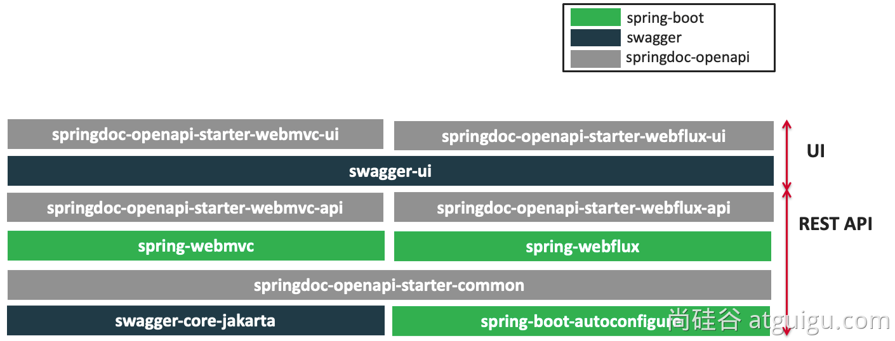

### 2.2. 整合

导入场景

```xml
<dependency>
    <groupId>org.springdoc</groupId>
    <artifactId>springdoc-openapi-starter-webmvc-ui</artifactId>
    <version>2.1.0</version>
</dependency>
```

配置

```properties
# /api-docs endpoint custom path 默认 /v3/api-docs
springdoc.api-docs.path=/api-docs

# swagger 相关配置在  springdoc.swagger-ui
# swagger-ui custom path
springdoc.swagger-ui.path=/swagger-ui.html

springdoc.show-actuator=true
```

### 2.3. 使用

#### 1. 常用注解

| 注解         | 标注位置            | 作用                   |
| ------------ | ------------------- | ---------------------- |
| @Tag         | controller 类       | 标识 controller 作用   |
| @Parameter   | 参数                | 标识参数作用           |
| @Parameters  | 参数                | 参数多重说明           |
| @Schema      | model 层的 JavaBean | 描述模型作用及每个属性 |
| @Operation   | 方法                | 描述方法作用           |
| @ApiResponse | 方法                | 描述响应状态码等       |

#### 2. Docket配置

如果有多个Docket，配置如下

```java
  @Bean
  public GroupedOpenApi publicApi() {
      return GroupedOpenApi.builder()
              .group("springshop-public")
              .pathsToMatch("/public/**")
              .build();
  }
  @Bean
  public GroupedOpenApi adminApi() {
      return GroupedOpenApi.builder()
              .group("springshop-admin")
              .pathsToMatch("/admin/**")
              .addMethodFilter(method -> method.isAnnotationPresent(Admin.class))
              .build();
  }
```

如果只有一个Docket，可以配置如下

```properties
springdoc.packagesToScan=package1, package2
springdoc.pathsToMatch=/v1, /api/balance/**
```

#### 3. OpenAPI配置

```java
  @Bean
  public OpenAPI springShopOpenAPI() {
      return new OpenAPI()
              .info(new Info().title("SpringShop API")
              .description("Spring shop sample application")
              .version("v0.0.1")
              .license(new License().name("Apache 2.0").url("http://springdoc.org")))
              .externalDocs(new ExternalDocumentation()
              .description("SpringShop Wiki Documentation")
              .url("https://springshop.wiki.github.org/docs"));
  }
```

### 2.4. Springfox 迁移

#### 1 注解变化

| 原注解                                      | 现注解                                                       | 作用           |
| ------------------------------------------- | ------------------------------------------------------------ | -------------- |
| @Api                                        | @Tag                                                         | 描述Controller |
| @ApiIgnore                                  | @Parameter(hidden = true)  @Operation(hidden = true) @Hidden | 描述忽略操作   |
| @ApiImplicitParam                           | @Parameter                                                   | 描述参数       |
| @ApiImplicitParams                          | @Parameters                                                  | 描述参数       |
| @ApiModel                                   | @Schema                                                      | 描述对象       |
| @ApiModelProperty(hidden = true)            | @Schema(accessMode = READ_ONLY)                              | 描述对象属性   |
| @ApiModelProperty                           | @Schema                                                      | 描述对象属性   |
| @ApiOperation(value = "foo", notes = "bar") | @Operation(summary = "foo", description = "bar")             | 描述方法       |
| @ApiParam                                   | @Parameter                                                   | 描述参数       |
| @ApiResponse(code = 404, message = "foo")   | @ApiResponse(responseCode = "404", description = "foo")      | 描述响应       |

#### 2 Docket配置

##### 1. 以前写法

```java
  @Bean
  public Docket publicApi() {
      return new Docket(DocumentationType.SWAGGER_2)
              .select()
              .apis(RequestHandlerSelectors.basePackage("org.github.springshop.web.public"))
              .paths(PathSelectors.regex("/public.*"))
              .build()
              .groupName("springshop-public")
              .apiInfo(apiInfo());
  }

  @Bean
  public Docket adminApi() {
      return new Docket(DocumentationType.SWAGGER_2)
              .select()
              .apis(RequestHandlerSelectors.basePackage("org.github.springshop.web.admin"))
              .paths(PathSelectors.regex("/admin.*"))
              .apis(RequestHandlerSelectors.withMethodAnnotation(Admin.class))
              .build()
              .groupName("springshop-admin")
              .apiInfo(apiInfo());
  }
```

##### 2. 新写法

```java
  @Bean
  public GroupedOpenApi publicApi() {
      return GroupedOpenApi.builder()
              .group("springshop-public")
              .pathsToMatch("/public/**")
              .build();
  }
  @Bean
  public GroupedOpenApi adminApi() {
      return GroupedOpenApi.builder()
              .group("springshop-admin")
              .pathsToMatch("/admin/**")
              .addOpenApiMethodFilter(method -> method.isAnnotationPresent(Admin.class))
              .build();
  }
```

##### 3. 添加OpenAPI组件

```java
  @Bean
  public OpenAPI springShopOpenAPI() {
      return new OpenAPI()
              .info(new Info().title("SpringShop API")
              .description("Spring shop sample application")
              .version("v0.0.1")
              .license(new License().name("Apache 2.0").url("http://springdoc.org")))
              .externalDocs(new ExternalDocumentation()
              .description("SpringShop Wiki Documentation")
              .url("https://springshop.wiki.github.org/docs"));
  }
```


# 3、远程调用

**RPC（Remote Procedure Call）：远程过程调用**

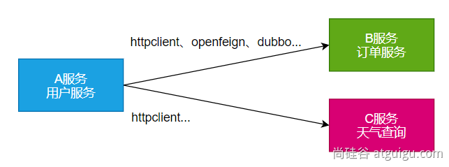

**本地过程调用**： a()； b()； a() { b()；}： 不同方法都在**同一个JVM运行**

**远程过程调用**：

- 服务提供者：
- 服务消费者：
- 通过连接对方服务器进行请求\响应交互，来实现调用效果

API/SDK的区别是什么？

- api：接口（Application Programming Interface）

- - 远程提供功能； 

- sdk：工具包（Software Development Kit）

- - 导入jar包，直接调用功能即可

**开发过程中***，我们经常需要调用别人写的功能*

- *如果是***内部***微服务，可以通过***依赖cloud***、***注册中心、openfeign***等进行调用*
- *如果是***外部***暴露的，可以***发送 http 请求、或遵循外部协议***进行调用*

*SpringBoot 整合提供了很多方式进行远程调用*

- **轻量级客户端方式**

- - **RestTemplate***： 普通开发*
  - **WebClient***： 响应式编程开发*
  - **Http Interface***： 声明式编程*

- **Spring Cloud分布式***解决方案方式*

- - *Spring Cloud OpenFeign*

- **第三方框架**

- - *Dubbo*
  - *gRPC*
  - *...*

## 3.1. WebClient

非阻塞、响应式HTTP客户端

### 1 创建与配置

发请求：

- 请求方式： GET\POST\DELETE\xxxx
- 请求路径： /xxx
- 请求参数：aa=bb&cc=dd&xxx
- 请求头： aa=bb,cc=ddd
- 请求体：

创建 WebClient 非常简单:

- WebClient.create()
- WebClient.create(String baseUrl)

还可以使用 WebClient.builder() 配置更多参数项:

- uriBuilderFactory: 自定义UriBuilderFactory ，定义 baseurl.
- defaultUriVariables: 默认 uri 变量.
- defaultHeader: 每个请求默认头.
- defaultCookie: 每个请求默认 cookie.
- defaultRequest: Consumer 自定义每个请求.
- filter: 过滤 client 发送的每个请求
- exchangeStrategies: HTTP 消息 reader/writer 自定义.
- clientConnector: HTTP client 库设置.

```java
//获取响应完整信息
WebClient client = WebClient.create("https://example.org");
```

### 2 获取响应

retrieve()方法用来声明如何提取响应数据。比如

```java
//获取响应完整信息
WebClient client = WebClient.create("https://example.org");

Mono<ResponseEntity<Person>> result = client.get()
        .uri("/persons/{id}", id).accept(MediaType.APPLICATION_JSON)
        .retrieve()
        .toEntity(Person.class);

//只获取body
WebClient client = WebClient.create("https://example.org");

Mono<Person> result = client.get()
        .uri("/persons/{id}", id).accept(MediaType.APPLICATION_JSON)
        .retrieve()
        .bodyToMono(Person.class);

//stream数据
Flux<Quote> result = client.get()
        .uri("/quotes").accept(MediaType.TEXT_EVENT_STREAM)
        .retrieve()
        .bodyToFlux(Quote.class);

//定义错误处理
Mono<Person> result = client.get()
        .uri("/persons/{id}", id).accept(MediaType.APPLICATION_JSON)
        .retrieve()
        .onStatus(HttpStatus::is4xxClientError, response -> ...)
        .onStatus(HttpStatus::is5xxServerError, response -> ...)
        .bodyToMono(Person.class);
```

### 3 定义请求体

```java
//1、响应式-单个数据
Mono<Person> personMono = ... ;

Mono<Void> result = client.post()
        .uri("/persons/{id}", id)
        .contentType(MediaType.APPLICATION_JSON)
        .body(personMono, Person.class)
        .retrieve()
        .bodyToMono(Void.class);

//2、响应式-多个数据
Flux<Person> personFlux = ... ;

Mono<Void> result = client.post()
        .uri("/persons/{id}", id)
        .contentType(MediaType.APPLICATION_STREAM_JSON)
        .body(personFlux, Person.class)
        .retrieve()
        .bodyToMono(Void.class);

//3、普通对象
Person person = ... ;

Mono<Void> result = client.post()
        .uri("/persons/{id}", id)
        .contentType(MediaType.APPLICATION_JSON)
        .bodyValue(person)
        .retrieve()
        .bodyToMono(Void.class);
```

## 3.2. HTTP Interface

Spring 允许我们通过定义接口的方式，给任意位置发送 http 请求，实现远程调用，可以用来简化 HTTP 远程访问。需要webflux场景才可

### 1 导入依赖

```xml
<dependency>
    <groupId>org.springframework.boot</groupId>
    <artifactId>spring-boot-starter-webflux</artifactId>
</dependency>
```

### 2 定义接口

```java
public interface BingService {

    @GetExchange(url = "/search")
    String search(@RequestParam("q") String keyword);
}
```

### 3 创建代理&测试

```java
@SpringBootTest
class Boot05TaskApplicationTests {

    @Test
    void contextLoads() throws InterruptedException {
        //1、创建客户端
        WebClient client = WebClient.builder()
                .baseUrl("https://cn.bing.com")
                .codecs(clientCodecConfigurer -> {
                    clientCodecConfigurer
                            .defaultCodecs()
                            .maxInMemorySize(256*1024*1024);
                            //响应数据量太大有可能会超出BufferSize，所以这里设置的大一点
                })
                .build();
        //2、创建工厂
        HttpServiceProxyFactory factory = HttpServiceProxyFactory
                .builder(WebClientAdapter.forClient(client)).build();
        //3、获取代理对象
        BingService bingService = factory.createClient(BingService.class);


        //4、测试调用
        Mono<String> search = bingService.search("尚硅谷");
        System.out.println("==========");
        search.subscribe(str -> System.out.println(str));

        Thread.sleep(100000);

    }

}
```


# 4、消息服务

<https://kafka.apache.org/documentation/> 

## 4.1 消息队列-场景

### 1. 异步

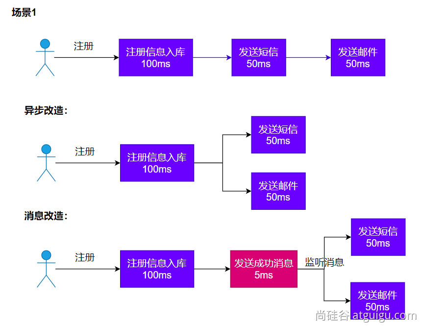


### 2. 解耦

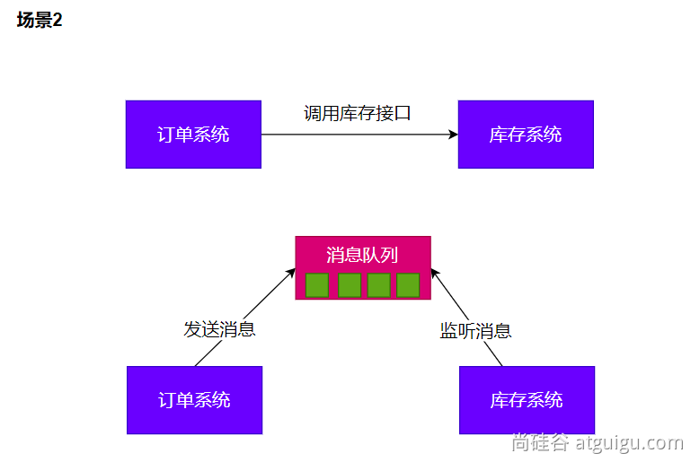


### 3. 削峰

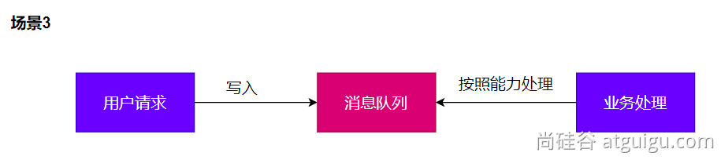

### 4. 缓冲

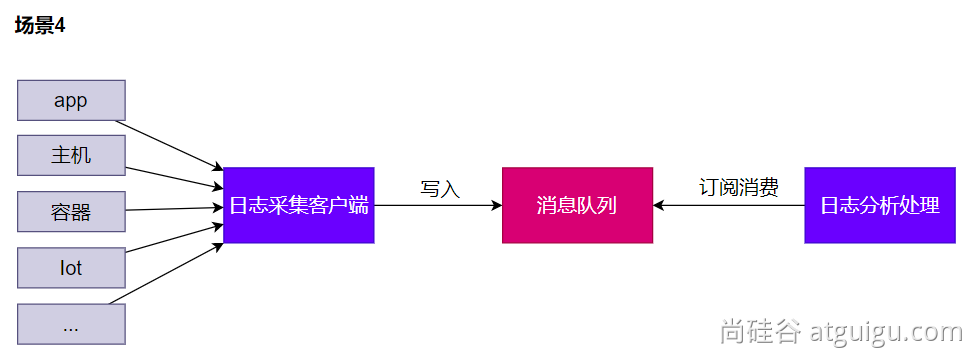


## 4.2消息队列-Kafka

### 1. 消息模式

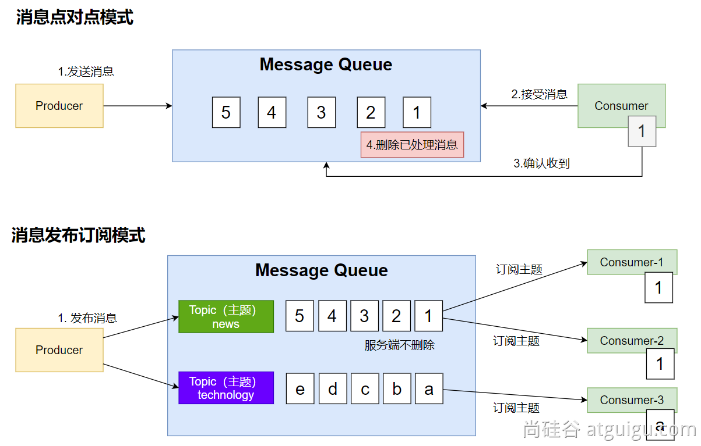


### 2. Kafka工作原理

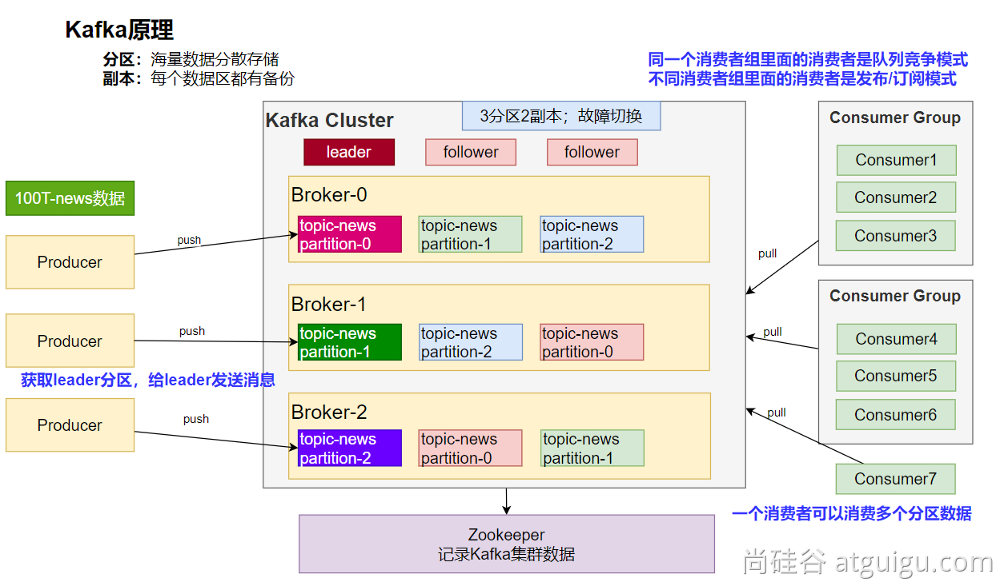


### 3. SpringBoot整合

参照：<https://docs.spring.io/spring-kafka/reference/>

```xml
<dependency>
    <groupId>org.springframework.kafka</groupId>
    <artifactId>spring-kafka</artifactId>
</dependency>
```


配置

```properties
spring.kafka.bootstrap-servers=172.20.128.1:9092
```


修改`C:\Windows\System32\drivers\etc\hosts`文件，配置`8.130.32.70 kafka`

### 4. 消息发送

```java
@SpringBootTest
class Boot07KafkaApplicationTests {

    @Autowired
    KafkaTemplate kafkaTemplate;
    @Test
    void contextLoads() throws ExecutionException, InterruptedException {
        StopWatch watch = new StopWatch();
        watch.start();
        CompletableFuture[] futures = new CompletableFuture[10000];
        for (int i = 0; i < 10000; i++) {
            CompletableFuture send = kafkaTemplate.send("order", "order.create."+i, "订单创建了："+i);
            futures[i]=send;
        }
        CompletableFuture.allOf(futures).join();
        watch.stop();
        System.out.println("总耗时："+watch.getTotalTimeMillis());
    }

}
import org.springframework.kafka.core.KafkaTemplate;
import org.springframework.stereotype.Component;

@Component
public class MyBean {

    private final KafkaTemplate<String, String> kafkaTemplate;

    public MyBean(KafkaTemplate<String, String> kafkaTemplate) {
        this.kafkaTemplate = kafkaTemplate;
    }

    public void someMethod() {
        this.kafkaTemplate.send("someTopic", "Hello");
    }

}
```

### 5. 消息监听

```java
@Component
public class OrderMsgListener {

    @KafkaListener(topics = "order",groupId = "order-service")
    public void listen(ConsumerRecord record){
        System.out.println("收到消息："+record); //可以监听到发给kafka的新消息，以前的拿不到
    }

    @KafkaListener(groupId = "order-service-2",topicPartitions = {
            @TopicPartition(topic = "order",partitionOffsets = {
                    @PartitionOffset(partition = "0",initialOffset = "0")
            })
    })
    public void listenAll(ConsumerRecord record){
        System.out.println("收到partion-0消息："+record);
    }
}
```

### 6. 参数配置

消费者

```properties
spring.kafka.consumer.value-deserializer=org.springframework.kafka.support.serializer.JsonDeserializer
spring.kafka.consumer.properties[spring.json.value.default.type]=com.example.Invoice
spring.kafka.consumer.properties[spring.json.trusted.packages]=com.example.main,com.example.another
```


生产者

```properties
spring.kafka.producer.value-serializer=org.springframework.kafka.support.serializer.JsonSerializer
spring.kafka.producer.properties[spring.json.add.type.headers]=false
```

### 7. 自动配置原理

kafka 自动配置在KafkaAutoConfiguration

1. 容器中放了 KafkaTemplate 可以进行消息收发
2. 容器中放了KafkaAdmin 可以进行 Kafka 的管理，比如创建 topic 等
3. kafka 的配置在KafkaProperties中
4. @EnableKafka可以开启基于注解的模式

# 5、web安全

- Apache Shiro
- Spring Security
- 自研：Filter

## 5.1 Spring Security

### 1. 安全架构

#### 1. 认证：Authentication 

who are you?

登录系统，用户系统


#### 2. 授权：Authorization

what are you allowed to do？

权限管理，用户授权


#### 3. 攻击防护

- XSS（Cross-site scripting）
- CSRF（Cross-site request forgery）
- CORS（Cross-Origin Resource Sharing）
- SQL注入
- ...


#### 扩展. 权限模型

##### 1. RBAC(Role Based Access Controll)

- 用户（t_user）

- - id,username,password，xxx
  - 1,zhangsan
  - 2,lisi 

- 用户_角色（t_user_role）【N对N关系需要中间表】

- - zhangsan, admin
  - zhangsan,common_user
  - **lisi,** **hr**
  - **lisi, common_user**

- 角色（t_role）

- - id,role_name
  - admin
  - hr
  - common_user

- 角色_权限(t_role_perm)

- - admin, 文件r
  - admin, 文件w
  - admin, 文件执行
  - admin, 订单query，create,xxx
  - **hr, 文件r**

- 权限（t_permission）

- - id,perm_id
  - 文件 r,w,x
  - 订单 query,create,xxx


##### 2. ACL(Access Controll List)

直接用户和权限挂钩

- 用户（t_user）

- - zhangsan
  - lisi

- 用户_权限(t_user_perm)

- - zhangsan,文件 r
  - zhangsan,文件 x
  - zhangsan,订单 query

- 权限（t_permission）

- - id,perm_id
  - 文件 r,w,x
  - 订单 query,create,xxx


```java
@Secured("文件 r")
public void readFile(){
    //读文件
}
```


### 2. Spring Security 原理

#### 1. 过滤器链架构

Spring Security利用 FilterChainProxy 封装一系列拦截器链，实现各种安全拦截功能

Servlet三大组件：Servlet、Filter、Listener


#### 2. FilterChainProxy


#### 3. SecurityFilterChain


### 3. 使用

#### 1. HttpSecurity

```java
@Configuration
@Order(SecurityProperties.BASIC_AUTH_ORDER - 10)
public class ApplicationConfigurerAdapter extends WebSecurityConfigurerAdapter {
  @Override
  protected void configure(HttpSecurity http) throws Exception {
    http.antMatcher("/match1/**")
      .authorizeRequests()
        .antMatchers("/match1/user").hasRole("USER")
        .antMatchers("/match1/spam").hasRole("SPAM")
        .anyRequest().isAuthenticated();
  }
}
```


#### 2. MethodSecurity

```java
@SpringBootApplication
@EnableGlobalMethodSecurity(securedEnabled = true)
public class SampleSecureApplication {
}

@Service
public class MyService {

  @Secured("ROLE_USER")
  public String secure() {
    return "Hello Security";
  }

}
```


核心

- **WebSecurityConfigurerAdapter**
- @**EnableGlobalMethodSecurity**： 开启全局方法安全配置

- - @Secured
  - @PreAuthorize
  - @PostAuthorize

- **UserDetailService： 去数据库查询用户详细信息的service（用户基本信息、用户角色、用户权限）**

### 4. 实战

#### 1. 引入依赖

```xml
<dependency>
    <groupId>org.springframework.boot</groupId>
    <artifactId>spring-boot-starter-data-redis</artifactId>
</dependency>
<dependency>
    <groupId>org.springframework.boot</groupId>
    <artifactId>spring-boot-starter-thymeleaf</artifactId>
</dependency>
<dependency>
    <groupId>org.springframework.boot</groupId>
    <artifactId>spring-boot-starter-security</artifactId>
</dependency>
<dependency>
    <groupId>org.springframework.boot</groupId>
    <artifactId>spring-boot-starter-web</artifactId>
</dependency>
<dependency>
    <groupId>org.mybatis.spring.boot</groupId>
    <artifactId>mybatis-spring-boot-starter</artifactId>
    <version>3.0.0</version>
</dependency>

<dependency>
    <groupId>org.springframework.boot</groupId>
    <artifactId>spring-boot-devtools</artifactId>
    <scope>runtime</scope>
    <optional>true</optional>
</dependency>
<dependency>
    <groupId>com.mysql</groupId>
    <artifactId>mysql-connector-j</artifactId>
    <scope>runtime</scope>
</dependency>
<dependency>
    <groupId>org.projectlombok</groupId>
    <artifactId>lombok</artifactId>
    <optional>true</optional>
</dependency>
<dependency>
    <groupId>org.springframework.boot</groupId>
    <artifactId>spring-boot-starter-test</artifactId>
    <scope>test</scope>
</dependency>
<dependency>
    <groupId>org.thymeleaf.extras</groupId>
    <artifactId>thymeleaf-extras-springsecurity6</artifactId>
    <!-- Temporary explicit version to fix Thymeleaf bug -->
    <version>3.1.1.RELEASE</version>
</dependency>
<dependency>
    <groupId>org.springframework.security</groupId>
    <artifactId>spring-security-test</artifactId>
    <scope>test</scope>
</dependency>
```

#### 2. 页面

##### 首页

```html
<p>Click <a th:href="@{/hello}">here</a> to see a greeting.</p>
```


##### Hello页

```html
<h1>Hello</h1>
```


##### 登录页

```html
<!DOCTYPE html>
<html xmlns="http://www.w3.org/1999/xhtml" xmlns:th="https://www.thymeleaf.org">
  <head>
    <title>Spring Security Example</title>
  </head>
  <body>
    <div th:if="${param.error}">Invalid username and password.</div>
    <div th:if="${param.logout}">You have been logged out.</div>
    <form th:action="@{/login}" method="post">
      <div>
        <label> User Name : <input type="text" name="username" /> </label>
      </div>
      <div>
        <label> Password: <input type="password" name="password" /> </label>
      </div>
      <div><input type="submit" value="Sign In" /></div>
    </form>
  </body>
</html>
```

#### 3. 配置类

##### 视图控制

```java
package com.example.securingweb;

import org.springframework.context.annotation.Configuration;
import org.springframework.web.servlet.config.annotation.ViewControllerRegistry;
import org.springframework.web.servlet.config.annotation.WebMvcConfigurer;

@Configuration
public class MvcConfig implements WebMvcConfigurer {

    public void addViewControllers(ViewControllerRegistry registry) {
        registry.addViewController("/home").setViewName("index");
        registry.addViewController("/").setViewName("index");
        registry.addViewController("/hello").setViewName("hello");
        registry.addViewController("/login").setViewName("login");
    }
}
```

##### Security配置

```java
package com.atguigu.security.config;

import org.springframework.context.annotation.Bean;
import org.springframework.context.annotation.Configuration;
import org.springframework.security.config.annotation.web.builders.HttpSecurity;
import org.springframework.security.config.annotation.web.configuration.EnableWebSecurity;
import org.springframework.security.core.userdetails.User;
import org.springframework.security.core.userdetails.UserDetails;
import org.springframework.security.core.userdetails.UserDetailsService;
import org.springframework.security.provisioning.InMemoryUserDetailsManager;
import org.springframework.security.web.SecurityFilterChain;

/**
 * @author lfy
 * @Description
 * @create 2023-03-08 16:54
 */
@Configuration
@EnableWebSecurity
public class WebSecurityConfig {

    @Bean
    public SecurityFilterChain securityFilterChain(HttpSecurity http) throws Exception {


        http
                .authorizeHttpRequests((requests) -> requests
                        .requestMatchers("/", "/home").permitAll()
                        .anyRequest().authenticated()
                )
                .formLogin((form) -> form
                        .loginPage("/login")
                        .permitAll()
                )
                .logout((logout) -> logout.permitAll());

        return http.build();
    }

    @Bean
    public UserDetailsService userDetailsService() {
        UserDetails user =
                User.withDefaultPasswordEncoder()
                        .username("admin")
                        .password("admin")
                        .roles("USER")
                        .build();

        return new InMemoryUserDetailsManager(user);
    }
}
```


#### 4. 改造Hello页

```html
<!DOCTYPE html>
<html
  xmlns="http://www.w3.org/1999/xhtml"
  xmlns:th="https://www.thymeleaf.org"
  xmlns:sec="https://www.thymeleaf.org/thymeleaf-extras-springsecurity6"
>
  <head>
    <title>Hello World!</title>
  </head>
  <body>
    <h1 th:inline="text">
      Hello <span th:remove="tag" sec:authentication="name">thymeleaf</span>!
    </h1>
    <form th:action="@{/logout}" method="post">
      <input type="submit" value="Sign Out" />
    </form>
  </body>
</html>
```

# 6、可观测性

可观测性 Observability

对线上应用进行观测、监控、预警...

- 健康状况【组件状态、存活状态】Health
- 运行**指标**【cpu、内存、垃圾回收、吞吐量、响应成功率...】**Metrics**
- 链路追踪
- ...

## 6.1. SpringBoot Actuator

### 1. 实战

#### 1. 场景引入

```xml
<dependency>
    <groupId>org.springframework.boot</groupId>
    <artifactId>spring-boot-starter-actuator</artifactId>
</dependency>
```


#### 2. 暴露指标

```properties
management:
  endpoints:
    enabled-by-default: true #暴露所有端点信息
    web:
      exposure:
        include: '*'  #以web方式暴露
```


#### 3. 访问数据

- 访问 [http://localhost:8080/actuator](http://localhost:8080/actuator/)；展示出所有可以用的监控端点
- <http://localhost:8080/actuator/beans>
- <http://localhost:8080/actuator/configprops>
- <http://localhost:8080/actuator/metrics>
- <http://localhost:8080/actuator/metrics/jvm.gc.pause>
- [http://localhost:8080/actuator/](http://localhost:8080/actuator/metrics)endpointName/detailPath


### 2. Endpoint

#### 1. 常用端点

| ID                 | 描述                                                         |
| ------------------ | ------------------------------------------------------------ |
| `auditevents`      | 暴露当前应用程序的审核事件信息。需要一个`AuditEventRepository组件`。 |
| `beans`            | 显示应用程序中所有Spring Bean的完整列表。                    |
| `caches`           | 暴露可用的缓存。                                             |
| `conditions`       | 显示自动配置的所有条件信息，包括匹配或不匹配的原因。         |
| `configprops`      | 显示所有`@ConfigurationProperties`。                         |
| `env`              | 暴露Spring的属性`ConfigurableEnvironment`                    |
| `flyway`           | 显示已应用的所有Flyway数据库迁移。 需要一个或多个`Flyway`组件。 |
| `health`           | 显示应用程序运行状况信息。                                   |
| `httptrace`        | 显示HTTP跟踪信息（默认情况下，最近100个HTTP请求-响应）。需要一个`HttpTraceRepository`组件。 |
| `info`             | 显示应用程序信息。                                           |
| `integrationgraph` | 显示Spring `integrationgraph` 。需要依赖`spring-integration-core`。 |
| `loggers`          | 显示和修改应用程序中日志的配置。                             |
| `liquibase`        | 显示已应用的所有Liquibase数据库迁移。需要一个或多个`Liquibase`组件。 |
| `metrics`          | 显示当前应用程序的“指标”信息。                               |
| `mappings`         | 显示所有`@RequestMapping`路径列表。                          |
| `scheduledtasks`   | 显示应用程序中的计划任务。                                   |
| `sessions`         | 允许从Spring Session支持的会话存储中检索和删除用户会话。需要使用Spring Session的基于Servlet的Web应用程序。 |
| `shutdown`         | 使应用程序正常关闭。默认禁用。                               |
| `startup`          | 显示由`ApplicationStartup`收集的启动步骤数据。需要使用`SpringApplication`进行配置`BufferingApplicationStartup`。 |
| `threaddump`       | 执行线程转储。                                               |
| `heapdump`         | 返回`hprof`堆转储文件。                                      |
| `jolokia`          | 通过HTTP暴露JMX bean（需要引入Jolokia，不适用于WebFlux）。需要引入依赖`jolokia-core`。 |
| `logfile`          | 返回日志文件的内容（如果已设置`logging.file.name`或`logging.file.path`属性）。支持使用HTTP`Range`标头来检索部分日志文件的内容。 |
| `prometheus`       | 以Prometheus服务器可以抓取的格式公开指标。需要依赖`micrometer-registry-prometheus`。 |

```
threaddump`、`heapdump`、`metrics
```

#### 2. 定制端点

- 健康监控：返回存活、死亡
- 指标监控：次数、率

##### 1. HealthEndpoint

```java
import org.springframework.boot.actuate.health.Health;
import org.springframework.boot.actuate.health.HealthIndicator;
import org.springframework.stereotype.Component;

@Component
public class MyHealthIndicator implements HealthIndicator {

    @Override
    public Health health() {
        int errorCode = check(); // perform some specific health check
        if (errorCode != 0) {
            return Health.down().withDetail("Error Code", errorCode).build();
        }
        return Health.up().build();
    }

}

构建Health
Health build = Health.down()
                .withDetail("msg", "error service")
                .withDetail("code", "500")
                .withException(new RuntimeException())
                .build();
```


```properties
management:
    health:
      enabled: true
      show-details: always #总是显示详细信息。可显示每个模块的状态信息
@Component
public class MyComHealthIndicator extends AbstractHealthIndicator {

    /**
     * 真实的检查方法
     * @param builder
     * @throws Exception
     */
    @Override
    protected void doHealthCheck(Health.Builder builder) throws Exception {
        //mongodb。  获取连接进行测试
        Map<String,Object> map = new HashMap<>();
        // 检查完成
        if(1 == 2){
//            builder.up(); //健康
            builder.status(Status.UP);
            map.put("count",1);
            map.put("ms",100);
        }else {
//            builder.down();
            builder.status(Status.OUT_OF_SERVICE);
            map.put("err","连接超时");
            map.put("ms",3000);
        }


        builder.withDetail("code",100)
                .withDetails(map);

    }
}
```


##### 2. MetricsEndpoint 

```java
class MyService{
    Counter counter;
    public MyService(MeterRegistry meterRegistry){
         counter = meterRegistry.counter("myservice.method.running.counter");
    }

    public void hello() {
        counter.increment();
    }
}
```


## 6.2. 监控案例落地

基于 Prometheus + Grafana

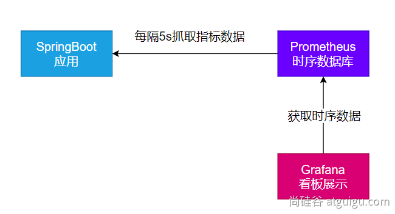

### 1. 安装 Prometheus + Grafana

```shell
#安装prometheus:时序数据库
docker run -p 9090:9090 -d \
-v pc:/etc/prometheus \
prom/prometheus

#安装grafana；默认账号密码 admin:admin
docker run -d --name=grafana -p 3000:3000 grafana/grafana
```


### 2. 导入依赖

```xml
<dependency>
    <groupId>org.springframework.boot</groupId>
    <artifactId>spring-boot-starter-actuator</artifactId>
</dependency>
<dependency>
    <groupId>io.micrometer</groupId>
    <artifactId>micrometer-registry-prometheus</artifactId>
    <version>1.10.6</version>
</dependency>
management:
  endpoints:
    web:
      exposure: #暴露所有监控的端点
        include: '*'
```

访问： <http://localhost:8001/actuator/prometheus>  验证，返回 prometheus 格式的所有指标


部署Java应用

```shell
#安装上传工具
yum install lrzsz

#安装openjdk
# 下载openjdk
wget https://download.oracle.com/java/17/latest/jdk-17_linux-x64_bin.tar.gz

mkdir -p /opt/java
tar -xzf jdk-17_linux-x64_bin.tar.gz -C /opt/java/
sudo vi /etc/profile
#加入以下内容
export JAVA_HOME=/opt/java/jdk-17.0.7
export PATH=$PATH:$JAVA_HOME/bin

#环境变量生效
source /etc/profile


# 后台启动java应用
nohup java -jar boot3-14-actuator-0.0.1-SNAPSHOT.jar > output.log 2>&1 &
```

确认可以访问到： <http://8.130.32.70:9999/actuator/prometheus>

### 3. 配置 Prometheus 拉取数据

```yaml
## 修改 prometheus.yml 配置文件
scrape_configs:
  - job_name: 'spring-boot-actuator-exporter'
    metrics_path: '/actuator/prometheus' #指定抓取的路径
    static_configs:
      - targets: ['192.168.200.1:8001']
        labels:
          nodename: 'app-demo'
```

### 4. 配置 Grafana 监控面板

- 添加数据源（Prometheus）
- 添加面板。可去 dashboard 市场找一个自己喜欢的面板，也可以自己开发面板;[Dashboards | Grafana Labs](https://grafana.com/grafana/dashboards/?plcmt=footer)


### 5. 效果

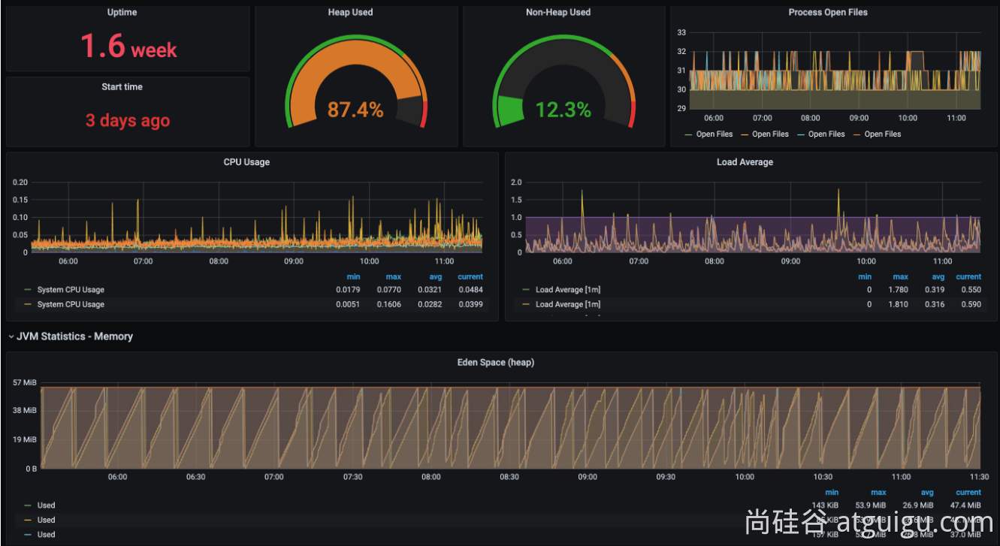

# 7、AOT

## 7.1. AOT与JIT

**AOT**：Ahead-of-Time（提前**编译**）：**程序执行前**，全部被编译成**机器码**

**JIT**：Just in Time（即时**编译**）: 程序边**编译**，边运行；

**编译：** 

- **源代码（.c、.cpp、.go、.java。。。） ===编译===  机器码**


**语言：**

- **编译****型语言：编译器**
- **解释型语言：解释器**

### 1. Complier 与 Interpreter

Java：**半编译半解释**

<https://anycodes.cn/editor>

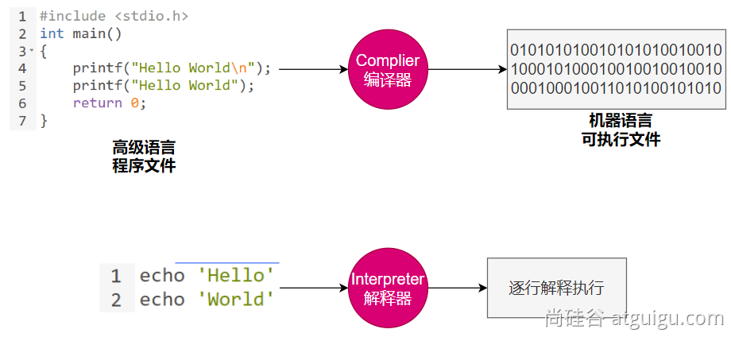

| 对比项                 | **编译器**                                         | **解释器**                                               |
| ---------------------- | -------------------------------------------------- | -------------------------------------------------------- |
| **机器执行速度**       | **快**，因为源代码只需被转换一次                   | **慢**，因为每行代码都需要被解释执行                     |
| **开发效率**           | **慢**，因为需要耗费大量时间编译                   | **快**，无需花费时间生成目标代码，更快的开发和测试       |
| **调试**               | **难以调试**编译器生成的目标代码                   | **容易调试**源代码，因为解释器一行一行地执行             |
| **可移植性（跨平台）** | 不同平台需要重新编译目标平台代码                   | 同一份源码可以跨平台执行，因为每个平台会开发对应的解释器 |
| **学习难度**           | 相对较高，需要了解源代码、编译器以及目标机器的知识 | 相对较低，无需了解机器的细节                             |
| **错误检查**           | 编译器可以在编译代码时检查错误                     | 解释器只能在执行代码时检查错误                           |
| **运行时增强**         | 无                                                 | 可以**动态增强**                                         |

### 2. AOT 与 JIT 对比

|      | JIT                                                          | AOT                                                          |
| ---- | ------------------------------------------------------------ | ------------------------------------------------------------ |
| 优点 | 1.具备**实时调整**能力 2.生成**最优机器指令** 3.根据代码运行情况**优化内存占用** | 1.速度快，优化了运行时编译时间和内存消耗 2.程序初期就能达最高性能 3.加快程序启动速度 |
| 缺点 | 1.运行期边编译**速度慢** 2.初始编译不能达到**最高性能**      | 1.程序第一次编译占用时间长 2.牺牲**高级语言**一些特性        |

在 OpenJDK 的官方 Wiki 上，介绍了HotSpot 虚拟机一个相对比较全面的、**即时编译器（JIT）**中采用的[优化技术列表](https://xie.infoq.cn/link?target=https%3A%2F%2Fwiki.openjdk.java.net%2Fdisplay%2FHotSpot%2FPerformanceTacticIndex)。

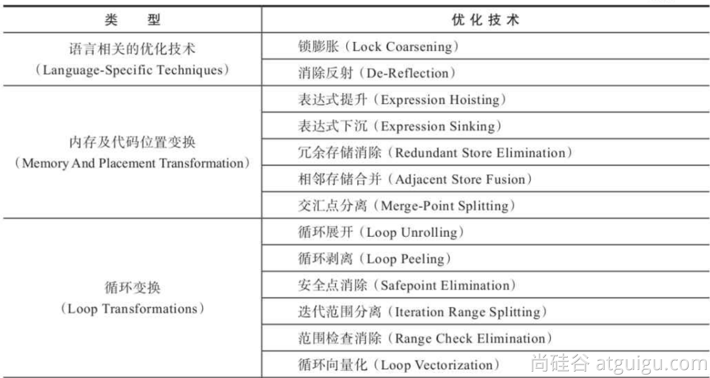

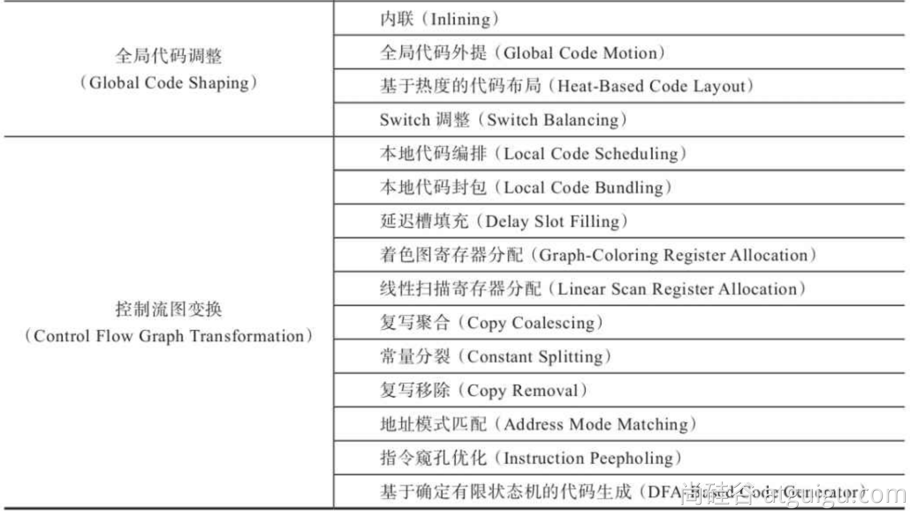

可使用：-XX:+PrintCompilation 打印JIT编译信息

### 3. JVM架构

.java === .class === 机器码

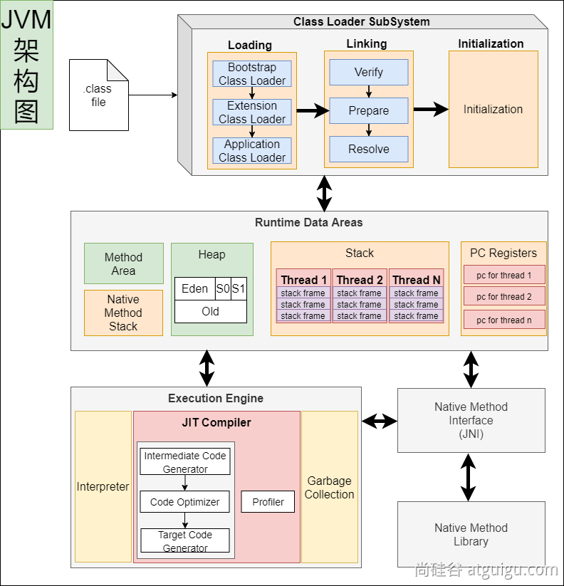

**JVM**: 既有**解释器**，又有**编辑器（JIT：即时编译）**；


### 4. Java的执行过程

建议阅读：

- 美团技术：<https://tech.meituan.com/2020/10/22/java-jit-practice-in-meituan.html>
- openjdk官网：<https://wiki.openjdk.org/display/HotSpot/Compiler>

#### 1. 流程概要

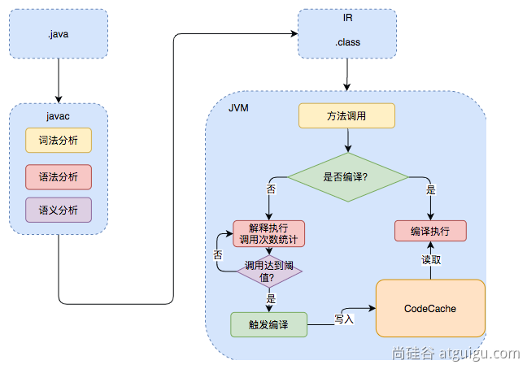

解释执行：

编译执行：

#### 2. 详细流程

热点代码：调用次数非常多的代码


### 5. JVM编译器

JVM中集成了两种编译器，Client Compiler 和 Server Compiler；

- Client Compiler注重启动速度和局部的优化
- Server Compiler更加关注全局优化，性能更好，但由于会进行更多的全局分析，所以启动速度会慢。


Client Compiler：

- HotSpot VM带有一个Client Compiler **C1编译器**
- 这种编译器**启动速度快**，但是性能比较Server Compiler来说会差一些。
- 编译后的机器码执行效率没有C2的高


Server Compiler：

- Hotspot虚拟机中使用的Server Compiler有两种：**C2** 和 **Graal**。
- 在Hotspot VM中，默认的Server Compiler是**C2编译器。**


### 6. 分层编译

Java 7开始引入了分层编译(**Tiered Compiler**)的概念，它结合了**C1**和**C2**的优势，追求启动速度和峰值性能的一个平衡。分层编译将JVM的执行状态分为了五个层次。**五个层级**分别是：

- 解释执行。
- 执行不带profiling的C1代码。
- 执行仅带方法调用次数以及循环回边执行次数profiling的C1代码。
- 执行带所有profiling的C1代码。
- 执行C2代码。

**profiling就是收集能够反映程序执行状态的数据**。其中最基本的统计数据就是方法的调用次数，以及循环回边的执行次数。

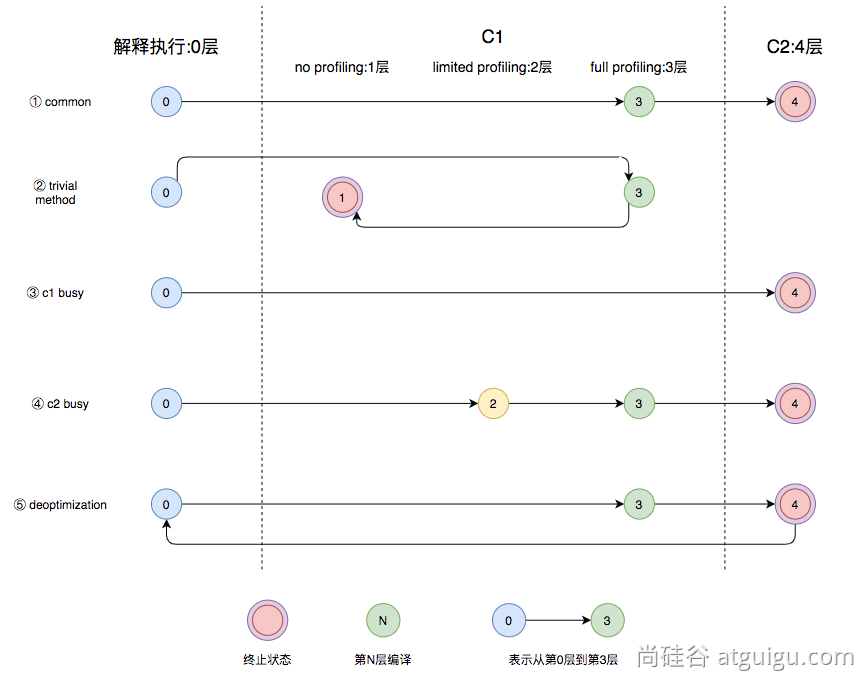

- 图中第①条路径，代表编译的一般情况，**热点方法**从解释执行到被3层的C1编译，最后被4层的C2编译。
- 如果**方法比较小**（比如Java服务中常见的**getter/setter**方法），3层的profiling没有收集到有价值的数据，JVM就会断定该方法对于C1代码和C2代码的执行效率相同，就会执行图中第②条路径。在这种情况下，JVM会在3层编译之后，放弃进入C2编译，**直接选择用1层的C1编译运行**。
- 在**C1忙碌**的情况下，执行图中第③条路径，在解释执行过程中对程序进行**profiling** ，根据信息直接由第4层的**C2编译**。
- 前文提到C1中的执行效率是**1层>2层>3层**，**第3层**一般要比**第2层**慢35%以上，所以在**C2忙碌**的情况下，执行图中第④条路径。这时方法会被2层的C1编译，然后再被3层的C1编译，以减少方法在**3层**的执行时间。
- 如果**编译器**做了一些比较**激进的优化**，比如分支预测，在实际运行时**发现预测出错**，这时就会进行**反优化**，重新进入**解释执行**，图中第⑤条执行路径代表的就是**反优化**。

总的来说，C1的编译速度更快，C2的编译质量更高，分层编译的不同编译路径，也就是JVM根据当前服务的运行情况来寻找当前服务的最佳平衡点的一个过程。从JDK 8开始，JVM默认开启分层编译。


**云原生**：Cloud Native； Java小改版；


最好的效果：

存在的问题：

- java应用如果用jar，解释执行，热点代码才编译成机器码；初始启动速度慢，初始处理请求数量少。
- 大型云平台，要求每一种应用都必须秒级启动。每个应用都要求效率高。

希望的效果：

- java应用也能提前被编译成**机器码**，随时**急速启动**，一启动就急速运行，最高性能
- 编译成机器码的好处：

- - 另外的服务器还需要安装Java环境
  - 编译成**机器码**的，可以在这个平台 Windows X64 **直接运行**。


**原生**镜像：**native**-image（机器码、本地镜像）

- 把应用打包成能适配本机平台 的可执行文件（机器码、本地镜像）

## 7.2. GraalVM

<https://www.graalvm.org/>

**GraalVM**是一个高性能的**JDK**，旨在**加速**用Java和其他JVM语言编写的**应用程序**的**执行**，同时还提供JavaScript、Python和许多其他流行语言的运行时。 

**GraalVM**提供了**两种**运行**Java应用程序**的方式：

- \1. 在HotSpot JVM上使用**Graal即时（JIT）编译器**
- \2. 作为**预先编译（AOT）**的本机**可执行文件**运行（**本地镜像**）。

 GraalVM的多语言能力使得在单个应用程序中混合多种编程语言成为可能，同时消除了外部语言调用的成本。


### 1. 架构

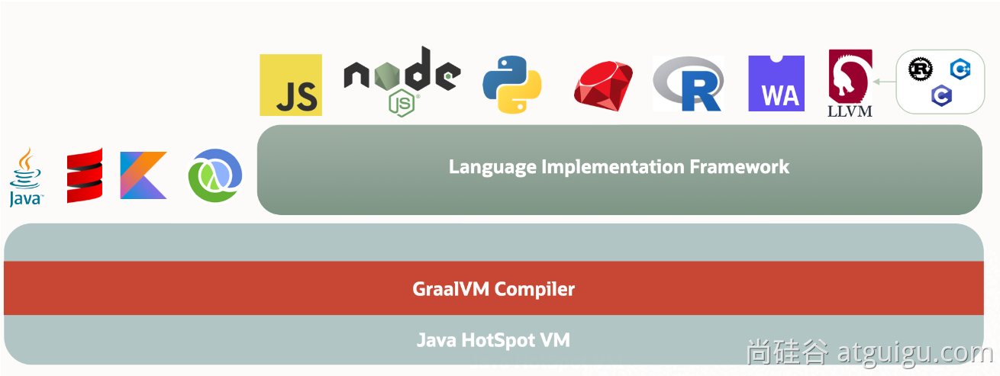

### 2. 安装

跨平台提供原生镜像原理：


#### 1. VisualStudio

<https://visualstudio.microsoft.com/zh-hans/free-developer-offers/>


别选中文


记住你安装的地址；


#### 2. GraalVM 

##### 1. 安装

下载 GraalVM + native-image


##### 2. 配置

修改 JAVA_HOME 与 Path，指向新bin路径


验证JDK环境为GraalVM提供的即可：

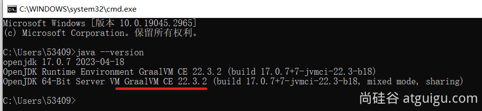


##### 3. 依赖

安装 native-image 依赖：

1. 网络环境好：参考：<https://www.graalvm.org/latest/reference-manual/native-image/#install-native-image>

```shell
gu install native-image
```

1. 网络不好，使用我们下载的离线jar;`native-image-xxx.jar`文件

```shell
gu install --file native-image-installable-svm-java17-windows-amd64-22.3.2.jar
```

##### 4. 验证

```shell
native-image
```


### 3. 测试

#### 1. 创建项目

- \1. 创建普通java项目。编写HelloWorld类；

- - 使用`mvn clean package`进行打包
  - 确认jar包是否可以执行`java -jar xxx.jar`
  - 可能需要给 `MANIFEST.MF`添加 `Main-Class: 你的主类`


#### 2. 编译镜像

- 编译为原生镜像（native-image）：使用`native-tools`终端

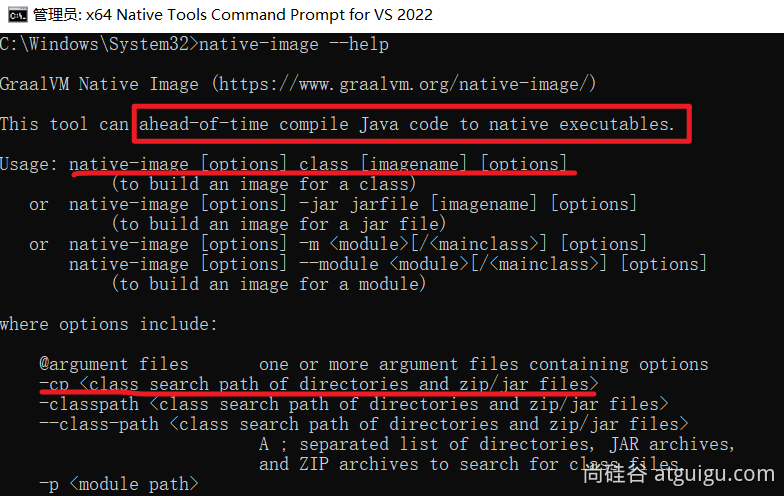

```shell
#从入口开始，编译整个jar
native-image -cp boot3-15-aot-common-1.0-SNAPSHOT.jar com.atguigu.MainApplication -o Haha

#编译某个类【必须有main入口方法，否则无法编译】
native-image -cp .\classes org.example.App
```


#### 3. Linux平台测试

- \1. 安装gcc等环境

```shell
yum install lrzsz
sudo yum install gcc glibc-devel zlib-devel
```

- \2. 下载安装配置Linux下的GraalVM、native-image

- - 下载：<https://www.graalvm.org/downloads/>
  - 安装：GraalVM、native-image
  - 配置：JAVA环境变量为GraalVM

```shell
tar -zxvf graalvm-ce-java17-linux-amd64-22.3.2.tar.gz -C /opt/java/

sudo vim /etc/profile
#修改以下内容
export JAVA_HOME=/opt/java/graalvm-ce-java17-22.3.2
export PATH=$PATH:$JAVA_HOME/bin

source /etc/profile
```

- \3. 安装native-image

```shell
gu install --file native-image-installable-svm-java17-linux-amd64-22.3.2.jar
```

- \4. 使用native-image编译jar为原生程序

```shell
native-image -cp xxx.jar org.example.App
```


## 7.3. SpringBoot整合

### 1. 依赖导入

```xml
 <build>
        <plugins>
            <plugin>
                <groupId>org.graalvm.buildtools</groupId>
                <artifactId>native-maven-plugin</artifactId>
            </plugin>
            <plugin>
                <groupId>org.springframework.boot</groupId>
                <artifactId>spring-boot-maven-plugin</artifactId>
            </plugin>
        </plugins>
    </build>
```

### 2. 生成native-image

1、运行aot提前处理命令：`mvn springboot:process-aot`

2、运行native打包：`mvn -Pnative native:build`

```shell
# 推荐加上 -Pnative
mvn -Pnative native:build -f pom.xml
```


### 3. 常见问题

可能提示如下各种错误，无法构建原生镜像，需要配置环境变量；

- 出现`cl.exe`找不到错误
- 出现乱码
- 提示`no include path set`
- 提示fatal error LNK1104: cannot open file 'LIBCMT.lib'
- 提示 LINK : fatal error LNK1104: cannot open file 'kernel32.lib'
- 提示各种其他找不到


**需要修改三个环境变量**：`Path`、`INCLUDE`、`lib`

- 1、 Path：添加如下值

- - `C:\Program Files\Microsoft Visual Studio\2022\Community\VC\Tools\MSVC\14.33.31629\bin\Hostx64\x64`

- 2、新建`INCLUDE`环境变量：值为

```plain
C:\Program Files\Microsoft Visual Studio\2022\Community\VC\Tools\MSVC\14.33.31629\include;C:\Program Files (x86)\Windows Kits\10\Include\10.0.19041.0\shared;C:\Program Files (x86)\Windows Kits\10\Include\10.0.19041.0\ucrt;C:\Program Files (x86)\Windows Kits\10\Include\10.0.19041.0\um;C:\Program Files (x86)\Windows Kits\10\Include\10.0.19041.0\winrt
```


- 3、新建`lib`环境变量：值为

```latex
C:\Program Files\Microsoft Visual Studio\2022\Community\VC\Tools\MSVC\14.33.31629\lib\x64;C:\Program Files (x86)\Windows Kits\10\Lib\10.0.19041.0\um\x64;C:\Program Files (x86)\Windows Kits\10\Lib\10.0.19041.0\ucrt\x64
```


