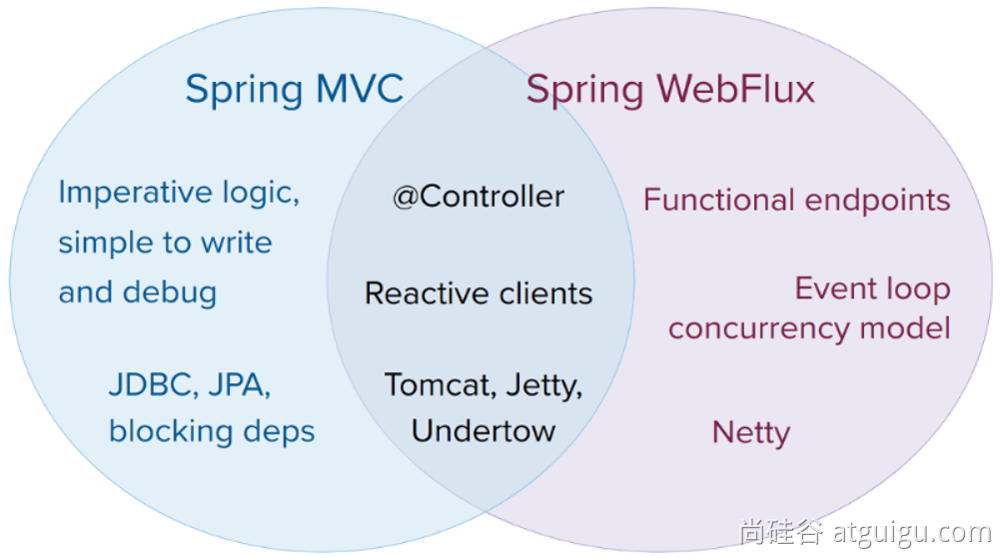
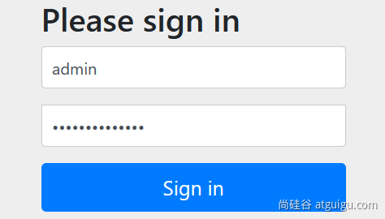

# 1、Reactor核心

## 1.1 前置知识

### 1、Lambda

Java8**语法糖**：

```java
package com.atguiggu.lambda;

import java.util.*;
import java.util.function.*;
import java.util.stream.Collectors;

/**
 * @author lfy
 * @Description
 * @create 2023-11-16 20:07
 */

//函数式接口；只要是函数式接口就可以用Lambda表达式简化
//函数式接口： 接口中有且只有一个未实现的方法，这个接口就叫函数式接口


interface MyInterface {
    int sum(int i, int j);
}

interface MyHaha {
    int haha();

    default int heihei() {
        return 2;
    }

    ; //默认实现
}

interface My666 {
    void aaa(int i,int j,int k);
}


@FunctionalInterface //检查注解，帮我们快速检查我们写的接口是否函数式接口
interface MyHehe {
    int hehe(int i);


}

//1、自己写实现类
class MyInterfaceImpl implements MyInterface {
    @Override
    public int sum(int i, int j) {
        return i + j;
    }
}


public class Lambda {

    public static void main(String[] args) {
        //声明一个函数
        BiConsumer<String,String> consumer = (a,b)->{
            System.out.println("哈哈："+a+"；呵呵："+b);
        };
        consumer.accept("1","2");


        //声明一个函数
        Function<String,Integer> function = (String x) -> Integer.parseInt(x);
        System.out.println(function.apply("2"));


        Supplier<String> supplier = ()-> UUID.randomUUID().toString();
        String s = supplier.get();
        System.out.println(s);


        BiFunction<String,Integer,Long> biFunction = (a,b)-> 888L;

        Predicate<Integer> even = (t)-> t%2 ==0;

//        even.test()//正向判断
//        even.negate().test(2) //反向判断
        System.out.println(even.negate().test(2));


    }


    public static void bbbbb(String[] args) {
        var names = new ArrayList<String>();

        names.add("Alice");
        names.add("Bob");
        names.add("Charlie");
        names.add("David");


        //比较器
//        Collections.sort(names, new Comparator<String>() {
//            @Override
//            public int compare(String o1, String o2) {
//                return o2.compareTo(o1);
//            }
//        });


        //直接写函数式接口就方便   (o1,o2)->o1.compareTo(o2)
//        Collections.sort(names,(o1,o2)->o1.compareTo(o2));
        System.out.println(names);


        // 类::方法； 引用类中的实例方法； 忽略lambda的完整写法
        Collections.sort(names,String::compareTo);
        System.out.println(names);


        new  Thread(
                new Runnable() {
                    @Override
                    public void run() {
                        System.out.println("哈哈啊");
                    }
                }
        ).start();

        Runnable runnable = () -> System.out.println("aaa");

        new Thread(runnable).start();


        //最佳实战：
        //1、以后调用某个方法传入参数，这个参数实例是一个接口对象，且只定义了一个方法，就直接用lambda简化写法


    }


    /**
     * lambda简化函数式接口实例创建
     *
     * @param args
     */
    public static void aaaa(String[] args) {

        //1、自己创建实现类对象
        MyInterface myInterface = new MyInterfaceImpl();
        System.out.println(myInterface.sum(1, 2));

        //2、创建匿名实现类
        MyInterface myInterface1 = new MyInterface() {
            @Override
            public int sum(int i, int j) {
                return i * i + j * j;
            }
        };
//        System.out.println(myInterface1.sum(2, 3));
        //冗余写法

        //3、lambda表达式:语法糖  参数列表  + 箭头 + 方法体
        MyInterface myInterface2 = (x, y) -> {
            return x * x + y * y;
        };
        System.out.println(myInterface2.sum(2, 3));


        //参数位置最少情况
        MyHaha myHaha = () -> {
            return 1;
        };

        MyHehe myHehe = y -> {
            return y * y;
        };


        MyHehe hehe2 = y -> y - 1;

        //完整写法如上：
        //简化写法：
        //1)、参数类型可以不写，只写(参数名)，参数变量名随意定义;
        //    参数表最少可以只有一个 ()，或者只有一个参数名；
        //2、方法体如果只有一句话，{} 可以省略


        MyHehe hehe3 = y -> y + 1;
        System.out.println(hehe3.hehe(7));
        //以上Lambda表达式简化了实例的创建。


        //总结：
        // 1、Lambda表达式： (参数表) -> {方法体}
        // 2、分辨出你的接口是否函数式接口。 函数式接口就可以lambda简化


    }


}
```


### 2、Function

函数式接口的出入参定义：

1、有入参，无出参【消费者】：  function.accept

```java
        BiConsumer<String,String> function = (a,b)->{ //能接受两个入参
            System.out.println("哈哈："+a+"；呵呵："+b);
        };
        function.accept("1","2");
```

2、有入参，有出参【**多功能函数**】：   function.apply

```java
        Function<String,Integer> function = (String x) -> Integer.parseInt(x);
        System.out.println(function.apply("2"));
```

3、无入参，无出参【**普通函数**】：

```java
        Runnable runnable = () -> System.out.println("aaa");

        new Thread(runnable).start();
```

4、无入参 ，有出参【**提供者**】：  supplier.get()

```java
        Supplier<String> supplier = ()-> UUID.randomUUID().toString();
        String s = supplier.get();
        System.out.println(s);
```


java.util.function包下的所有function定义：

- Consumer： 消费者
- Supplier： 提供者
- Predicate： 断言

get/test/apply/accept调用的函数方法；


### 3、StreamAPI

最佳实战：以后凡是你写for循环处理数据的统一全部用StreamAPI进行替换；

Stream所有数据和操作被组合成流管道流管道组成：

- 一个数据源（可以是一个数组、集合、生成器函数、I/O管道）
- 零或多个中间操作（将一个流变形成另一个流）
- 一个终止操作（产生最终结果）


#### 中间操作：Intermediate Operations

- filter：过滤；  挑出我们用的元素
- map： 映射： 一一映射，a 变成 b

- - mapToInt、mapToLong、mapToDouble

- flatMap：打散、散列、展开、扩维：一对多映射


```java
filter、
map、mapToInt、mapToLong、mapToDouble
flatMap、flatMapToInt、flatMapToLong、flatMapToDouble
mapMulti、mapMultiToInt、mapMultiToLong、mapMultiToDouble、
parallel、unordered、onClose、sequential
distinct、sorted、peek、limit、skip、takeWhile、dropWhile、
```

#### 终止操作：Terminal Operation

```java
forEach、forEachOrdered、toArray、reduce、collect、toList、min、
max、count、anyMatch、allMatch、noneMatch、findFirst、findAny、iterator
```


### 4、Reactive-Stream

[2、响应式编程-Reactor核心.pptx](https://www.yuque.com/attachments/yuque/0/2023/pptx/1613913/1700230453410-c21ddb51-bbcf-44c0-862d-d86f1d8f81cd.pptx)


## 1.2 Reactor

### 1、快速上手

#### 介绍

Reactor 是一个用于JVM的完全非阻塞的响应式编程框架，具备高效的需求管理（即对 “背压（backpressure）”的控制）能力。它与 Java 8 函数式 API 直接集成，比如 CompletableFuture， Stream， 以及 Duration。它提供了异步序列 API Flux（用于[N]个元素）和 Mono（用于 [0|1]个元素），并完全遵循和实现了“响应式扩展规范”（Reactive Extensions Specification）。

Reactor 的 reactor-ipc 组件还支持非阻塞的进程间通信（inter-process communication, IPC）。 Reactor IPC 为 HTTP（包括 Websockets）、TCP 和 UDP 提供了支持背压的网络引擎，从而适合 应用于微服务架构。并且完整支持响应式编解码（reactive encoding and decoding）。


#### 依赖

```xml
<dependencyManagement> 
    <dependencies>
        <dependency>
            <groupId>io.projectreactor</groupId>
            <artifactId>reactor-bom</artifactId>
            <version>2023.0.0</version>
            <type>pom</type>
            <scope>import</scope>
        </dependency>
    </dependencies>
</dependencyManagement>
<dependencies>
    <dependency>
        <groupId>io.projectreactor</groupId>
        <artifactId>reactor-core</artifactId> 
        
    </dependency>
    <dependency>
        <groupId>io.projectreactor</groupId>
        <artifactId>reactor-test</artifactId> 
        <scope>test</scope>
    </dependency>
</dependencies>
```


### 2、响应式编程

响应式编程是一种关注于**数据流（data streams）**和**变化传递（propagation of change）**的**异步编程**方式。 这意味着它可以用既有的编程语言表达静态（如数组）或动态（如事件源）的数据流。


了解历史：

- 在响应式编程方面，微软跨出了第一步，它在 .NET 生态中创建了响应式扩展库（Reactive Extensions library, Rx）。接着 RxJava 在JVM上实现了响应式编程。后来，在 JVM 平台出现了一套标准的响应式 编程规范，它定义了一系列标准接口和交互规范。并整合到 Java 9 中（使用 Flow 类）。
- 响应式编程通常作为面向对象编程中的“观察者模式”（Observer design pattern）的一种扩展。 响应式流（reactive streams）与“迭代子模式”（Iterator design pattern）也有相通之处， 因为其中也有 Iterable-Iterator 这样的对应关系。主要的区别在于，Iterator 是基于 “拉取”（pull）方式的，而响应式流是基于“推送”（push）方式的。
- 使用 iterator 是一种“命令式”（imperative）编程范式，即使访问元素的方法是 Iterable 的唯一职责。关键在于，什么时候执行 next() 获取元素取决于开发者。在响应式流中，相对应的 角色是 Publisher-Subscriber，但是 *当有新的值到来的时候* ，却反过来由发布者（Publisher） 通知订阅者（Subscriber），这种“推送”模式是响应式的关键。此外，对推送来的数据的操作 是通过一种声明式（declaratively）而不是命令式（imperatively）的方式表达的：开发者通过 描述“控制流程”来定义对数据流的处理逻辑。
- 除了数据推送，对错误处理（error handling）和完成（completion）信号的定义也很完善。 一个 Publisher 可以推送新的值到它的 Subscriber（调用 onNext 方法）， 同样也可以推送错误（调用 onError 方法）和完成（调用 onComplete 方法）信号。 错误和完成信号都可以终止响应式流。可以用下边的表达式描述：

```r
onNext x 0..N [onError | onComplete]
```


#### 2.1. 阻塞是对资源的浪费

现代应用需要**应对大量的并发用户**，而且即使现代硬件的处理能力飞速发展，**软件性能仍然是关键因素**。

广义来说我们有两种思路来提升程序性能：

1. **并行化（parallelize）** ：使用更多的线程和硬件资源。[异步]
2. 基于现有的资源来 **提高执行效率** 。

通常，Java开发者使用阻塞式（blocking）编写代码。这没有问题，在出现性能瓶颈后， 我们可以增加处理线程，线程中同样是阻塞的代码。但是这种使用资源的方式会迅速面临 资源竞争和并发问题。

更糟糕的是，阻塞会浪费资源。具体来说，比如当一个程序面临延迟（通常是I/O方面， 比如数据库读写请求或网络调用），所在线程需要进入 idle 状态等待数据，从而浪费资源。

所以，并行化方式并非银弹。这是挖掘硬件潜力的方式，但是却带来了复杂性，而且容易造成浪费。


#### 2.2. 异步可以解决问题吗？

第二种思路——提高执行效率——可以解决资源浪费问题。通过编写 *异步非阻塞* 的代码， （任务发起异步调用后）执行过程会切换到另一个 **使用同样底层资源** 的活跃任务，然后等 异步调用返回结果再去处理。


但是在 JVM 上如何编写异步代码呢？Java 提供了两种异步编程方式：

- **回调（Callbacks）** ：异步方法没有返回值，而是采用一个 callback 作为参数（lambda 或匿名类），当结果出来后回调这个 callback。常见的例子比如 Swings 的 EventListener。
- **Futures** ：异步方法 **立即** 返回一个 Future<T>，该异步方法要返回结果的是 T 类型，通过 Future封装。这个结果并不是 *立刻* 可以拿到，而是等实际处理结束才可用。比如， ExecutorService 执行 Callable<T> 任务时会返回 Future 对象。


这些技术够用吗？并非对于每个用例都是如此，两种方式都有局限性。

回调很难组合起来，因为很快就会导致代码难以理解和维护（即所谓的“回调地狱（callback hell）”）。

考虑这样一种情景：

- 在用户界面上显示用户的5个收藏，或者如果没有任何收藏提供5个建议。
- 这需要3个 服务（一个提供收藏的ID列表，第二个服务获取收藏内容，第三个提供建议内容）：

回调地狱（Callback Hell）的例子：

```java
userService.getFavorites(userId, new Callback<List<String>>() { 
  public void onSuccess(List<String> list) { 
    if (list.isEmpty()) { 
      suggestionService.getSuggestions(new Callback<List<Favorite>>() {
        public void onSuccess(List<Favorite> list) { 
          UiUtils.submitOnUiThread(() -> { 
            list.stream()
                .limit(5)
                .forEach(uiList::show); 
            });
        }

        public void onError(Throwable error) { 
          UiUtils.errorPopup(error);
        }
      });
    } else {
      list.stream() 
          .limit(5)
          .forEach(favId -> favoriteService.getDetails(favId, 
            new Callback<Favorite>() {
              public void onSuccess(Favorite details) {
                UiUtils.submitOnUiThread(() -> uiList.show(details));
              }

              public void onError(Throwable error) {
                UiUtils.errorPopup(error);
              }
            }
          ));
    }
  }

  public void onError(Throwable error) {
    UiUtils.errorPopup(error);
  }
});
```


Reactor改造后为：

```java
userService.getFavorites(userId) 
           .flatMap(favoriteService::getDetails) 
           .switchIfEmpty(suggestionService.getSuggestions()) 
           .take(5) 
           .publishOn(UiUtils.uiThreadScheduler()) 
           .subscribe(uiList::show, UiUtils::errorPopup); 
```


如果你想确保“收藏的ID”的数据在800ms内获得（如果超时，从缓存中获取）呢？在基于回调的代码中， 会比较复杂。但 Reactor 中就很简单，在处理链中增加一个 timeout 的操作符即可。

```java
userService.getFavorites(userId)
           .timeout(Duration.ofMillis(800)) 
           .onErrorResume(cacheService.cachedFavoritesFor(userId)) 
           .flatMap(favoriteService::getDetails) 
           .switchIfEmpty(suggestionService.getSuggestions())
           .take(5)
           .publishOn(UiUtils.uiThreadScheduler())
           .subscribe(uiList::show, UiUtils::errorPopup);
```


额外扩展：

Futures 比回调要好一点，但即使在 Java 8 引入了 CompletableFuture，它对于多个处理的组合仍不够好用。 编排多个 Futures 是可行的，但却不易。此外，Future 还有一个问题：当对 Future 对象最终调用 get() 方法时，仍然会导致阻塞，并且缺乏对多个值以及更进一步对错误的处理。

考虑另外一个例子，我们首先得到 ID 的列表，然后通过它进一步获取到“对应的 name 和 statistics” 为元素的列表，整个过程用异步方式来实现。

CompletableFuture 处理组合的例子

```java
CompletableFuture<List<String>> ids = ifhIds(); 

CompletableFuture<List<String>> result = ids.thenComposeAsync(l -> { 
        Stream<CompletableFuture<String>> zip =
                        l.stream().map(i -> { 
                                                 CompletableFuture<String> nameTask = ifhName(i); 
                                                 CompletableFuture<Integer> statTask = ifhStat(i); 

                                                 return nameTask.thenCombineAsync(statTask, (name, stat) -> "Name " + name + " has stats " + stat); 
                                         });
        List<CompletableFuture<String>> combinationList = zip.collect(Collectors.toList()); 
        CompletableFuture<String>[] combinationArray = combinationList.toArray(new CompletableFuture[combinationList.size()]);

        CompletableFuture<Void> allDone = CompletableFuture.allOf(combinationArray); 
        return allDone.thenApply(v -> combinationList.stream()
                                                                                                 .map(CompletableFuture::join) 
                                                                                                 .collect(Collectors.toList()));
});

List<String> results = result.join(); 
assertThat(results).contains(
                                "Name NameJoe has stats 103",
                                "Name NameBart has stats 104",
                                "Name NameHenry has stats 105",
                                "Name NameNicole has stats 106",
                                "Name NameABSLAJNFOAJNFOANFANSF has stats 121");
```

#### 2.3. 从命令式编程到响应式编程

类似 Reactor 这样的响应式库的目标就是要弥补上述“经典”的 JVM 异步方式所带来的不足， 此外还会关注一下几个方面：

- **可编排性（Composability）** 以及 **可读性（Readability）**
- 使用丰富的 **操作符** 来处理形如 **流** 的数据
- 在 **订阅（subscribe）** 之前什么都不会发生
- **背压（backpressure）** 具体来说即 *消费者能够反向告知生产者生产内容的速度的能力*
- **高层次** （同时也是有高价值的）的抽象，从而达到 *并发无关* 的效果


##### 2.3.1. 可编排性与可读性

可编排性，指的是编排多个异步任务的能力。比如我们将前一个任务的结果传递给后一个任务作为输入， 或者将多个任务以分解再汇总（fork-join）的形式执行，或者将异步的任务作为离散的组件在系统中 进行重用。

这种编排任务的能力与代码的可读性和可维护性是紧密相关的。随着异步处理任务数量和复杂度 的提高，编写和阅读代码都变得越来越困难。就像我们刚才看到的，回调模式是简单的，但是缺点 是在复杂的处理逻辑中，回调中会层层嵌入回调，导致 **回调地狱（Callback Hell）** 。你能猜到 （或有过这种痛苦经历），这样的代码是难以阅读和分析的。

Reactor 提供了丰富的编排操作，从而代码直观反映了处理流程，并且所有的操作保持在同一层次 （尽量避免了嵌套）。


##### 2.3.2. 就像装配流水线

你可以想象数据在响应式应用中的处理，就像流过一条装配流水线。Reactor 既是传送带， 又是一个个的装配工或机器人。原材料从源头（最初的 Publisher）流出，最终被加工为成品， 等待被推送到消费者（或者说 Subscriber）。

原材料会经过不同的中间处理过程，或者作为半成品与其他半成品进行组装。如果某处有齿轮卡住， 或者某件产品的包装过程花费了太久时间，相应的工位就可以向上游发出信号来限制或停止发出原材料。


##### 2.3.3. 操作符（Operators）

在 Reactor 中，操作符（operator）就像装配线中的工位（操作员或装配机器人）。**每一个操作符 对 Publisher 进行相应的处理，然后将 Publisher 包装为一个新的 Publisher。**就像一个链条， 数据源自第一个 Publisher，然后顺链条而下，在每个环节进行相应的处理。**最终，一个订阅者 (Subscriber）终结这个过程**。请记住，**在订阅者（Subscriber）订阅（subscribe）到一个 发布者（Publisher）之前，什么都不会发生。**

**理解了操作符会创建新的** **Publisher** **实例这一点，能够帮助你避免一个常见的问题， 这种问题会让你觉得处理链上的某个操作符没有起作用。**

虽然响应式流规范（Reactive Streams specification）没有规定任何操作符， 类似 Reactor 这样的响应式库所带来的最大附加价值之一就是提供丰富的操作符。包括基础的转换操作， 到过滤操作，甚至复杂的编排和错误处理操作。


##### 2.3.4. subscribe() 之前什么都不会发生

在 Reactor 中，当你创建了一条 Publisher 处理链，数据还不会开始生成。事实上，你是创建了 一种抽象的对于异步处理流程的描述（从而方便重用和组装）。

当真正“订阅（subscrib）”的时候，你需要将 Publisher 关联到一个 Subscriber 上，然后 才会触发整个链的流动。这时候，Subscriber 会向上游发送一个 request 信号，一直到达源头 的 Publisher。


#### 2.3.5. 背压

向上游传递信号这一点也被用于实现 **背压** ，就像在装配线上，某个工位的处理速度如果慢于流水线 速度，会对上游发送反馈信号一样。

在响应式流规范中实际定义的机制同刚才的类比非常接近：订阅者可以无限接受数据并让它的源头 “满负荷”推送所有的数据，也可以通过使用 request 机制来告知源头它一次最多能够处理 n 个元素。

中间环节的操作也可以影响 request。想象一个能够将每10个元素分批打包的缓存（buffer）操作。 如果订阅者请求一个元素，那么对于源头来说可以生成10个元素。此外预取策略也可以使用了， 比如在订阅前预先生成元素。

**这样能够将“推送”模式转换为“推送+拉取”混合的模式，如果下游准备好了，可以从上游拉取 n 个元素；但是如果上游元素还没有准备好，下游还是要等待上游的推送。**


##### 2.3.6. 热（Hot） vs 冷（Cold）

在 Rx 家族的响应式库中，响应式流分为“热”和“冷”两种类型，区别主要在于响应式流如何 对订阅者进行响应：

- 一个“冷”的序列，指对于每一个 Subscriber，都会收到从头开始所有的数据。如果源头 生成了一个 HTTP 请求，对于每一个订阅都会创建一个新的 HTTP 请求。
- 一个“热”的序列，指对于一个 Subscriber，只能获取从它开始 订阅 *之后* 发出的数据。不过注意，有些“热”的响应式流可以缓存部分或全部历史数据。 通常意义上来说，一个“热”的响应式流，甚至在即使没有订阅者接收数据的情况下，也可以 发出数据（这一点同 “Subscribe() 之前什么都不会发生”的规则有冲突）。


### 3、核心特性

#### 1、Mono和Flux

Mono: 0|1 数据流

Flux: N数据流


响应式流：元素（内容） + 信号（完成/异常）；


#### 2、subscribe()

自定义流的信号感知回调

```java
flux.subscribe(
        v-> System.out.println("v = " + v), //流元素消费
        throwable -> System.out.println("throwable = " + throwable), //感知异常结束
        ()-> System.out.println("流结束了...") //感知正常结束
);
```


自定义消费者

```java
flux.subscribe(new BaseSubscriber<String>() {

            // 生命周期钩子1： 订阅关系绑定的时候触发
            @Override
            protected void hookOnSubscribe(Subscription subscription) {
                // 流被订阅的时候触发
                System.out.println("绑定了..."+subscription);

                //找发布者要数据
                request(1); //要1个数据
//                requestUnbounded(); //要无限数据
            }

            @Override
            protected void hookOnNext(String value) {
                System.out.println("数据到达，正在处理："+value);
                request(1); //要1个数据
            }


            //  hookOnComplete、hookOnError 二选一执行
            @Override
            protected void hookOnComplete() {
                System.out.println("流正常结束...");
            }

            @Override
            protected void hookOnError(Throwable throwable) {
                System.out.println("流异常..."+throwable);
            }

            @Override
            protected void hookOnCancel() {
                System.out.println("流被取消...");
            }

            @Override
            protected void hookFinally(SignalType type) {
                System.out.println("最终回调...一定会被执行");
            }
        });
```


#### 3、流的取消

消费者调用 cancle() 取消流的订阅； 

##### **Disposable**

```java
        Flux<String> flux = Flux.range(1, 10)
                .map(i -> {
                    System.out.println("map..."+i);
                    if(i==9) {
                        i = 10/(9-i); //数学运算异常;  doOnXxx
                    }
                    return "哈哈：" + i;
                }); //流错误的时候，把错误吃掉，转为正常信号


//        flux.subscribe(); //流被订阅; 默认订阅；
//        flux.subscribe(v-> System.out.println("v = " + v));//指定订阅规则： 正常消费者：只消费正常元素


//        flux.subscribe(
//                v-> System.out.println("v = " + v), //流元素消费
//                throwable -> System.out.println("throwable = " + throwable), //感知异常结束
//                ()-> System.out.println("流结束了...") //感知正常结束
//        );


        // 流的生命周期钩子可以传播给订阅者。
        //  a() {
        //      data = b();
        //  }
        flux.subscribe(new BaseSubscriber<String>() {

            // 生命周期钩子1： 订阅关系绑定的时候触发
            @Override
            protected void hookOnSubscribe(Subscription subscription) {
                // 流被订阅的时候触发
                System.out.println("绑定了..."+subscription);

                //找发布者要数据
                request(1); //要1个数据
//                requestUnbounded(); //要无限数据
            }

            @Override
            protected void hookOnNext(String value) {
                System.out.println("数据到达，正在处理："+value);
                if(value.equals("哈哈：5")){
                    cancel(); //取消流
                }
                request(1); //要1个数据
            }


            //  hookOnComplete、hookOnError 二选一执行
            @Override
            protected void hookOnComplete() {
                System.out.println("流正常结束...");
            }

            @Override
            protected void hookOnError(Throwable throwable) {
                System.out.println("流异常..."+throwable);
            }

            @Override
            protected void hookOnCancel() {
                System.out.println("流被取消...");
            }

            @Override
            protected void hookFinally(SignalType type) {
                System.out.println("最终回调...一定会被执行");
            }
        });
```


#### 4、**BaseSubscriber**

自定义消费者，推荐直接编写 **BaseSubscriber 的逻辑；**


#### 5、背压（Backpressure ）和请求重塑（Reshape Requests）

##### 1、buffer：缓冲

```java
Flux<List<Integer>> flux = Flux.range(1, 10)  //原始流10个
        .buffer(3)
        .log();//缓冲区：缓冲3个元素: 消费一次最多可以拿到三个元素； 凑满数批量发给消费者
//
//        //一次发一个，一个一个发；
// 10元素，buffer(3)；消费者请求4次，数据消费完成
```


##### 2、limit：限流

```java
Flux.range(1, 1000)
    .log()
    //限流触发，看上游是怎么限流获取数据的
    .limitRate(100) //一次预取30个元素； 第一次 request(100)，以后request(75)
    .subscribe();
```


#### 6、以编程方式创建序列-Sink

Sink.next  

Sink.complete  

##### 1、同步环境-generate


##### 2、多线程-create


#### 7、 handle()

自定义流中元素处理规则

```java
   //
        Flux.range(1,10)
                .handle((value,sink)->{
                    System.out.println("拿到的值："+value);
                    sink.next("张三："+value); //可以向下发送数据的通道
                })
                .log() //日志
                .subscribe();
```


#### 8、自定义线程调度

响应式：响应式编程： 全异步、消息、事件回调

默认还是用当前线程，生成整个流、发布流、流操作


```java
public void thread1(){
    Scheduler s = Schedulers.newParallel("parallel-scheduler", 4);

    final Flux<String> flux = Flux
            .range(1, 2)
            .map(i -> 10 + i)
            .log()
            .publishOn(s)
            .map(i -> "value " + i)
            ;

    //只要不指定线程池，默认发布者用的线程就是订阅者的线程；
    new Thread(() -> flux.subscribe(System.out::println)).start();
}
```


#### 9、错误处理

命令式编程：常见的错误处理方式

##### 1. Catch and return a static default value. 捕获异常返回一个静态默认值

```java
try {
  return doSomethingDangerous(10);
}
catch (Throwable error) {
  return "RECOVERED";
}
```

onErrorReturn: 实现上面效果，错误的时候返回一个值

- 1、吃掉异常，消费者无异常感知
- 2、返回一个兜底默认值
- 3、流正常完成；


```java
        Flux.just(1, 2, 0, 4)
                .map(i -> "100 / " + i + " = " + (100 / i))
                .onErrorReturn(NullPointerException.class,"哈哈-6666")
                .subscribe(v-> System.out.println("v = " + v),
                        err -> System.out.println("err = " + err),
                        ()-> System.out.println("流结束")); // error handling example
```


##### 2. Catch and execute an alternative path with a fallback method.

吃掉异常，执行一个兜底方法；

```java
try {
  return doSomethingDangerous(10);
}
catch (Throwable error) {
  return doOtherthing(10);
}
```

onErrorResume

- 1、吃掉异常，消费者无异常感知
- 2、调用一个兜底方法
- 3、流正常完成

```java
        Flux.just(1, 2, 0, 4)
                .map(i -> "100 / " + i + " = " + (100 / i)).onErrorResume(err -> Mono.just("哈哈-777"))
                .subscribe(v -> System.out.println("v = " + v),
                        err -> System.out.println("err = " + err),
                        () -> System.out.println("流结束"));
```


##### 3. Catch and dynamically compute a fallback value. 捕获并动态计算一个返回值

根据错误返回一个新值

```java
try {
  Value v = erroringMethod();
  return MyWrapper.fromValue(v);
}
catch (Throwable error) {
  return MyWrapper.fromError(error);
}
.onErrorResume(err -> Flux.error(new BusinessException(err.getMessage()+"：炸了")))
```

- 1、吃掉异常，消费者有感知
- 2、调用一个自定义方法
- 3、流异常完成

##### 4. Catch, wrap to a BusinessException, and re-throw.

捕获并包装成一个业务异常，并重新抛出

```java
try {
  return callExternalService(k);
}
catch (Throwable error) {
  throw new BusinessException("oops, SLA exceeded", error);
}
```

包装重新抛出异常:  推荐用  .onErrorMap

- 1、吃掉异常，消费者有感知 
- 2、抛新异常
- 3、流异常完成

```java
.onErrorResume(err -> Flux.error(new BusinessException(err.getMessage()+"：炸了")))

        Flux.just(1, 2, 0, 4)
                .map(i -> "100 / " + i + " = " + (100 / i))
                .onErrorMap(err-> new BusinessException(err.getMessage()+": 又炸了..."))
                .subscribe(v -> System.out.println("v = " + v),
                        err -> System.out.println("err = " + err),
                        () -> System.out.println("流结束"));
```


##### 5. Catch, log an error-specific message, and re-throw.

捕获异常，记录特殊的错误日志，重新抛出

```java
try {
  return callExternalService(k);
}
catch (RuntimeException error) {
  //make a record of the error
  log("uh oh, falling back, service failed for key " + k);
  throw error;
}
        Flux.just(1, 2, 0, 4)
                .map(i -> "100 / " + i + " = " + (100 / i))
                .doOnError(err -> {
                    System.out.println("err已被记录 = " + err);
                }).subscribe(v -> System.out.println("v = " + v),
                        err -> System.out.println("err = " + err),
                        () -> System.out.println("流结束"));
```

- 异常被捕获、做自己的事情
- 不影响异常继续顺着流水线传播
- 1、不吃掉异常，只在异常发生的时候做一件事，消费者有感知 


##### 6. Use the finally block to clean up resources or a Java 7 “try-with-resource” construct.

```java
        Flux.just(1, 2, 3, 4)
                .map(i -> "100 / " + i + " = " + (100 / i))
                .doOnError(err -> {
                    System.out.println("err已被记录 = " + err);
                })
                .doFinally(signalType -> {
                    System.out.println("流信号："+signalType);
                })
```


##### 7. 忽略当前异常，仅通知记录，继续推进

```java
Flux.just(1,2,3,0,5)
        .map(i->10/i)
        .onErrorContinue((err,val)->{
            System.out.println("err = " + err);
            System.out.println("val = " + val);
            System.out.println("发现"+val+"有问题了，继续执行其他的，我会记录这个问题");
        }) //发生
        .subscribe(v-> System.out.println("v = " + v),
                err-> System.out.println("err = " + err));
```


#### 10：常用操作

filter、flatMap、concatMap、flatMapMany、transform、defaultIfEmpty、switchIfEmpty、concat、concatWith、merge、mergeWith、mergeSequential、zip、zipWith...


今日内容：

- **常用操作**
- **错误处理**
- **超时与重试**
- **Sinks工具类**

- - **单播**
  - **多播**
  - **重放**
  - **背压**
  - **缓存**

- **阻塞式API**

- - **block**

- **Context-API**：响应式中的ThreadLocal

- - ThreadLocal机制失效

```
        Flux.just(1,2,3)                 .transformDeferredContextual((flux,context)->{                     System.out.println("flux = " + flux);                     System.out.println("context = " + context);                     return flux.map(i->i+"==>"+context.get("prefix"));                 })                 //上游能拿到下游的最近一次数据                 .contextWrite(Context.of("prefix","哈哈"))                 //ThreadLocal共享了数据，上游的所有人能看到; Context由下游传播给上游                 .subscribe(v-> System.out.println("v = " + v));
```

- **ParallelFlux**：

- - 并发流

```java
        Flux.range(1,1000000)
                .buffer(100)
                .parallel(8)
                .runOn(Schedulers.newParallel("yy"))
.log()
.subscribe();
```

# 2、Spring Webflux

**今日任务**：

- **Reactor核心**：**HttpHandler** 原生API；
- **DispatcherHandler** 原理；

- - DispatcherHandler 组件分析
  - DispatcherHandler 请求处理流程
  - 返回结果处理
  - 异常处理
  - 视图解析

- - - 重定向
    - Rendering

- **注解式 - Controller**

- - 兼容老版本方式
  - **新版本变化**

- - - **SSE**
    - **文件上传**

- **错误响应**

- - @ExceptionHandler 

- - - ErrorResponse： 自定义 错误响应
    - ProblemDetail：自定义PD返回

- **WebFlux配置**

- - @EnableWebFlux
  - WebFluxConfigurer


WebFlux：底层完全基于netty+reactor+springweb 完成一个全异步非阻塞的web**响应式框架**

**底层：异步 + 消息队列(内存) + 事件回调机制 = 整套系统**

**优点：能使用少量资源处理大量请求；**


## 2.1、组件对比

| **API****功能** | **Servlet-阻塞式Web**                   | **WebFlux-响应式Web**                                        |
| --------------- | --------------------------------------- | ------------------------------------------------------------ |
| 前端控制器      | DispatcherServlet                       | DispatcherHandler                                            |
| 处理器          | Controller                              | WebHandler/Controller                                        |
| 请求、响应      | **ServletRequest**、**ServletResponse** | **ServerWebExchange：****ServerHttpRequest、ServerHttpResponse** |
| 过滤器          | Filter（HttpFilter）                    | WebFilter                                                    |
| 异常处理器      | HandlerExceptionResolver                | DispatchExceptionHandler                                     |
| Web配置         | @EnableWebMvc                           | @EnableWebFlux                                               |
| 自定义配置      | WebMvcConfigurer                        | WebFluxConfigurer                                            |
| 返回结果        | 任意                                    | **Mono、Flux**、任意                                         |
| 发送REST请求    | RestTemplate                            | WebClient                                                    |

**Mono： 返回0|1 数据流**

**Flux：返回N数据流**


## 2.2、WebFlux

底层基于Netty实现的Web容器与请求/响应处理机制

参照：<https://docs.spring.io/spring-framework/reference/6.0/web/webflux.html>


### 1、引入

```xml
    <parent>
        <groupId>org.springframework.boot</groupId>
        <artifactId>spring-boot-starter-parent</artifactId>
        <version>3.1.6</version>
    </parent>


<dependencies>
        <dependency>
            <groupId>org.springframework.boot</groupId>
            <artifactId>spring-boot-starter-webflux</artifactId>
        </dependency>
    </dependencies>
```


**Context 响应式上下文数据传递； 由下游传播给上游；**

**以前： 浏览器 --> Controller --> Service --> Dao： 阻塞式编程**

**现在： Dao（数据源查询对象【数据发布者】） --> Service --> Controller --> 浏览器： 响应式**


**大数据流程： 从一个数据源拿到大量数据进行分析计算；**

**ProductVistorDao.loadData()**

​                              **.distinct()**

​    **.map()**

​    **.filter()**

​     **.handle()**

**.subscribe();**

**;//加载最新的商品浏览数据**



### 2、Reactor Core

#### 1、HttpHandler、HttpServer

```java
    public static void main(String[] args) throws IOException {
        //快速自己编写一个能处理请求的服务器

        //1、创建一个能处理Http请求的处理器。 参数：请求、响应； 返回值：Mono<Void>：代表处理完成的信号
        HttpHandler handler = (ServerHttpRequest request,
                                   ServerHttpResponse response)->{
            URI uri = request.getURI();
            System.out.println(Thread.currentThread()+"请求进来："+uri);
            //编写请求处理的业务,给浏览器写一个内容 URL + "Hello~!"
//            response.getHeaders(); //获取响应头
//            response.getCookies(); //获取Cookie
//            response.getStatusCode(); //获取响应状态码；
//            response.bufferFactory(); //buffer工厂
//            response.writeWith() //把xxx写出去
//            response.setComplete(); //响应结束

            //数据的发布者：Mono<DataBuffer>、Flux<DataBuffer>

            //创建 响应数据的 DataBuffer
            DataBufferFactory factory = response.bufferFactory();

            //数据Buffer
            DataBuffer buffer = factory.wrap(new String(uri.toString() + " ==> Hello!").getBytes());


            // 需要一个 DataBuffer 的发布者
            return response.writeWith(Mono.just(buffer));
        };

        //2、启动一个服务器，监听8080端口，接受数据，拿到数据交给 HttpHandler 进行请求处理
        ReactorHttpHandlerAdapter adapter = new ReactorHttpHandlerAdapter(handler);


        //3、启动Netty服务器
        HttpServer.create()
                .host("localhost")
                .port(8080)
                .handle(adapter) //用指定的处理器处理请求
                .bindNow(); //现在就绑定

        System.out.println("服务器启动完成....监听8080，接受请求");
        System.in.read();
        System.out.println("服务器停止....");


    }
```


### 3、DispatcherHandler

SpringMVC： DispatcherServlet；

SpringWebFlux： DispatcherHandler

#### 1、请求处理流程

- HandlerMapping：**请求映射处理器**； 保存每个请求由哪个方法进行处理
- HandlerAdapter：**处理器适配器**；反射执行目标方法
- HandlerResultHandler：**处理器结果**处理器；


SpringMVC： DispatcherServlet 有一个 doDispatch() 方法，来处理所有请求；

WebFlux： DispatcherHandler 有一个 handle() 方法，来处理所有请求；

```java
public Mono<Void> handle(ServerWebExchange exchange) { 
		if (this.handlerMappings == null) {
			return createNotFoundError();
		}
		if (CorsUtils.isPreFlightRequest(exchange.getRequest())) {
			return handlePreFlight(exchange);
		}
		return Flux.fromIterable(this.handlerMappings) //拿到所有的 handlerMappings
				.concatMap(mapping -> mapping.getHandler(exchange)) //找每一个mapping看谁能处理请求
				.next() //直接触发获取元素； 拿到流的第一个元素； 找到第一个能处理这个请求的handlerAdapter
				.switchIfEmpty(createNotFoundError()) //如果没拿到这个元素，则响应404错误；
				.onErrorResume(ex -> handleDispatchError(exchange, ex)) //异常处理，一旦前面发生异常，调用处理异常
				.flatMap(handler -> handleRequestWith(exchange, handler)); //调用方法处理请求，得到响应结果
	}
```

- 1、请求和响应都封装在 ServerWebExchange 对象中，由handle方法进行处理
- 2、如果没有任何的请求映射器； 直接返回一个： 创建一个未找到的错误； 404； 返回Mono.error；终结流
- 3、跨域工具，是否跨域请求，跨域请求检查是否复杂跨域，需要预检请求；
- 4、Flux流式操作，先找到HandlerMapping，再获取handlerAdapter，再用Adapter处理请求，期间的错误由onErrorResume触发回调进行处理；

源码中的核心两个：

- **handleRequestWith**： 编写了handlerAdapter怎么处理请求
- **handleResult**： String、User、ServerSendEvent、Mono、Flux ...


concatMap： 先挨个元素变，然后把变的结果按照之前元素的顺序拼接成一个完整流

```java
private <R> Mono<R> createNotFoundError() {
		Exception ex = new ResponseStatusException(HttpStatus.NOT_FOUND);
		return Mono.error(ex);
	}
Mono.defer(() -> {
			Exception ex = new ResponseStatusException(HttpStatus.NOT_FOUND);
			return Mono.error(ex);
		}); //有订阅者，且流被激活后就动态调用这个方法； 延迟加载；
```


### 4、注解开发

#### 1、目标方法传参

<https://docs.spring.io/spring-framework/reference/6.0/web/webflux/controller/ann-methods/arguments.html>

| Controller method argument                                   | Description                                                  |
| ------------------------------------------------------------ | ------------------------------------------------------------ |
| ServerWebExchange                                            | 封装了请求和响应对象的对象; 自定义获取数据、自定义响应       |
| ServerHttpRequest, ServerHttpResponse                        | 请求、响应                                                   |
| WebSession                                                   | 访问Session对象                                              |
| java.security.Principal                                      |                                                              |
| org.springframework.http.HttpMethod                          | 请求方式                                                     |
| java.util.Locale                                             | 国际化                                                       |
| java.util.TimeZone + java.time.ZoneId                        | 时区                                                         |
| @PathVariable                                                | 路径变量                                                     |
| @MatrixVariable                                              | 矩阵变量                                                     |
| @RequestParam                                                | 请求参数                                                     |
| @RequestHeader                                               | 请求头；                                                     |
| @CookieValue                                                 | 获取Cookie                                                   |
| @RequestBody                                                 | 获取请求体，Post、文件上传                                   |
| HttpEntity<B>                                                | 封装后的请求对象                                             |
| @RequestPart                                                 | 获取文件上传的数据 multipart/form-data.                      |
| java.util.Map, org.springframework.ui.Model, and org.springframework.ui.ModelMap. | Map、Model、ModelMap                                         |
| @ModelAttribute                                              |                                                              |
| Errors, BindingResult                                        | 数据校验，封装错误                                           |
| SessionStatus + class-level @SessionAttributes               |                                                              |
| UriComponentsBuilder                                         | For preparing a URL relative to the current request’s host, port, scheme, and context path. See [URI Links](https://docs.spring.io/spring-framework/reference/6.0/web/webflux/uri-building.html). |
| @SessionAttribute                                            |                                                              |
| @RequestAttribute                                            | 转发请求的请求域数据                                         |
| Any other argument                                           | 所有对象都能作为参数：1、基本类型 ，等于标注@RequestParam 2、对象类型，等于标注 @ModelAttribute |


#### 2、返回值写法

sse和websocket区别：

- SSE：单工；请求过去以后，等待服务端源源不断的数据
- websocket：双工： 连接建立后，可以任何交互；

| Controller method return value                               | Description                                                  |
| ------------------------------------------------------------ | ------------------------------------------------------------ |
| @ResponseBody                                                | 把响应数据写出去，如果是对象，可以自动转为json               |
| HttpEntity<B>, ResponseEntity<B>                             | ResponseEntity：支持快捷自定义响应内容                       |
| HttpHeaders                                                  | 没有响应内容，只有响应头                                     |
| ErrorResponse                                                | 快速构建错误响应                                             |
| ProblemDetail                                                | SpringBoot3；                                                |
| String                                                       | 就是和以前的使用规则一样；forward: 转发到一个地址redirect: 重定向到一个地址配合模板引擎 |
| View                                                         | 直接返回视图对象                                             |
| java.util.Map, org.springframework.ui.Model                  | 以前一样                                                     |
| @ModelAttribute                                              | 以前一样                                                     |
| Rendering                                                    | 新版的页面跳转API； 不能标注 @ResponseBody 注解              |
| void                                                         | 仅代表响应完成信号                                           |
| Flux<ServerSentEvent>, Observable<ServerSentEvent>, or other reactive type | 使用  text/event-stream 完成SSE效果                          |
| Other return values                                          | 未在上述列表的其他返回值，都会当成给页面的数据；             |


### 5、文件上传

<https://docs.spring.io/spring-framework/reference/6.0/web/webflux/controller/ann-methods/multipart-forms.html>

```java
class MyForm {

	private String name;

	private MultipartFile file;

	// ...

}

@Controller
public class FileUploadController {

	@PostMapping("/form")
	public String handleFormUpload(MyForm form, BindingResult errors) {
		// ...
	}

}
```


现在

```java
@PostMapping("/")
public String handle(@RequestPart("meta-data") Part metadata, 
		@RequestPart("file-data") FilePart file) { 
	// ...
}
```


### 6、错误处理

```java
    @ExceptionHandler(ArithmeticException.class)
    public String error(ArithmeticException exception){
        System.out.println("发生了数学运算异常"+exception);

        //返回这些进行错误处理；
//        ProblemDetail：  建造者：声明式编程、链式调用
//        ErrorResponse ： 

        return "炸了，哈哈...";
    }
```


### 7、RequestContext


### 8、自定义Flux配置

### WebFluxConfigurer

容器中注入这个类型的组件，重写底层逻辑


```java
@Configuration
public class MyWebConfiguration {

    //配置底层
    @Bean
    public WebFluxConfigurer webFluxConfigurer(){

        return new WebFluxConfigurer() {
            @Override
            public void addCorsMappings(CorsRegistry registry) {
                registry.addMapping("/**")
                        .allowedHeaders("*")
                        .allowedMethods("*")
                        .allowedOrigins("localhost");
            }
        };
    }
}
```


### 9、Filter

```java
@Component
public class MyWebFilter implements WebFilter {
    @Override
    public Mono<Void> filter(ServerWebExchange exchange, WebFilterChain chain) {
        ServerHttpRequest request = exchange.getRequest();
        ServerHttpResponse response = exchange.getResponse();

        System.out.println("请求处理放行到目标方法之前...");
        Mono<Void> filter = chain.filter(exchange); //放行


        //流一旦经过某个操作就会变成新流

        Mono<Void> voidMono = filter.doOnError(err -> {
                    System.out.println("目标方法异常以后...");
                }) // 目标方法发生异常后做事
                .doFinally(signalType -> {
                    System.out.println("目标方法执行以后...");
                });// 目标方法执行之后

        //上面执行不花时间。
        return voidMono; //看清楚返回的是谁！！！
    }
}
```

# 3、R2DBC

Web、网络、IO（存储）、中间件（Redis、MySQL）

应用开发：

- 网络
- **存储**：MySQL、Redis
- **Web**：Webflux
- 前端； 后端：Controller -- Service -- Dao（r2dbc；mysql）


数据库：

- **导入驱动**； 以前：JDBC（jdbc、各大驱动mysql-connector）； 现在：r2dbc（[r2dbc-spi](https://github.com/r2dbc/r2dbc-spi)、各大驱动 r2dbc-mysql）
- **驱动**：

- - 获取连接
  - 发送SQL、执行
  - 封装数据库返回结果


今日任务：

- r2dbc原生API：https://r2dbc.io
- boot整合spring data r2dbc：spring-boot-starter-data-r2dbc
- 三大组件：R2dbcRepository、R2dbcEntityTemplate 、DatabaseClient
- RBAC权限模型导入，基础CRUD练习；SQL文件在附录
- 1-1，1-N 关系处理；
- 扩展：导入接口文档进行测试： 访问 项目/doc.html

<dependency>
    <groupId>org.springdoc</groupId>
    <artifactId>springdoc-openapi-starter-webflux-ui</artifactId>
    <version>2.0.2</version>
</dependency>
<dependency>
    <groupId>com.github.xiaoymin</groupId>
    <artifactId>knife4j-openapi3-ui</artifactId>
    <version>4.0.0</version>
</dependency>


## 3.1、R2dbc

用法：

1、导入驱动: 导入连接池（[r2dbc-pool](https://github.com/r2dbc/r2dbc-pool)）、导入驱动（[r2dbc-mysql](https://github.com/asyncer-io/r2dbc-mysql) ）

2、使用驱动提供的API操作

```xml
        <dependency>
            <groupId>io.asyncer</groupId>
            <artifactId>r2dbc-mysql</artifactId>
            <version>1.0.5</version>
        </dependency>
```


```java
        //0、MySQL配置
        MySqlConnectionConfiguration configuration = MySqlConnectionConfiguration.builder()
                .host("localhost")
                .port(3306)
                .username("root")
                .password("123456")
                .database("test")
                .build();

        //1、获取连接工厂
        MySqlConnectionFactory connectionFactory = MySqlConnectionFactory.from(configuration);


        //2、获取到连接，发送sql

        // JDBC： Statement： 封装sql的
        //3、数据发布者
        Mono.from(connectionFactory.create())
                .flatMapMany(connection ->
                        connection
                                .createStatement("select * from t_author where id=?id and name=?name")
                                .bind("id",1L) //具名参数
                                .bind("name","张三")
                                .execute()
                ).flatMap(result -> {
                    return result.map(readable -> {
                        Long id = readable.get("id", Long.class);
                        String name = readable.get("name", String.class);
                        return new TAuthor(id, name);
                    });
                })
                .subscribe(tAuthor -> System.out.println("tAuthor = " + tAuthor))
        ;
```


## 3.2、Spring Data R2DBC

提升生产力方式的 响应式数据库操作


### 0、整合

1、导入依赖

```xml
        <!-- https://mvnrepository.com/artifact/io.asyncer/r2dbc-mysql -->
        <dependency>
            <groupId>io.asyncer</groupId>
            <artifactId>r2dbc-mysql</artifactId>
            <version>1.0.5</version>
        </dependency>
        <!--        响应式 Spring Data R2dbc-->
        <dependency>
            <groupId>org.springframework.boot</groupId>
            <artifactId>spring-boot-starter-data-r2dbc</artifactId>
        </dependency>
```


2、编写配置

```yaml
spring:
  r2dbc:
    password: 123456
    username: root
    url: r2dbc:mysql://localhost:3306/test
    name: test
```


### 1、声明式接口：R2dbcRepository

#### Repository接口

```java
@Repository
public interface AuthorRepositories extends R2dbcRepository<TAuthor,Long> {

    //默认继承了一堆CRUD方法； 像mybatis-plus

    //QBC： Query By Criteria
    //QBE： Query By Example

    //成为一个起名工程师  where id In () and name like ?
    //仅限单表复杂条件查询
    Flux<TAuthor> findAllByIdInAndNameLike(Collection<Long> id, String name);

    //多表复杂查询

    @Query("select * from t_author") //自定义query注解，指定sql语句
    Flux<TAuthor> findHaha();


    // 1-1：关联
    // 1-N：关联
    //场景：
    // 1、一个图书有唯一作者； 1-1
    // 2、一个作者可以有很多图书： 1-N


}
```


#### 自定义Converter

```java
package com.atguigu.r2dbc.config.converter;

import com.atguigu.r2dbc.entity.TAuthor;
import com.atguigu.r2dbc.entity.TBook;
import io.r2dbc.spi.Row;
import org.springframework.core.convert.converter.Converter;
import org.springframework.data.convert.ReadingConverter;

import java.time.Instant;

/**
 * @author lfy
 * @Description
 * @create 2023-12-23 22:04
 *
 * 告诉Spring Data 怎么封装Book对象
 */
@ReadingConverter //读取数据库数据的时候,把row转成 TBook
public class BookConverter implements Converter<Row, TBook> {
    @Override
    public TBook convert(Row source) {
        if(source == null) return null;
        //自定义结果集的封装
        TBook tBook = new TBook();

        tBook.setId(source.get("id", Long.class));
        tBook.setTitle(source.get("title", String.class));

        Long author_id = source.get("author_id", Long.class);
        tBook.setAuthorId(author_id);
        //        tBook.setPublishTime(source.get("publish_time", Instant.class));


        TAuthor tAuthor = new TAuthor();
        tAuthor.setId(author_id);
        tAuthor.setName(source.get("name", String.class));

        tBook.setAuthor(tAuthor);

        return null;
    }
}
```
#### 配置生效

```java
@EnableR2dbcRepositories //开启 R2dbc 仓库功能；jpa
@Configuration
public class R2DbcConfiguration {


    @Bean //替换容器中原来的
    @ConditionalOnMissingBean
    public R2dbcCustomConversions conversions(){

        //把我们的转换器加入进去； 效果新增了我们的 Converter
        return R2dbcCustomConversions.of(MySqlDialect.INSTANCE,new BookConverter());
    }
}
```

### 2、编程式组件

- R2dbcEntityTemplate 
- DatabaseClient


## 3.3、RBAC-SQL练习

### 1、1-1

- 自定义 Converter<Row，Bean> 方式

`    @Bean     R2dbcCustomConversions r2dbcCustomConversions(){         List<Converter<?, ?>> converters = new ArrayList<>();         converters.add(new BookConverter());         return R2dbcCustomConversions.of(MySqlDialect.INSTANCE, converters);     }  //1-1： 结合自定义 Converter bookRepostory.hahaBook(1L)         .subscribe(tBook -> System.out.println("tBook = " + tBook));`

- 编程式封装方式: 使用DatabaseClient

```java
//1-1：第二种方式
databaseClient.sql("select b.*,t.name as name from t_book b " +
                "LEFT JOIN t_author t on b.author_id = t.id " +
                "WHERE b.id = ?")
        .bind(0, 1L)
        .fetch()
        .all()
        .map(row-> {
            String id = row.get("id").toString();
            String title = row.get("title").toString();
            String author_id = row.get("author_id").toString();
            String name = row.get("name").toString();
            TBook tBook = new TBook();

            tBook.setId(Long.parseLong(id));
            tBook.setTitle(title);

            TAuthor tAuthor = new TAuthor();
            tAuthor.setName(name);
            tAuthor.setId(Long.parseLong(author_id));

            tBook.setAuthor(tAuthor);

            return tBook;
        })
        .subscribe(tBook -> System.out.println("tBook = " + tBook));
```


### 2、1-N

使用底层API DatabaseClient；

```java
    @Test
    void oneToN() throws IOException {

//        databaseClient.sql("select a.id aid,a.name,b.* from t_author a  " +
//                "left join t_book b on a.id = b.author_id " +
//                "order by a.id")
//                .fetch()
//                .all(row -> {
//
//                })


        // 1~6
        // 1：false 2：false 3:false 4: true 8:true 5:false 6:false 7:false 8:true 9:false 10:false
        // [1,2,3]
        // [4,8]
        // [5,6,7]
        // [8]
        // [9,10]
        // bufferUntilChanged：
        // 如果下一个判定值比起上一个发生了变化就开一个新buffer保存，如果没有变化就保存到原buffer中

//        Flux.just(1,2,3,4,8,5,6,7,8,9,10)
//                .bufferUntilChanged(integer -> integer%4==0 )
//                .subscribe(list-> System.out.println("list = " + list));
        ; //自带分组


        Flux<TAuthor> flux = databaseClient.sql("select a.id aid,a.name,b.* from t_author a  " +
                        "left join t_book b on a.id = b.author_id " +
                        "order by a.id")
                .fetch()
                .all()
                .bufferUntilChanged(rowMap -> Long.parseLong(rowMap.get("aid").toString()))
                .map(list -> {
                    TAuthor tAuthor = new TAuthor();
                    Map<String, Object> map = list.get(0);
                    tAuthor.setId(Long.parseLong(map.get("aid").toString()));
                    tAuthor.setName(map.get("name").toString());


                    //查到的所有图书
                    List<TBook> tBooks = list.stream()
                            .map(ele -> {
                                TBook tBook = new TBook();

                                tBook.setId(Long.parseLong(ele.get("id").toString()));
                                tBook.setAuthorId(Long.parseLong(ele.get("author_id").toString()));
                                tBook.setTitle(ele.get("title").toString());
                                return tBook;
                            })
                            .collect(Collectors.toList());

                    tAuthor.setBooks(tBooks);
                    return tAuthor;
                });//Long 数字缓存 -127 - 127；// 对象比较需要自己写好equals方法


        flux.subscribe(tAuthor -> System.out.println("tAuthor = " + tAuthor));

        System.in.read();


    }
```

## 3.4、最佳实践


最佳实践：  提升生产效率的做法

- 1、Spring Data R2DBC，基础的CRUD用 **R2dbcRepository** 提供好了
- 2、自定义复杂的SQL（**单表**）： **@Query**；
- 3、**多表查询复杂结果集**： **DatabaseClient** 自定义SQL及结果封装；

- - **@Query + 自定义 Converter 实现结果封装**

**经验：**

- **1-1:1-N 关联关系的封装都需要自定义结果集的方式**

- - **Spring Data R2DBC：** 

- - - **自定义Converter指定结果封装**
    - **DatabaseClient：贴近底层的操作进行封装; 见下面代码**

- - **MyBatis：  自定义 ResultMap 标签去来封装**

```java
        databaseClient.sql("select b.*,t.name as name from t_book b " +
                        "LEFT JOIN t_author t on b.author_id = t.id " +
                        "WHERE b.id = ?")
                .bind(0, 1L)
                .fetch()
                .all()
                .map(row-> {
                    String id = row.get("id").toString();
                    String title = row.get("title").toString();
                    String author_id = row.get("author_id").toString();
                    String name = row.get("name").toString();
                    TBook tBook = new TBook();

                    tBook.setId(Long.parseLong(id));
                    tBook.setTitle(title);

                    TAuthor tAuthor = new TAuthor();
                    tAuthor.setName(name);
                    tAuthor.setId(Long.parseLong(author_id));

                    tBook.setAuthor(tAuthor);

                    return tBook;
                })
                .subscribe(tBook -> System.out.println("tBook = " + tBook));
```


## 附录

- RBAC SQL文件

```sql
-- 用户表
DROP TABLE IF EXISTS `t_user`;
CREATE TABLE `t_user`(
                           `id` bigint(20) NOT NULL AUTO_INCREMENT,
                           `username` varchar(255) CHARACTER SET utf8mb4 COLLATE utf8mb4_0900_ai_ci NOT NULL COMMENT '用户名',
                           `password` varchar(255) CHARACTER SET utf8mb4 COLLATE utf8mb4_0900_ai_ci NOT NULL COMMENT '密码',
                           `email` varchar(255) CHARACTER SET utf8mb4 COLLATE utf8mb4_0900_ai_ci NOT NULL COMMENT '邮箱',
                           `phone` char(11) CHARACTER SET utf8mb4 COLLATE utf8mb4_0900_ai_ci NOT NULL COMMENT '电话',
                           `create_time` datetime(0) NOT NULL COMMENT '创建时间',
                           `update_time` datetime(0) NOT NULL COMMENT '更新时间',
                           PRIMARY KEY (`id`) USING BTREE
) ENGINE = InnoDB  CHARACTER SET = utf8mb4 COLLATE = utf8mb4_0900_ai_ci ROW_FORMAT = Dynamic;

-- 角色表
DROP TABLE IF EXISTS `t_roles`;
CREATE TABLE `t_roles`(
                            `id` bigint(20) NOT NULL AUTO_INCREMENT,
                            `name` varchar(255) CHARACTER SET utf8mb4 COLLATE utf8mb4_0900_ai_ci NOT NULL COMMENT '角色名',
                            `value` varchar(255) CHARACTER SET utf8mb4 COLLATE utf8mb4_0900_ai_ci NOT NULL COMMENT '角色的英文名',
                            `create_time` datetime(0) NOT NULL,
                            `update_time` datetime(0) NOT NULL,
                            PRIMARY KEY (`id`) USING BTREE
) ENGINE = InnoDB  CHARACTER SET = utf8mb4 COLLATE = utf8mb4_0900_ai_ci ROW_FORMAT = Dynamic;

-- 权限表（资源表）
DROP TABLE IF EXISTS `t_perm`;
CREATE TABLE `t_perm`(
                               `id` bigint(20) NOT NULL AUTO_INCREMENT,
                               `value` varchar(255) CHARACTER SET utf8mb4 COLLATE utf8mb4_0900_ai_ci NOT NULL COMMENT '权限字段',
                               `uri` varchar(255) CHARACTER SET utf8mb4 COLLATE utf8mb4_0900_ai_ci NOT NULL COMMENT '资源路径',
                               `description` varchar(255) CHARACTER SET utf8mb4 COLLATE utf8mb4_0900_ai_ci NOT NULL COMMENT '资源描述',
                               `create_time` datetime(0) NOT NULL,
                               `update_time` datetime(0) NOT NULL,
                               PRIMARY KEY (`id`) USING BTREE
) ENGINE = InnoDB  CHARACTER SET = utf8mb4 COLLATE = utf8mb4_0900_ai_ci ROW_FORMAT = Dynamic;

-- 用户角色关系表
DROP TABLE IF EXISTS `t_user_role`;
CREATE TABLE `t_user_role`(
                                `id` bigint(20) NOT NULL AUTO_INCREMENT,
                                `user_id` bigint(20) NOT NULL,
                                `role_id` bigint(20) NOT NULL,
                                `create_time` datetime(0) NOT NULL,
                                `update_time` datetime(0) NOT NULL,
                                PRIMARY KEY (`id`) USING BTREE
) ENGINE = InnoDB  CHARACTER SET = utf8mb4 COLLATE = utf8mb4_0900_ai_ci ROW_FORMAT = Dynamic;


-- 角色权限关系表
DROP TABLE IF EXISTS `t_role_perm`;
CREATE TABLE `t_role_perm`(
                                    `id` bigint(20) NOT NULL AUTO_INCREMENT,
                                    `role_id` bigint(20) NOT NULL,
                                    `perm_id` bigint(20) NOT NULL,
                                    `create_time` datetime(0) NOT NULL,
                                    `update_time` datetime(0) NOT NULL,
                                    PRIMARY KEY (`id`) USING BTREE
) ENGINE = InnoDB CHARACTER SET = utf8mb4 COLLATE = utf8mb4_0900_ai_ci ROW_FORMAT = Dynamic;

-- 图书&作者表
CREATE TABLE `t_book`(
                              `id` bigint(20) NOT NULL AUTO_INCREMENT,
                              `title` varchar(255) NOT NULL,
                              `author_id` bigint(20) NOT NULL,
                              `publish_time` datetime(0) NOT NULL,
                              PRIMARY KEY (`id`) USING BTREE
) ENGINE = InnoDB CHARACTER SET = utf8mb4 COLLATE = utf8mb4_0900_ai_ci ROW_FORMAT = Dynamic;

CREATE TABLE `t_author`(
                         `id` bigint(20) NOT NULL AUTO_INCREMENT,
                         `name` varchar(255) NOT NULL,
                         PRIMARY KEY (`id`) USING BTREE
) ENGINE = InnoDB CHARACTER SET = utf8mb4 COLLATE = utf8mb4_0900_ai_ci ROW_FORMAT = Dynamic;
```

# 4、Spring Security Reactive

目标：

SpringBoot +  Webflux + Spring Data R2DBC + Spring Security


今日任务：

- RBAC权限模型
- WebFlux配置：@EnableWebFluxSecurity、@EnableReactiveMethodSecurity
- SecurityFilterChain 组件
- AuthenticationManager  组件
- UserDetailsService  组件
- 基于注解的方法级别授权


## 4.1、整合

```xml
    <dependencies>
        <!-- https://mvnrepository.com/artifact/io.asyncer/r2dbc-mysql -->
        <dependency>
            <groupId>io.asyncer</groupId>
            <artifactId>r2dbc-mysql</artifactId>
            <version>1.0.5</version>
        </dependency>
        <!--        响应式 Spring Data R2dbc-->
        <dependency>
            <groupId>org.springframework.boot</groupId>
            <artifactId>spring-boot-starter-data-r2dbc</artifactId>
        </dependency>

        <!--        响应式Web  -->
        <dependency>
            <groupId>org.springframework.boot</groupId>
            <artifactId>spring-boot-starter-webflux</artifactId>
        </dependency>


        <dependency>
            <groupId>org.springframework.boot</groupId>
            <artifactId>spring-boot-starter-test</artifactId>
            <scope>test</scope>
        </dependency>

        <dependency>
            <groupId>org.springframework.boot</groupId>
            <artifactId>spring-boot-starter-security</artifactId>
        </dependency>

        <dependency>
            <groupId>org.projectlombok</groupId>
            <artifactId>lombok</artifactId>
        </dependency>
    </dependencies>
```


## 4.2、开发

### 1、应用安全

- **防止攻击**：

- - DDos、CSRF、XSS、SQL注入...

- **控制权限**

- - 登录的用户能干什么。
  - 用户登录系统以后要控制住用户的所有行为，防止越权；

- 传输加密

- - https
  - X509

- 认证：

- - OAuth2.0
  - JWT

### 2、RBAC权限模型

Role Based Access Controll： 基于角色的访问控制


一个网站有很多**用户**： zhangsan

每个用户可以有很多**角色**：

一个角色可以关联很多**权限**：

一个人到底能干什么？

权限控制：

- 找到这个人，看他有哪些角色，每个角色能拥有哪些**权限**。  这个人就拥有一堆的 **角色** 或者 **权限**
- 这个人执行方法的时候，我们给方法规定好权限，由权限框架负责判断，这个人是否有指定的权限


所有权限框架：

- 让用户登录进来：  **认证（authenticate）**：用账号密码、各种其他方式，先让用户进来
- 查询用户拥有的所有角色和权限： **授权（authorize）**： 每个方法执行的时候，匹配角色或者权限来判定用户是否可以执行这个方法


导入Spring Security：默认效果


## 4.3、认证

登录行为


### 1、静态资源放行

### 2、其他请求需要登录


```java
package com.atguigu.security.config;

import com.atguigu.security.component.AppReactiveUserDetailsService;
import org.springframework.beans.factory.annotation.Autowired;
import org.springframework.boot.autoconfigure.security.reactive.PathRequest;
import org.springframework.context.annotation.Bean;
import org.springframework.context.annotation.Configuration;
import org.springframework.context.annotation.Primary;
import org.springframework.security.authentication.UserDetailsRepositoryReactiveAuthenticationManager;
import org.springframework.security.config.annotation.method.configuration.EnableReactiveMethodSecurity;
import org.springframework.security.config.web.server.ServerHttpSecurity;
import org.springframework.security.core.userdetails.ReactiveUserDetailsService;
import org.springframework.security.crypto.bcrypt.BCryptPasswordEncoder;
import org.springframework.security.crypto.factory.PasswordEncoderFactories;
import org.springframework.security.crypto.password.PasswordEncoder;
import org.springframework.security.web.SecurityFilterChain;
import org.springframework.security.web.server.SecurityWebFilterChain;

/**
 * @author lfy
 * @Description
 * @create 2023-12-24 21:39
 */
@Configuration
@EnableReactiveMethodSecurity //开启响应式 的 基于方法级别的权限控制
public class AppSecurityConfiguration {


    @Autowired
    ReactiveUserDetailsService appReactiveUserDetailsService;

    @Bean
    SecurityWebFilterChain springSecurityFilterChain(ServerHttpSecurity http) {
        //1、定义哪些请求需要认证，哪些不需要
        http.authorizeExchange(authorize -> {
            //1.1、允许所有人都访问静态资源；
            authorize.matchers(PathRequest.toStaticResources()
                    .atCommonLocations()).permitAll();


            //1.2、剩下的所有请求都需要认证（登录）
            authorize.anyExchange().authenticated();
        });

        //2、开启默认的表单登录
        http.formLogin(formLoginSpec -> {
//            formLoginSpec.loginPage("/haha");
        });

        //3、安全控制:
        http.csrf(csrfSpec -> {
            csrfSpec.disable();
        });

        // 目前认证： 用户名 是 user  密码是默认生成。
        // 期望认证： 去数据库查用户名和密码

        //4、配置 认证规则： 如何去数据库中查询到用户;
        // Sprinbg Security 底层使用 ReactiveAuthenticationManager 去查询用户信息
        // ReactiveAuthenticationManager 有一个实现是
        //   UserDetailsRepositoryReactiveAuthenticationManager： 用户信息去数据库中查
        //   UDRespAM 需要  ReactiveUserDetailsService：
        // 我们只需要自己写一个 ReactiveUserDetailsService： 响应式的用户详情查询服务
        http.authenticationManager(
                new UserDetailsRepositoryReactiveAuthenticationManager(
                        appReactiveUserDetailsService)
        );


//        http.addFilterAt()


        //构建出安全配置
        return http.build();
    }


    @Primary
    @Bean
    PasswordEncoder passwordEncoder(){

        PasswordEncoder encoder = PasswordEncoderFactories.createDelegatingPasswordEncoder();
        return encoder;
    }
}
```




这个界面点击登录，最终Spring Security 框架会使用 ReactiveUserDetailsService 组件，按照 表单提交的用户名 去**数据库查询**这个**用户详情**（**基本信息**[账号、密码]，**角色**，**权限**）；

把数据库中返回的 **用户详情** 中的密码 和 表单提交的密码进行比对。比对成功则登录成功；


```java
package com.atguigu.security.component;

import org.springframework.beans.factory.annotation.Autowired;
import org.springframework.r2dbc.core.DatabaseClient;
import org.springframework.security.core.authority.SimpleGrantedAuthority;
import org.springframework.security.core.userdetails.ReactiveUserDetailsService;
import org.springframework.security.core.userdetails.User;
import org.springframework.security.core.userdetails.UserDetails;
import org.springframework.security.crypto.factory.PasswordEncoderFactories;
import org.springframework.security.crypto.password.PasswordEncoder;
import org.springframework.stereotype.Component;
import reactor.core.publisher.Mono;

/**
 * @author lfy
 * @Description
 * @create 2023-12-24 21:57
 */
@Component  // 来定义如何去数据库中按照用户名查用户
public class AppReactiveUserDetailsService implements ReactiveUserDetailsService {


    @Autowired
    DatabaseClient databaseClient;

    // 自定义如何按照用户名去数据库查询用户信息

    @Autowired
    PasswordEncoder passwordEncoder;
    @Override
    public Mono<UserDetails> findByUsername(String username) {


//        PasswordEncoder encoder = PasswordEncoderFactories.createDelegatingPasswordEncoder();
        //从数据库查询用户、角色、权限所有数据的逻辑
        Mono<UserDetails> userDetailsMono = databaseClient.sql("select u.*,r.id rid,r.name,r.value,pm.id pid,pm.value pvalue,pm.description " +
                        "from t_user u " +
                        "left join t_user_role ur on ur.user_id=u.id " +
                        "left join t_roles r on r.id = ur.role_id " +
                        "left join t_role_perm rp on rp.role_id=r.id " +
                        "left join t_perm pm on rp.perm_id=pm.id " +
                        "where u.username = ? limit 1")
                .bind(0, username)
                .fetch()
                .one()// all()
                .map(map -> {
                    UserDetails details = User.builder()
                            .username(username)
                            .password(map.get("password").toString())
                            //自动调用密码加密器把前端传来的明文 encode
//                            .passwordEncoder(str-> passwordEncoder.encode(str)) //为啥？？？
                            //权限
//                            .authorities(new SimpleGrantedAuthority("ROLE_delete")) //默认不成功
                            .roles("admin", "sale","haha","delete") //ROLE成功
                            .build();

                    //角色和权限都被封装成 SimpleGrantedAuthority
                    // 角色有 ROLE_ 前缀， 权限没有
                    // hasRole：hasAuthority
                    return details;
                });

        return userDetailsMono;
    }
}
```


## 4.4、授权

@EnableReactiveMethodSecurity


```java
package com.atguigu.security.controller;

import org.springframework.security.access.prepost.PreAuthorize;
import org.springframework.web.bind.annotation.GetMapping;
import org.springframework.web.bind.annotation.RestController;
import reactor.core.publisher.Mono;

/**
 * @author lfy
 * @Description
 * @create 2023-12-24 21:31
 */
@RestController
public class HelloController {


    @PreAuthorize("hasRole('admin')")
    @GetMapping("/hello")
    public Mono<String> hello(){

        return Mono.just("hello world!");
    }


    // 角色 haha： ROLE_haha：角色
    // 没有ROLE 前缀是权限

    //复杂的SpEL表达式
    @PreAuthorize("hasRole('delete')")
    @GetMapping("/world")
    public Mono<String> world(){
        return Mono.just("world!!!");
    }
}
```


官方实例：

<https://github.com/spring-projects/spring-security-samples/tree/main>


配置是： SecurityWebFilterChain

```java
package com.atguigu.security.config;

import com.atguigu.security.component.AppReactiveUserDetailsService;
import org.springframework.beans.factory.annotation.Autowired;
import org.springframework.boot.autoconfigure.security.reactive.PathRequest;
import org.springframework.context.annotation.Bean;
import org.springframework.context.annotation.Configuration;
import org.springframework.context.annotation.Primary;
import org.springframework.security.authentication.UserDetailsRepositoryReactiveAuthenticationManager;
import org.springframework.security.config.annotation.method.configuration.EnableReactiveMethodSecurity;
import org.springframework.security.config.web.server.ServerHttpSecurity;
import org.springframework.security.core.userdetails.ReactiveUserDetailsService;
import org.springframework.security.crypto.bcrypt.BCryptPasswordEncoder;
import org.springframework.security.crypto.factory.PasswordEncoderFactories;
import org.springframework.security.crypto.password.PasswordEncoder;
import org.springframework.security.web.SecurityFilterChain;
import org.springframework.security.web.server.SecurityWebFilterChain;

/**
 * @author lfy
 * @Description
 * @create 2023-12-24 21:39
 */
@Configuration
@EnableReactiveMethodSecurity //开启响应式 的 基于方法级别的权限控制
public class AppSecurityConfiguration {


    @Autowired
    ReactiveUserDetailsService appReactiveUserDetailsService;

    @Bean
    SecurityWebFilterChain springSecurityFilterChain(ServerHttpSecurity http) {
        //1、定义哪些请求需要认证，哪些不需要
        http.authorizeExchange(authorize -> {
            //1.1、允许所有人都访问静态资源；
            authorize.matchers(PathRequest.toStaticResources()
                    .atCommonLocations()).permitAll();


            //1.2、剩下的所有请求都需要认证（登录）
            authorize.anyExchange().authenticated();
        });

        //2、开启默认的表单登录
        http.formLogin(formLoginSpec -> {
//            formLoginSpec.loginPage("/haha");
        });

        //3、安全控制:
        http.csrf(csrfSpec -> {
            csrfSpec.disable();
        });

        // 目前认证： 用户名 是 user  密码是默认生成。
        // 期望认证： 去数据库查用户名和密码

        //4、配置 认证规则： 如何去数据库中查询到用户;
        // Sprinbg Security 底层使用 ReactiveAuthenticationManager 去查询用户信息
        // ReactiveAuthenticationManager 有一个实现是
        //   UserDetailsRepositoryReactiveAuthenticationManager： 用户信息去数据库中查
        //   UDRespAM 需要  ReactiveUserDetailsService：
        // 我们只需要自己写一个 ReactiveUserDetailsService： 响应式的用户详情查询服务
        http.authenticationManager(
                new UserDetailsRepositoryReactiveAuthenticationManager(
                        appReactiveUserDetailsService)
        );


        //构建出安全配置
        return http.build();
    }


    @Primary
    @Bean
    PasswordEncoder passwordEncoder(){

        PasswordEncoder encoder = PasswordEncoderFactories.createDelegatingPasswordEncoder();
        return encoder;
    }
}
```


