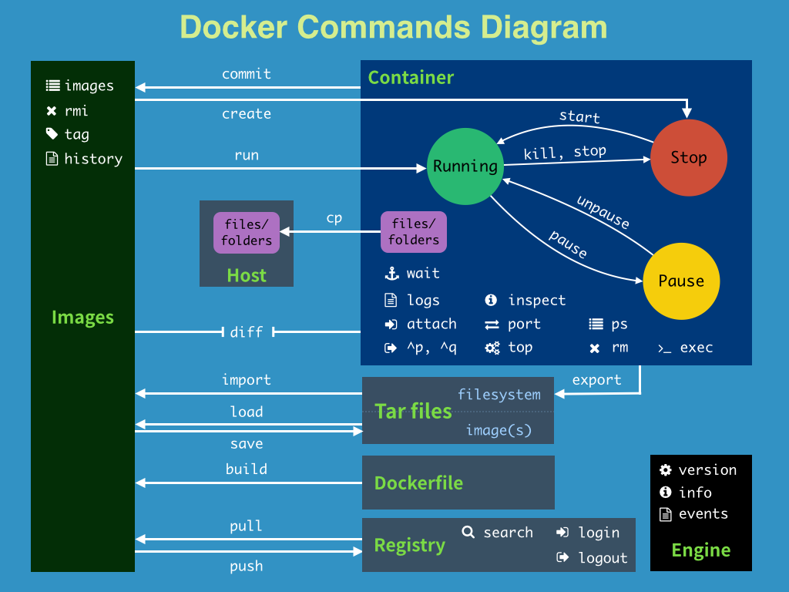
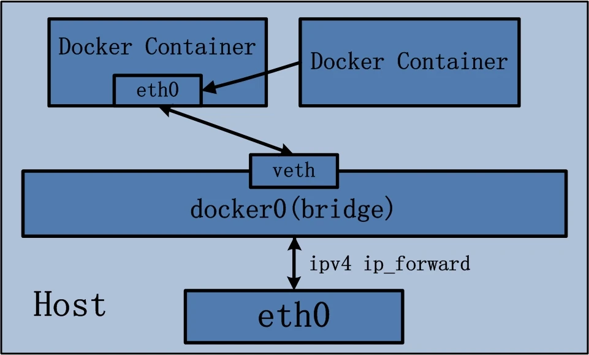

# 一、Docker概述

## 1. Docker简介

Docker是基于Go语言实现的云开源项目。

Docker的主要目标是：`Build, Ship and Run Any App, Anywhere`，也就是通过对应用组件的封装、分发、部署、运行等生命周期的管理，使用户的APP及其运行环境能做到**一次镜像,处处运行**。

## 2. 传统虚拟机和容器

> 传统虚拟机（virtual machine）：

传统虚拟机技术基于安装在主操作系统上的虚拟机管理系统（如VirtualBox、VMware等），创建虚拟机（虚拟出各种硬件），在虚拟机上安装从操作系统，在从操作系统中安装部署各种应用。

**缺点：资源占用多、冗余步骤多、启动慢**

> Linux容器（Linux Container，简称LXC）：

Linux容器是与系统其他部分分隔开的一系列进程，从另一个镜像运行，并由该镜像提供支持进程所需的全部文件。容器提供的镜像包含了应用的所有依赖项，因而在从开发到测试再到生产的整个过程中，它都具有可移植性和一致性。

Linux容器不是模拟一个完整的操作系统，而是对进程进行隔离。有了容器，就可以将软件运行所需的所有资源打包到一个隔离的容器中。容器与虚拟机不同，不需要捆绑一整套操作系统，只需要软件工作所需的库资源和设置。系统因此而变得高效轻量并保证部署在任何环境中的软件都能始终如一的运行。


> 对比：

| 特性         | 容器               | 虚拟机     |
| ------------ | ------------------ | ---------- |
| 启动         | 秒级               | 分钟级     |
| 大小         | 一般为Mb           | 一般为Gb   |
| 速度         | 接近原生           | 比较慢     |
| 系统支持数量 | 单机支持上千个容器 | 一般几十个 |

## 3. Docker运行速度快的原因

> Docker有比虚拟机更少的抽象层：
>
> 由于Docker不需要Hypervisor（虚拟机）实现硬件资源虚拟化，运行在Docker容器上的程序直接使用的都是实际物理机的硬件资源，因此在CPU、内存利用率上docker有明显优势。
>
> Docker利用的是宿主机的内核，而不需要加载操作系统OS内核：
>
> 当新建一个容器时，Docker不需要和虚拟机一样重新加载一个操作系统内核。进而避免引寻、加载操作系统内核返回等比较耗时耗资源的过程。当新建一个虚拟机时，虚拟机软件需要加载OS，返回新建过程是分钟级别的。而Docker由于直接利用宿主机的操作系统，则省略了返回过程，因此新建一个docker容器只需要几秒钟。
>
> Docker容器的本质就是一个进程。

## 4. Docker软件

Docker并非一个通用的容器工具，它依赖于已经存在并运行的Linux内核环境。（在Windows上安装Docker时需要依赖WLS，也即Windows下的Linux子系统）。

Docker实质上是在已经运行的Linux下制造了一个隔离的文件环境，因此它执行的效率几乎等同于所部署的Linux主机。

Docker的基本组成部分：

- 镜像（image）

- 容器（container）

- 仓库（repository）

### 1. Docker镜像

Docker镜像就是一个只读的模板。镜像可以用来创建Docker容器，一个镜像可以创建多个容器。

### 2. Docker容器

Docker利用容器独立运行的一个或一组应用，应用程序或服务运行在容器里面，容器就类似于一个虚拟化的运行环境，容器是用镜像创建的运行实例。

### 3. Docker仓库

Docker仓库是集中存放镜像文件的场所。

仓库分为公开仓库和私有仓库两种。

最大的公开仓库是Docker官方的Docker Hub：<https://hub.docker.com/>

## 5. Docker架构

Docker是一个 C/S（Client-Server） 结构的系统，后端是一个松耦合架构，众多模块各司其职。

Docker守护进程运行在主机上，然后通过Socket连接从客户端访问，守护进程从容器接收命令并管理运行在主机上的容器。


Docker运行的基本流程为：

1. 用户是使用Docker Client 与 Docker Daemon 建立通信，并发送请求给后者

1. Docker Daemon 作为 Docker 架构的主体部分，首先提供 Docker Server 的功能使其可以接收 Docker Client 的请求

1. Docker Engine 执行 Docker 内部的一系列工作，每一项工作都是以一个 Job 的形式存在

1. Job 的运行过程中，当需要容器镜像时，则从 Docker Registry 中下载镜像，并通过镜像管理驱动 Graph Driver 将下载镜像以 Graph 的形式存储

1. 当需要为 Docker 创建网络环境时，通过网络管理驱动 Network driver 创建并配置 Docker 容器网络环境

1. 当需要限制 Docker 容器运行资源或执行用户指令等操作时，则通过 Exec driver 来完成

1. Libcontainer 是一项独立的容器管理包，Network driver 以及 Exec driver 都是通过 Libcontainer 来实现具体对容器进行的操作


# 二、Docker安装

## 1. CentOS安装Docker

参考官网：<https://docs.docker.com/engine/install/centos/>

>  卸载旧版本

如果之前安装过Docker，需要先卸载旧版本：

```shell
sudo yum remove docker \
                  docker-client \
                  docker-client-latest \
                  docker-common \
                  docker-latest \
                  docker-latest-logrotate \
                  docker-logrotate \
                  docker-engine
```

旧版本的Docker引擎包可能叫做：`docker`、`docker-engine`。

 新版本的Docker引擎包叫做：`docker-ce`


> 配置yum资源库

安装`yum-config-manager`：

```shell
# yum-util提供yum-config-manager功能 
sudo yum install -y yum-utils
```

配置docker的资源库地址：

官方地址：（比较慢，不推荐）

```shell
# 在yum资源库中添加docker资源库
sudo yum-config-manager --add-repo https://download.docker.com/linux/centos/docker-ce.repo
```

阿里云镜像地址：

```shell
sudo yum-config-manager --add-repo https://mirrors.aliyun.com/docker-ce/linux/centos/docker-ce.repo
```

阿里云官网提供了很多资源镜像，镜像地址：`https://mirrors.aliyun.com`，进入之后可以选择自己需要的资源进行配置

创建缓存（可选）：

```shell
yum makecache fast
```


> 安装Docker引擎

安装最新版本的Docker引擎、Docker客户端：

```shell
# docker-ce是Docker引擎，docker-ce-cli是客户端
sudo yum install docker-ce docker-ce-cli containerd.io docker-compose-plugin
```

此时，默认安装的docker引擎、客户端都是最新版本。

如果要安装指定版本：

```shell
# 查询版本列表
yum list docker-ce --showduplicates | sort -r

# 指定版本安装17.09.0.ce版
# sudo yum install docker-ce-<VERSION_STRING> docker-ce-cli-<VERSION_STRING> containerd.io docker-compose-plugin
sudo yum install docker-ce-17.09.0.ce docker-ce-cli-17.09.0.ce containerd.io docker-compose-plugin
```


> 启动docker引擎

如果没有启动Docker引擎，那么执行 `docker version`查看版本号时，只能看到 `Client: Docker Engine`（Docker引擎客户端）的版本号。

启动Docker引擎：

```shell
# 新版本的Docker就是一个系统服务，可以直接使用启动系统服务方式启动
systemctl start docker

# 此时查看docker版本，可以看到Server: Docker Engine（Docker引擎）版本号
docker version
```


## 2. 卸载Docker

卸载Docker步骤：

1.  关闭服务 

```shell
systemctl stop docker
```

2. 使用`yum`删除docker引擎 

```shell
sudo yum remove docker-ce docker-ce-cli containerd.io
```

3. 删除镜像、容器、卷、自定义配置等文件 

```shell
 sudo rm -rf /var/lib/docker
 sudo rm -rf /var/lib/containerd
```

 

## 3. 运行HelloWorld测试

运行HelloWorld：

```shell
docker run hello-world
```


## 4. Ubuntu安装Docker

> 卸载旧版本

卸载旧版本Docker（如果已经安装）：

```shell
sudo apt-get remove docker docker-engine docker.io containerd runc
```

> 安装依赖

安装必要的依赖：

```shell
sudo apt-get update
sudo apt-get install apt-transport-https ca-certificates curl gnupg lsb-release
```

> 添加docker软件源

官网源：(不推荐，可能会连不上报错)

```shell
# 导入源仓库的 GPG key
curl -fsSL https://download.docker.com/linux/ubuntu/gpg | sudo apt-key add -

# 将 Docker APT 软件源添加到你的系统
sudo add-apt-repository "deb [arch=amd64] https://download.docker.com/linux/ubuntu $(lsb_release -cs) stable"
```

阿里云源（推荐）：

```shell
# 添加Docker GPG密钥
curl -fsSL https://mirrors.aliyun.com/docker-ce/linux/ubuntu/gpg | sudo gpg --dearmor -o /usr/share/keyrings/docker-archive-keyring.gpg

# 添加Docker软件源信息
echo "deb [arch=amd64 signed-by=/usr/share/keyrings/docker-archive-keyring.gpg] https://mirrors.aliyun.com/docker-ce/linux/ubuntu $(lsb_release -cs) stable" | sudo tee /etc/apt/sources.list.d/docker.list > /dev/null
```

> 安装docker

更新软件源并安装Docker：

```shell
sudo apt-get update
sudo apt-get install docker-ce docker-ce-cli containerd.io
```

> 启动并测试Docker

```shell
sudo systemctl start docker
sudo docker run hello-world
```


## 5. 离线安装

> 下载安装

从docker官网（或者国内镜像站）下载对应linux版本的安装包，例如[docker-27.0.3.tgz](https://mirrors.ustc.edu.cn/docker-ce/linux/static/stable/x86_64/docker-27.0.3.tgz)。

将安装包上传到服务器，解压：

```shell
tar -zxvf docker-27.0.3.tgz
```

解压出来的文件的所有者可能不是root，修改为root用户：

```shell
chown -R root:root docker/
```

将解压的文件移动到`/usr/bin`下：

```shell
\cp -f docker/* /usr/bin
```

启动测试：

```shell
dockerd
```


> 配置成系统服务

将docker添加到systemd：

编辑文件`/usr/lib/systemd/system/docker.service`。

文件内容参考：[github的docker-ce官方文档](https://github.com/docker-archive/docker-ce/blob/master/components/engine/contrib/init/systemd/docker.service)

```properties
[Unit]
Description=Docker Application Container Engine
Documentation=https://docs.docker.com
After=network-online.target docker.socket firewalld.service 
Wants=network-online.target 
Requires=docker.socket

[Service]
Type=notify
ExecStart=/usr/bin/dockerd
ExecReload=/bin/kill -s HUP $MAINPID
TimeoutStartSec=0
RestartSec=2
Restart=always

StartLimitBurst=3
StartLimitInterval=60s
LimitNOFILE=infinity
LimitNPROC=infinity
LimitCORE=infinity

TasksMax=infinity

Delegate=yes

KillMode=process
OOMScoreAdjust=-500

[Install]
WantedBy=multi-user.target
```

为`docker.service`添加执行权限：

```shell
chmod +x /usr/lib/systemd/system/docker.service
```


> 配置docker

创建`docker`组：

```shell
groupadd docker
```

编辑`daemon.json`配置文件：

文件：`/etc/docker/daemon.json`

```json
{
    // 还可以在这个文件中配置加速器、镜像仓库地址等
    "insecure-registries": [
        // 配置不验证https证书、允许http连接
        "192.168.xxx.xxx:8088"
    ],
    "data-root":"/data/docker",
    "log-driver":"json-file",
    "log-opts":{
        "max-size":"200m","max-file":"3"
    }
}
```

重载配置：

```shell
systemctl daemon-reload
```


> 启动docker并设置开机自启

启动docker：

```shell
systemctl start docker
```

设置开机自启：

```shell
systemctl enable docker
```

检验：

```shell
docker version
```


> 配置命令自动补全

从docker的github官方仓库获取命令补全的文件：[docker](https://github.com/docker-archive/docker-ce/blob/master/components/cli/contrib/completion/bash/docker)

将该文件放到`/usr/share/bash-completion/completions`，启用该文件：

```shell
source /usr/share/bash-completion/completions/docker
```


# 三、Docker下载加速

## 1. docker下载加速

方式1：使用 网易数帆、阿里云等容器镜像仓库进行下载。

例如，下载网易数帆镜像中的mysql。（网易数帆的地址为 `hub.c.163.com`，网易数帆对dockerhub官方的镜像命名空间为 `library`）。

```shell
docker pull hub.c.163.com/library/mysql:latest
```

方式2：配置阿里云加速。

登录阿里云，进入 `工作台` -> `容器镜像服务` -> `镜像工具` -> `镜像加速器`。

里面提供了一个加速器地址：`https://xxxxx.mirror.aliyuncs.com`，将该地址配置到docker中：

```shell
cd /etc/docker

# 初次进来时没有/etc/docker/daemon.json文件，直接创建该文件即可
vi /etc/docker/daemon.json
```

在`daemon.json`中写入以下内容：（即加速器地址）

```json
{
  "registry-mirrors": ["https://xxxxx.mirror.aliyuncs.com"]  
}
```

然后刷新配置、重启docker即可：

```shell
# centos6 的命令
sudo chkconfig daemon-reload
sudo service docker restart

# centos7 的命令
sudo systemctl daemon-reload
sudo systemctl restart docker
```

使用方式2可以直接下载官方的镜像，且镜像tag为官方tag，不需要加上云服务商的地址。

例如：

```shell
docker pull mysql:latest
```

## 2. Docker配置代理

如果使用了科学上网，可以为docker配置代理。

在`/etc/docker/daemon.json`文件中加入以下内容：

```json
{
  "proxies": {
    "http-proxy": "http://127.0.0.1:7890",  // 代理地址
    "https-proxy": "http://127.0.0.1:7890",
    "no-proxy": "localhost"
  }
}
```


# 四、Docker常用命令

## 1. 启动类命令

启动docker：

```shell
systemctl start docker
```

停止Docker：

```shell
systemctl stop docker
```

重启Docker：

```shell
systemctl restart docker
```

查看状态：

```shell
systemctl status docker
```

设置开机自启：

```shell
systemctl enable docker
```


## 2. 帮助类命令

查看Docker版本：

```shell
docker version
```

查看Docker概要信息：

```shell
docker info
```

查看Docker总体帮助文档：

```shell
docker --help
```

查看docker具体命令帮助文档：

```shell
docker 具体命令 --help
```


## 3. 镜像命令

> 列出本地主机上的镜像

```shell
docker images
```

参数：

- `-a`：列出所有镜像（含历史镜像）

- `-q`：只显示镜像ID

- `-f`：过滤

> 在远程仓库中搜索镜像

（默认取docker hub中搜索）

```shell
docker search 镜像名称
```

参数：

- `-f`：过滤

- `--limit 数量`：只展示前几项

> 下载镜像

```shell
docker pull 镜像名称[:tag]
```

不加 tag 时，默认下载最新的镜像（即tag为`latest`）。

> 查看占据的空间

查看镜像/容器/数据卷所占的空间：

```shell
docker system df
```

> 删除镜像

```shell
docker rmi 镜像名称/ID
```

可以使用空格分隔，删除多个镜像：

```shell
docker rmi 镜像1 镜像2 镜像3
```

删除全部镜像：

```shell
docker rmi -f $(docker images -qa)
```


## 4. 虚悬镜像

仓库名、标签都是`<none>`的镜像，俗称虚悬镜像（dangling image）。


## 5. 命令自动补全

docker支持命令自动补全功能，当输入镜像名前几位时，可以按`tab`键自动补全镜像名称、tag等。

```shell
# 如果镜像中有ubuntu，查看输入ub按下tab是否可以补全
docker run ub
```

如果按下`tab`时没有自动补全，可以按以下步骤操作：

1.  检查是否安装了`bash-completion`（命令补全增强包） 

```shell
# 检查有 /usr/share/bash-completion/bash_completion 这个文件
ls /usr/share/bash-completion/bash_completion
```

2. 如果有`/usr/share/bash-completion`目录，但是没有`/usr/share/bash-completion/bash_completion`文件（centos6为`/etc/bash_completion`文件），则需要安装`bash-completion` 

```shell
yum -y install bash-completion
```

3. 检查是否安装了docker的自动补全 

```shell
# 检查/usr/share/bash-completion/completions文件夹下是否有docker开头的自动补全
# docker安装完后会在该文件夹下生成自动补全文件docker
# 如果安装了docker-compose，则该文件夹下还会有 docker-compose文件
ll /usr/share/bash-completion/completions/docker*
```

4. 如果已经安装了docker自动补全，使用`source`命令使其生效 

```shell
source /usr/share/bash-completion/completions/docker
```

5. 再次使用`tab`查看是否可以自动补全 

```shell
# 如果镜像中有ubuntu，查看输入ub按下tab是否可以补全
docker run ub
```

6. 如果有报错，且报错中提示`_get_comp_words_by_ref: command not found`。说明`bash-completion`的配置文件没有生效，需要`source`一下 

```shell
# 对于centos7，bash-completion安装的是2.x版本，配置文件为/usr/share/bash-completion/bash_completion
source /usr/share/bash-completion/bash_completion

# 如果是centos6，自动安装的bash-completion最新版为1.x版本，配置文件为/etc/bash_completion
# bash /etc/bash_completion
```

7. 再次使用`tab`查看是否可以自动补全 

```shell
# 如果镜像中有ubuntu，查看输入ub按下tab是否可以补全
docker run ub
```

 

# 五、容器命令

## 1. 新建启动容器

```shell
docker run [OPTIONS] IMAGE [COMMAND] [ARG...]
```

常用的参数：

- `--name`：为容器指定一个名称

- `-d`：后台运行容器并返回容器ID，也即启动守护式容器

- `-i`：以交互模式（interactive）运行容器，通常与`-t`同时使用

- `-t`：为容器重新分配一个伪输入终端（tty），通常与`-i`同时使用。也即启动交互式容器（前台有伪终端，等待交互）

- `-e`：为容器添加环境变量


- `-u, --user=""`， 指定容器的用户
- `-a, --attach=[]`， 登录容器（必须是以docker run -d启动的容器）
- `-w, --workdir=""`， 指定容器的工作目录
- `-c, --cpu-shares=0`， 设置容器CPU权重，在CPU共享场景使用
- `-m, --memory=""`， 指定容器的内存上限
- `-P`：随机端口映射。将容器内暴露的所有端口映射到宿主机随机端口
- `-p`：指定端口映射
  - `-p hostPort:containerPort`：端口映射，例如`-p 8080:80`
  - `-p ip:hostPort:containerPort`：配置监听地址，例如 `-p 10.0.0.1:8080:80`
  - `-p ip::containerPort`：随机分配端口，例如 `-p 10.0.0.1::80`
  - `-p hostPort1:containerPort1 -p hostPort2:containerPort2`：指定多个端口映射，例如`-p 8080:80 -p 8888:3306`
- `-h, --hostname=""`， 指定容器的主机名
- `-v, --volume=[]`， 给容器挂载存储卷，挂载到容器的某个目录
- `--volumes-from=[]`， 给容器挂载其他容器上的卷，挂载到容器的某个目录
- `--cap-add=[]`， 添加权限，权限清单详见：[http://linux.die.net/man/7/capabilities](https://links.jianshu.com/go?to=http%3A%2F%2Flinux.die.net%2Fman%2F7%2Fcapabilities)
- `--cap-drop=[]`， 删除权限，权限清单详见：[http://linux.die.net/man/7/capabilities](https://links.jianshu.com/go?to=http%3A%2F%2Flinux.die.net%2Fman%2F7%2Fcapabilities)
- `--cidfile=""`， 运行容器后，在指定文件中写入容器PID值，一种典型的监控系统用法
- `--cpuset=""`， 设置容器可以使用哪些CPU，此参数可以用来容器独占CPU
- `--device=[]`， 添加主机设备给容器，相当于设备直通
- `--dns=[]`， 指定容器的dns服务器
- `--dns-search=[]`， 指定容器的dns搜索域名，写入到容器的/etc/resolv.conf文件
- `--entrypoint=""`， 覆盖image的入口点
- `--env-file=[]`， 指定环境变量文件，文件格式为每行一个环境变量
- `--expose=[]`， 指定容器暴露的端口，即修改镜像的暴露端口
- `--link=[]`， 指定容器间的关联，使用其他容器的IP、env等信息
- `--lxc-conf=[]`， 指定容器的配置文件，只有在指定--exec-driver=lxc时使用
- `--name=""`， 指定容器名字，后续可以通过名字进行容器管理，links特性需要使用名字
- `--net="bridge"`
  - bridge 使用docker daemon指定的网桥
  - host //容器使用主机的网络
  - container:NAME_or_ID >//使用其他容器的网路，共享IP和PORT等网络资源
  - none 容器使用自己的网络（类似--net=bridge），但是不进行配置
- `--privileged=false`， 指定容器是否为特权容器，特权容器拥有所有的capabilities
- `--restart="no"` 指定容器停止后的重启策略:
  - no：容器退出时不重启
  - on-failure：容器故障退出（返回值非零）时重启
  - always：容器退出时总是重启
- `--rm=false`， 指定容器停止后自动删除容器(不支持以docker run -d启动的容器)
- `--sig-proxy=true`， 设置由代理接受并处理信号，但是SIGCHLD、SIGSTOP和SIGKILL不能被代理


> 启动交互式容器

以交互方式启动ubuntu镜像

```shell
# -i 交互模式
# -t 分配一个伪输入终端tty
# ubuntu 镜像名称
# /bin/bash（或者bash） shell交互的接口
docker run -it ubuntu /bin/bash
```


退出交互模式：

方式1：

```shell
# 在交互shell中exit即可退回宿主机
exit;
```

方式2：使用快捷键`ctrl` + `P` + `Q`


方式1 退出后，容器会停止； 方式2 退出后容器依然正在运行。


> 启动守护式容器

大部分情况下，我们系统docker容器服务时在后台运行的，可以通过`-d`指定容器的后台运行模式：

```shell
docker run -d 容器名
```

注意事项：

如果使用`docker run -d ubuntu`尝试启动守护式的ubuntu，会发现容器启动后就自动退出了。

因为Docker容器如果在后台运行，就必须要有一个前台进程。容器运行的命令如果不是那些一直挂起的命令（例如`top`、`tail`），就会自动退出。


## 2. 列出正在运行的容器

列出所有正在运行的容器：

```shell
docker ps [OPTIONS]
```

常用参数：

- `-a`：列出当前所有正在运行的容器+历史上运行过的容器

- `-l`：显示最近创建的容器

- `-n`：显示最近n个创建的容器

- `-q`：静默模式，只显示容器编号

  

## 3. 容器其他启停操作

> 启动已经停止的容器

```shell
docker start 容器ID或容器名
```

> 重启容器

```shell
docker restart 容器ID或容器名
```

> 停止容器

```shell
docker stop 容器ID或容器名
```

> 强制停止容器

```shell
docker kill 容器ID或容器名
```


## 4. 删除容器

删除已经停止的容器：

```shell
docker rm 容器ID或容器名
```

删除容器是 `docker rm`，删除镜像是 `docker rmi`，注意区分。

强制删除正在运行的容器：

```shell
docker rm -f 容器ID或容器名
```

一次删除多个容器实例：

```shell
docker rm -f ${docker ps -a -q}

# 或者
docker ps -a -q | xargs docker rm
```

## 5. 查看容器日志

```shell
docker logs 容器ID或容器名
```

## 6. 查看容器内运行的进程

```shell
docker top 容器ID或容器名
```

## 7. 查看容器内部细节

```shell
docker inspect 容器ID或容器名
```

## 8. 进入正在运行的容器

进入正在运行的容器，并以命令行交互：

```shell
docker exec -it 容器ID bashShell
```

重新进入：

```shell
docker attach 容器ID
```

`docker exec` 和 `docker attach` 区别：

- `attach`直接进入容器启动命令的终端，不会启动新的进程，用`exit`退出会导致容器的停止

- `exec`是在容器中打开新的终端，并且可以启动新的进程，用`exit`退出不会导致容器的停止

如果有多个终端，都对同一个容器执行了 `docker attach`，就会出现类似投屏显示的效果。一个终端中输入输出的内容，在其他终端上也会同步的显示。


## 9. 容器和宿主机文件拷贝

容器内文件拷贝到宿主机：

```shell
docker cp 容器ID:容器内路径 目的主机路径
```

宿主机文件拷贝到容器中：

```shell
docker cp 主机路径 容器ID:容器内路径
```


## 10. 导入和导出容器

`export`：导出容器的内容流作为一个tar归档文件（对应`import`命令）；

`import`：从tar包中的内容创建一个新的文件系统再导入为镜像（对应`export`命令）；

示例：

```shell
# 导出
# docker export 容器ID > tar文件名
docker export abc > aaa.tar

# 导入
# cat tar文件 | docker import - 自定义镜像用户/自定义镜像名:自定义镜像版本号
cat aaa.tar | docker import - test/mytest:1.0.1
```


## 11. 将容器生成新镜像

`docker commit`提交容器副本使之成为一个新的镜像。

docker 启动一个镜像容器后， 可以在里面执行一些命令操作，然后使用`docker commit`将新的这个容器快照生成一个镜像。

```shell
docker commit -m="提交的描述信息" -a="作者" 容器ID 要创建的目标镜像名:[tag]
```


## 12. 容器数据卷

卷就是目录或文件，存在于一个或多个容器中，由docker挂载到容器，但不属于联合文件系统，因此能够绕过UnionFS，提供一些用于持续存储或共享数据。

特性：卷设计的目的就是数据的持久化，完全独立于容器的生存周期，因此Docker不会在容器删除时删除其挂载的数据卷。

特点：

- 数据卷可以在容器之间共享或重用数据

- 卷中的更改可以直接实施生效

- 数据卷中的更改不会包含在镜像的更新中

- 数据卷的生命周期一直持续到没有容器使用它为止

运行一个带有容器卷存储功能的容器实例：

```shell
docker run -it --privileged=true -v 宿主机绝对路径目录:容器内目录[rw|ro] 镜像名
```

Docker挂载主机目录，可能会出现报错：`cannot open directory .: Perission denied`。

解决方案：在命令中加入参数 `--privileged=true`。

CentOS7安全模块比之前系统版本加强，不安全的会先禁止，目录挂载的情况被默认为不安全的行为，在SELinux里面挂载目录被禁止掉了。如果要开启，一般使用 `--privileged=true`，扩大容器的权限解决挂载没有权限的问题。也即使用该参数，容器内的root才拥有真正的root权限，否则容器内的root只是外部的一个普通用户权限。


可以使用`docker inspect`查看容器绑定的数据卷。

权限：

-  `rw`：读写 （默认）

-  `ro`：只读。如果宿主机写入内容，可以同步给容器内，容器内可以读取。 

容器卷的继承：

```shell
# 启动一个容器u1，完成与宿主机的卷映射
docker run -it --privileged=true /tmp/test:/tmp/docker --name u1 ubuntu /bin/bash

# 容器u2使用 --volumes-from 继承 u1 的容器卷映射配置
docker run -it --privileged=true --volumes-from u1 --name u2 ubuntu
```


## 13. 所有命令示意图




# 六、Docker镜像

## 1. 镜像

镜像是一种轻量级、可执行的独立软件包，它包含运行某个软件所需的所有内容，我们把应用程序和配置依赖打包好行程一个可交付的运行环境（包括代码、运行时需要的库、环境变量和配置文件等），这个打包好的运行环境就是image镜像文件。

## 2. Docker镜像加载原理

### 1. 联合文件系统

Docker 中的文件存储驱动叫做 storage driver。

Docker 最早支持的stotage driver是 AUFS，它实际上由一层一层的文件系统组成，这种层级的文件系统叫UnionFS。

联合文件系统（UnionFS）：Union 文件系统，是一种分层、轻量级并且高性能的文件系统，它支持对文件系统的修改作为一次提交来一层层的叠加，同时可以将不同目录挂载到同一个虚拟文件系统下（unite serveral directories into a single virtual filesystem）。

Union文件系统是Docker镜像的基础。镜像可以通过分层来进行集成，基于基础镜像可以制作具体的应用镜像。

特性：一次同时加载多个文件系统，但从外面看起来，只能看到一个文件系统，联合加载会把各层文件系统叠加起来，这样最终的文件系统会包含所有底层的文件和目录。

后来出现的docker版本中，除了AUFS，还支持OverlayFS、Btrfs、Device Mapper、VFS、ZFS等storage driver。

### 2. bootfs和rootfs

bootfs（boot file system）主要包含 bootloader 和 kernel，bootloader主要是引导加载 kernel，Linux刚启动时会加载bootfs文件系统。

在Docker镜像的最底层是引导文件系统bootfs。这一层与我们典型的Linux/Unix系统是一样的，包含boot加载器和内核。当boot加载完成之后整个内核就都在内存中了，此时内存的使用权已经由 bootfs 转交给内核，此时系统也会卸载 bootfs。

rootfs（root file system），在bootfs之上，包含的就是典型Linux系统中的 /dev、/proc、/bin、/etc等标准目录和文件。rootfs就是各种不同的操作系统发行版，比如Ubuntu、CentOS等。

docker镜像底层层次：


对于一个精简的OS，rootfs可以很小，只需要包括最基本的命令、工具和程序库就可以了，因为底层直接使用Host的Kernel，自己只需要提供rootfs就可以。所以，对于不同的Linux发行版，bootfs基本是一致的，rootfs会有差别，不同的发行版可以共用bootfs。

有差别的rootfs：


### 3. 镜像分层

Docker支持扩展现有镜像，创建新的镜像。新镜像是从base镜像一层一层叠加生成的。

例如：

```shell
# Version: 0.0.1
FROM debian  # 直接在debain base镜像上构建
MAINTAINER mylinux
RUN apt-get update && apt-get install -y emacs # 安装emacs
RUN apt-get install -y apache2 # 安装apache2
CMD ["/bin/bash"] # 容器启动时运行bash
```

镜像创建过程：


## 3. 镜像分层的优势

镜像分层的一个最大好处就是共享资源，方便复制迁移，方便复用。

## 4. 容器层

当容器启动时，一个新的可写层将被加载到镜像的顶部，这一层通常被称为容器层，容器层之下的都叫镜像层。

所有对容器的改动，无论添加、删除、还是修改文件都只会发生在容器层中。

只有容器层是可写的，容器层下面的所有镜像层都是只读的。

如图：


# 七、nexus搭建docker私仓

## 1. 使用nexus创建docker私有仓库

Nexus的安装请参考该文档：<https://www.yuque.com/tmfl/pom/uumrx2>

Nexus配置Docker仓库步骤；

1.  nexus默认docker是失效的，需要 在`security` --> `Realms`，将docker配置成`Active` 

2. 在 `Repository` 的 `Blob Store` 中创建一个用于存放docker镜像的存储。内网没有`S3`的话，把`Type`配置为`file`就行。 

S3：Simple Storage Service，简单对象存储服务，即云存储。

3.  在 `Repository` 的 `Repositories` 中创建一个新的资源库，类型为 `docker-hosted`。 

创建的 `docker-hosted`资源库的相关配置：

4. `Name`：指定该资源库的名称，例如就叫 `docker-hosted``
5. ``Online`：默认勾选即可
6. `HTTP`：与下面的HTTPS，至少需要勾选其中一个选择框，并配置一个和nexus不同的端口号，例如 `8881`。将来docker客户端向镜像中心上传镜像时，需要向该端口号进行上传。
7. `HTTPS`：如果服务器可以开启https服务，则也可以勾选`HTTPS`，然后配置一个端口号，接收docker客户端上传上来的镜像。
8. `Allow anonymous docker pull`：允许匿名上传，默认不勾选
9. `Enable docker V1 API`：是否启用 docker早期`V1`版本的API，默认不勾选，即只启用`V2 API`：`http://xxx.xxx.xxx.xxx:8881/v2/``
10. ``Blob Store`：选择上面创建的docker镜像的存储
11. `Deployment Policy`：是否允许重复上传同一个资源，默认允许

配置好之后，修改防火墙设置，开启刚刚配置的`8881` 端口：

```shell
vim /etc/sysconfig/iptables
```

添加：

```plain
-A INPUT -p tcp -m tcp --dport 8881 -j ACCEPT
```

重启iptables：

```shell
service iptables restart
```


## 2. docker客户端的镜像导出和导入

镜像下载和导出：

```shell
# 下载镜像
docker pull mysql:8.0.28
# 将镜像导出成本地tar文件
docker save -o mysql-8.0.28.tar mysql:8.0.28
```

镜像的导入：

```shell
# 将本地文件导入到docker镜像中（docker会自动解析出文件中的tag，无需手动指定）
docker load < mysql-8.0.28.tar
```


## 3. docker 客户端向私仓上传镜像

> 配置docker允许接收`http`请求

docker默认只接收`https`请求，而我们的`nexus`私仓如果配置的是`HTTP`接口的话，docker直接连会报错：

```plain
server gave HTTP response to HTTPS client
```

需要配置docker允许连接我们私仓的`http`。

```shell
vim /usr/lib/systemd/system/docker.service
```

在其中的`ExecStart` 选项后面，添加 `--insecure-registry {docker 私有镜像库 IP} --ipv6=false`。

例如：

```plain
[Service]

#  前面的-H参数可能不同，不需要管，只需在最后面加上我们的私仓地址即可：--insecure-registry 192.168.x.xxx:8881 --ipv6=false

ExecStart=/usr/bin/dockerd -H tcp://0.0.0.0:2375 -H unix://var/run/docker.sock --insecure-registry 192.168.x.xxx:8881 --ipv6=false
```

然后重启docker：

```shell
# centos6 的命令
sudo chkconfig daemon-reload
sudo service docker restart

# centos7 的命令
sudo systemctl daemon-reload
sudo systemctl restart docker
```

也可以在`/etc/docker/daemon.json` 中进行配置：

```json
{
    "insecure-reigstries":["192.168.xxx.xxx:8881"]
}
```

> 向私仓推送镜像

1.  如果私仓不允许匿名上传镜像，则需要先进行登陆。（一般私仓都不允许匿名上传，`nexus`默认匿名上传也没有勾选） 

```shell
# --username后面为nexus用户名，执行命令后会提示输入密码
docker login --username=admin http://192.168.xxx.xxx:8881
# 登录之后，会在 $HOME/.docker/config.json 中记录下登录的用户信息，之后便不需要再进行登陆操作
# 如果要取消登录，则只需执行以下命令
# docker logout http://192.168.xxx.xxx:8881
```

2.  将要上传的镜像重新设置`Tag`。
   docker按照镜像名称区分上传的资源库。
   例如：
   `mysql:8.0.28`会被上传到docker官方`dockerhub`；
   `tengyer/helloworld:lasted`会被上传到dockerhub的`tengyer`命名空间中；
   `registry.cn-hangzhou.aliyuncs.com/命名空间/镜像名称:[镜像版本号]` 会上传到阿里云指定命名空间中；
   `ccr.ccs.tencentyun.com/命名空间/hello-world`：会上传到腾讯云指定命名空间中；
   `hub.c.163.com/命名空间/hello-world`：会上传到网易数帆指定命名空间中；
   所以，我们如果要上传到我们的私仓，需要将`Tag`修改为`xxx.xxx.xxx.xxx:8881/命名空间/mysql:5.0.27`格式： 

```shell
# 将mysql:8.0.28复制出一个私仓格式的Tag
# 该操作在 docker images中会多出一个复制出来的tag，但是ImageId和原始的相同
# 加个official命名空间，方便区分这个镜像是从官方镜像下载下来的，不加命名空间也可以上传
docker tag [ImageId] xxx.xxx.xxx.xxx:8881/official/mysql:8.0.28
```

3.  将修改好`Tag`的镜像进行上传： 

```shell
docker push xxx.xxx.xxx.xxx:8881/official/mysql:8.0.28
```

 

# 八、Registry搭建docker私仓

## 1. Docker Registry

Docker Registry是官方提供的工具，用于构建私有镜像仓库。

## 2. 环境搭建

Docker Registry也是Docker Hub提供的一个镜像，可以直接拉取运行。

步骤：

1.  拉取镜像 

```shell
docker pull registry
```

2.  启动Docker Registry 

```shell
docker run -d -p 5000:5000 -v /app/myregistry/:/tmp/registry --privileged=true registry
```

3.  验证（查看私服中的所有镜像） 

```shell
curl http://192.168.xxx.xxx:5000/v2/_catalog
```

Registry会返回json格式的所有镜像目录  

## 3. 向Registry私仓中上传镜像

> 配置docker允许接收`http`请求

（配置方式和上传到nexus私仓相同）。

修改`/etc/docker/daemon.json`，添加`insecure-registries`允许http：

```json
{
    "registry-mirros": ["https://xxxx.mirror.aliyuncs.com"],
    "insecure-registries": ["192.168.xxx.xxx:5000"]
}
```

然后重启docker：（新版本的docker会立即生效）

```shell
# centos7 的命令
sudo systemctl daemon-reload
sudo systemctl restart docker
```


> 推送到私仓

步骤：

1.  添加一个对应私仓地址的tag 

```shell
docker tag myubuntu:1.0.1 192.168.xxx.xxx:5000/myubuntu:1.0.1
```

2.  push到私仓 

```shell
docker push 192.168.xxx.xxx:5000/myubuntu:1.0.1
```

3.  查看私仓中镜像目录验证 

```shell
curl http://192.168.xxx.xxx:5000/v2/_catalog
```

 拉取验证：

```shell
docker pull 192.169.xxx.xxx:5000/myubuntu:1.0.1
```


# 九、Docker安装Mysql

以安装 Mysql 5.7为例：

```shell
docker pull mysql:5.7
```

## 1. Mysql 单机

### 1. 简单版 Mysql 5.7 安装

简单的启动Mysql容器：

```shell
# 需要使用 -e 配置环境变量 MYSQL_ROOT_PASSWORD（mysql root用户的密码）
docker run -p 3306:3306 -e MYSQL_ROOT_PASSWORD=root -d mysql:5.7
```

简单版的Mysql会存在以下问题：

- 中文乱码

- 没有容器卷映射

启动docker容器后，可以正常的连接、创建数据库，创建表，插入数据。但是插入中文则会报错。

例如：

```sql
-- 创建db01数据库
create database db01;
-- 切换到db01;
use db01;
-- 创建表
create table t1(id int, name varchar(20));

-- 插入英文可以正常插入
insert into t1 values(1, 'abc');

-- 插入中文报错
insert into t1 values(2, '张三');
```

这是因为docker默认的字符集的问题，可以在mysql中使用以下命令查看数据库字符集：

```sql
show variables like 'character%';
```

返回的字符集中，`character_set_database`、`character_set_server`等都为`latin1`字符集，所以会报错。

而且因为启动容器时没有配置容器卷映射，当容器意外被删时，数据无法找回。

### 2. 实际应用版 Mysql 5.7安装

启动 Mysql 容器，并配置容器卷映射：

```shell
docker run -d -p 3306:3306 \
           --privileged=true \
           -v /app/mysql/log:/var/log/mysql \
           -v /app/mysql/data:/var/lib/mysql \
           -v /app/mysql/conf:/etc/mysql/conf.d \
           -e MYSQL_ROOT_PASSWORD=123456 \
           --name mysql \
           mysql:5.7
```

在`/app/mysql/conf`下新建 `my.cnf`，通过容器卷同步给mysql实例，解决中文乱码问题：

```plain
[client]
default-character-set=utf8
[mysqld]
collation_server = utf8_general_ci
character_set_server = utf8
```

重启mysql容器，使得容器重新加载配置文件：

```shell
docker restart mysql
```

此时便解决了中文乱码（中文插入报错）问题。

而且因为启动时将容器做了容器卷映射，将mysql的配置（映射到`/app/mysql/conf`）、数据（映射到`/app/mysql/data`）、日志（映射到`/app/mysql/log`）都映射到了宿主机实际目录，所以即使删除了容器，也不会产生太大影响。只需要再执行一下启动Mysql容器命令，容器卷还按相同位置进行映射，所有的数据便都可以正常恢复。

## 2. Mysql 主从复制安装

> **安装主服务器容器实例（端口号3307）：**

1.  启动容器实例 

```shell
docker run -p 3307:3306 \
           --name mysql-master \
           --privileged=true \
           -v /app/mysql-master/log:/var/log/mysql \
           -v /app/mysql-master/data:/var/lib/mysql \
           -v /app/mysql-master/conf:/etc/mysql/conf.d \
           -e MYSQL_ROOT_PASSWORD=123456 \
           -d mysql:5.7
```

2.  进入`/app/mysql-master/conf`，新建`my.cnf`配置文件： 

```plain
[mysqld]
## 设置server_id, 同一个局域网中需要唯一
server_id=101
## 指定不需要同步的数据库名称
binlog-ignore-db=mysql
## 开启二进制日志功能
log-bin=mall-mysql-bin
## 设置二进制日志使用内存大小（事务）
binlog_cache_size=1M
## 设置使用的二进制日志格式（mixed,statement,row）
binlog_format=mixed
## 二进制日志过期清理时间。默认值为0，表示不自动清理
expire_logs_days=7
## 跳过主从复制中遇到的所有错误或指定类型的错误，避免slave端复制中断
## 如：1062错误是指一些主键重复，1032错误是因为主从数据库数据不一致
slave_skip_errors=1062
```

3.  重启容器实例 

```shell
docker restart mysql-master
```

4.  进入容器实例内 

```shell
docker exec -it mysql-master /bin/bash
```

5.  登录mysql，创建数据同步用户 

```sql
-- 首先使用 mysql -uroot -p 登录mysql
-- 创建数据同步用户
create user 'slave'@'%' identified by '123456'; --mysql5.7
ALTER USER 'slave'@'%' IDENTIFIED WITH mysql_native_password BY '123456'; --mysql5.8
-- 授权
grant replication slave, replication client on *.* to 'slave'@'%';
flush privileges;
```

> **安装从服务器容器实例（端口号3308）：**

1.  启动容器服务： 

```shell
docker run -p 3308:3306 \
           --name mysql-slave \
           --privileged=true \
           -v /app/mysql-slave/log:/var/log/mysql \
           -v /app/mysql-slave/data:/var/lib/mysql \
           -v /app/mysql-slave/conf:/etc/mysql/conf.d \
           -e MYSQL_ROOT_PASSWORD=123456 \
           -d mysql:5.7
```

2.  进入`/app/mysql-slave/conf`目录，创建`my.cnf`配置文件： 

```plain
[mysqld]
## 设置server_id, 同一个局域网内需要唯一
server_id=102
## 指定不需要同步的数据库名称
binlog-ignore-db=mysql
## 开启二进制日志功能，以备slave作为其它数据库实例的Master时使用
log-bin=mall-mysql-slave1-bin
## 设置二进制日志使用内存大小（事务）
binlog_cache_size=1M
## 设置使用的二进制日志格式（mixed,statement,row）
binlog_format=mixed
## 二进制日志过期清理时间。默认值为0，表示不自动清理
expire_logs_days=7
## 跳过主从复制中遇到的所有错误或指定类型的错误，避免slave端复制中断
## 如：1062错误是指一些主键重复，1032是因为主从数据库数据不一致
slave_skip_errors=1062
## relay_log配置中继日志
relay_log=mall-mysql-relay-bin
## log_slave_updates表示slave将复制事件写进自己的二进制日志
log_slave_updates=1
## slave设置只读（具有super权限的用户除外）
read_only=1
```

3.  修改完配置需要重启slave容器实例 

```shell
docker restart mysql-slave
```

 在主数据库中查看主从同步状态：

1.  进入主数据库容器： 

```shell
docker exec -it mysql-master /bin/bash
```

2.  进入Mysql 

```shell
mysql -uroot -p
```

3.  查看主从同步状态 

```sql
show master status;
```

主要查看返回结果的文件名`File`、当前位置`Position` 

进入从数据库容器，配置主从复制：

1.  进入从数据库容器： 

```shell
docker exec -it mysql-slave /bin/bash
```

2.  进入数据库 

```shell
mysql -uroot -p
```

3.  配置从数据库所属的主数据库： 

```sql
-- 格式：
-- change master to master_host='宿主机ip',master_user='主数据库配置的主从复制用户名',master_password='主数据库配置的主从复制用户密码',master_port=宿主机主数据库端口,master_log_file='主数据库主从同步状态的文件名File',master_log_pos=主数据库主从同步状态的Position,master_connect_retry=连接失败重试时间间隔（秒）;

change master to master_host='192.168.xxx.xxx',master_user='slave',master_password='123456',master_port=3307,master_log_file='mall-mysql-bin.000001',master_log_pos=769,master_connect_retry=30;
```

4.  从库中查看主从同步状态： 

```sql
# \G 可以将横向的结果集表格转换成纵向展示。
# slave status的字段比较多，纵向展示比友好
show slave status \G;
```

除了展示刚刚配置的主数据库信息外，主要关注 `Slave_IO_Running`、`Slave_SQL_Running`。目前两个值应该都为 `No`，表示还没有开始。 

1.  在从库中开启主从同步： 

```sql
start slave;
```

2.  再次查看主从同步状态，`Slave_IO_Running`、`Slave_SQL_Running`都变为`Yes`。 

主从复制测试：

1.  在主数据库上新建库、使用库、新建表、插入数据 

```sql
create database db01;
use db01;
create table t1 (id int, name varchar(20));
insert into t1 values (1, 'abc');
```

2.  在从数据库上使用库、查看记录 

```sql
show databases;
use db01;
select * from t1;
```

 

# 十、Docker安装Redis

以 Redis 6.0.8 为例：

```shell
docker pull redis:6.0.8
```

## 1. 单机版安装

### 1. 简单版 Redis

简单的启动Redis容器：

```shell
docker run -p 6379:6379 -d redis:6.0.8
```

简单版没有配置容器卷映射，当容器被删除时数据无法恢复。

### 2. 实际应用版Redis

配置文件、数据文件都和容器卷进行映射。

步骤：

1.  宿主机创建目录`/app/redis` 

2.  在`/app/redis`下创建文件`redis.conf`，主要修改以下几项配置 

```plain
# 开启密码验证（可选）
requirepass 123456

# 允许redis外地连接，需要注释掉绑定的IP
# bind 127.0.0.1

# 关闭保护模式（可选）
protected-mode no

# 注释掉daemonize yes，或者配置成 daemonize no。因为该配置和 docker run中的 -d 参数冲突，会导致容器一直启动失败
daemonize no

# 开启redis数据持久化， （可选）
appendonly yes
```

即最后的配置文件为：  

1.  启动docker容器：（因为要使用自定义的配置文件，所以需要指定容器运行的命令为`redis-server 容器内配置文件路径`） 

```shell
docker run -d -p 6379:6379 --name redis --privileged=true \
           -v /app/redis/redis.conf:/etc/redis/redis.conf \
           -v /app/redis/data:/data \
           redis:6.0.8 \
           redis-server /etc/redis/redis.conf
```


## 2. 3主3从Redis集群

### 1. 搭建

使用docker搭建3主3从的Redis集群，每台主机都对应一台从机。

**启动6台redis容器**

```shell
# 启动第1台节点
# --net host 使用宿主机的IP和端口，默认
# --cluster-enabled yes 开启redis集群
# --appendonly yes 开启redis持久化
# --port 6381 配置redis端口号
docker run -d --name redis-node-1 --net host --privileged=true -v /app/redis-cluster/share/redis-node-1:/data redis:6.0.8 --cluster-enabled yes --appendonly yes --port 6381

# 启动第2台节点
docker run -d --name redis-node-2 --net host --privileged=true -v /app/redis-cluster/share/redis-node-2:/data redis:6.0.8 --cluster-enabled yes --appendonly yes --port 6382

# 启动第3台节点
docker run -d --name redis-node-3 --net host --privileged=true -v /app/redis-cluster/share/redis-node-3:/data redis:6.0.8 --cluster-enabled yes --appendonly yes --port 6383

# 启动第4台节点
docker run -d --name redis-node-4 --net host --privileged=true -v /app/redis-cluster/share/redis-node-4:/data redis:6.0.8 --cluster-enabled yes --appendonly yes --port 6384

# 启动第5台节点
docker run -d --name redis-node-5 --net host --privileged=true -v /app/redis-cluster/share/redis-node-5:/data redis:6.0.8 --cluster-enabled yes --appendonly yes --port 6385

# 启动第6台节点
docker run -d --name redis-node-6 --net host --privileged=true -v /app/redis-cluster/share/redis-node-6:/data redis:6.0.8 --cluster-enabled yes --appendonly yes --port 6386
```


**构建主从关系：**

1.  进入节点1（或其中任意一个节点）: 

```shell
docker exec -it redis-node-1 /bin/bash
```

2.  构建主从关系： 

```shell
# 宿主机IP:端口
redis-cli --cluster create 192.168.xxx.xxx:6381 192.168.xxx.xxx:6382 192.168.xxx.xxx:6383 192.168.xxx.xxx:6384 192.168.xxx.xxx:6385 192.168.xxx.xxx:6386 --cluster-replicas 1
```

3.  redis尝试自动进行主从节点分配 

4. 因为我们的docker容器IP相同，所以会出现警告，可以直接忽略该警告 

```plain
[WARNING] Some slaves are in the same host as their master
```

5. redis自动分配结果完成后，需要输入 `Yes` 确认配置信息： 

```plain
M: f451eb48bbc0a7c31c7da022ffe80cc1696e0f37 192.168.xxx.xxx:6381
   slots:[0-5460] (5461 slots) master
M: 05984211b8c38222a73abeff1d4e459c0fe1efbc 192.168.xxx.xxx:6382
   slots:[5461-10922] (5462 slots) master
M: 1fc935c12b1d34a7df50aed643c195eb29bb3435 192.168.xxx.xxx:6383
   slots:[10923-16383] (5461 slots) master
S: f8d0de47114bf33438747acd713cce4e412ae721 192.168.xxx.xxx:6384
   replicates 1fc935c12b1d34a7df50aed643c195eb29bb3435
S: de0b393c17e452d856f6de2b348e9ca4e5aa4002 192.168.xxx.xxx:6385
   replicates f451eb48bbc0a7c31c7da022ffe80cc1696e0f37
S: 0c0767e13a09ee48541738d4163592cd9842c143 192.168.xxx.xxx:6386
   replicates 05984211b8c38222a73abeff1d4e459c0fe1efbc
Can I set the above configuration? (type 'yes' to accept):
```

6.  输入`Yes`确认后，redis会向其他节点发送信息加入集群，并分配哈希槽： 

```plain
>>> Nodes configuration updated
>>> Assign a different config epoch to each node
>>> Sending CLUSTER MEET messages to join the cluster
Waiting for the cluster to join
.....
>>> Performing Cluster Check (using node 192.168.xxx.xxx:6381)
M: f451eb48bbc0a7c31c7da022ffe80cc1696e0f37 192.168.xxx.xxx:6381
   slots:[0-5460] (5461 slots) master
   1 additional replica(s)
M: 1fc935c12b1d34a7df50aed643c195eb29bb3435 192.168.xxx.xxx:6383
   slots:[10923-16383] (5461 slots) master
   1 additional replica(s)
M: 05984211b8c38222a73abeff1d4e459c0fe1efbc 192.168.xxx.xxx:6382
   slots:[5461-10922] (5462 slots) master
   1 additional replica(s)
S: 0c0767e13a09ee48541738d4163592cd9842c143 192.168.xxx.xxx:6386
   slots: (0 slots) slave
   replicates 05984211b8c38222a73abeff1d4e459c0fe1efbc
S: f8d0de47114bf33438747acd713cce4e412ae721 192.168.xxx.xxx:6384
   slots: (0 slots) slave
   replicates 1fc935c12b1d34a7df50aed643c195eb29bb3435
S: de0b393c17e452d856f6de2b348e9ca4e5aa4002 192.168.xxx.xxx:6385
   slots: (0 slots) slave
   replicates f451eb48bbc0a7c31c7da022ffe80cc1696e0f37
[OK] All nodes agree about slots configuration.
>>> Check for open slots...
>>> Check slots coverage...
[OK] All 16384 slots covered.
```


 **查看集群状态：**

1.  进入容器节点1（或集群中其他节点）： 

```shell
docker exec -it redis-node-1 /bin/bash
```

2.  使用`redis-cli`连接到`6381`节点： 

```shell
redis-cli -p 6381
```

3.  使用`redis`的相关命令查看集群状态： 

```shell
cluster info
```

其中，分配的哈希槽数量 `cluster_slots_assigned`为16384，集群节点数量`cluster_known_nodes`为6 

4.  查看集群节点信息 

```shell
cluster nodes
```

 

### 2. Redis集群读写出错

当使用 `redis-cli`连接redis集群时，需要添加 `-c`参数，否则可能会出现读写出错。

示例：

1.  进入容器节点1 

```shell
docker exec -it redis-node-1 /bin/bash
```

2.  使用`redis-cli`连接，不加`-c`参数时 

```shell
redis-cli -p 6381
```

3. 此时向redis中添加键值对，可能会成功，也可能会失败 

```shell
set k1 v1
```

报错：`k1`经过计算得到的哈希槽为12706，但是当前连接的redis-server为`6381`（即节点1），它的哈希槽为：`[0,5460]`（在创建构建主从关系时redis有提示，也可以通过 `cluster nodes`查看），所以会因为存不进去而报错。 
执行 `set k2 v2`可以成功，因为`k2`计算出的哈希槽在`[0-5460]`区间中。 

4.  使用`-c`参数的`redis-cli`命令连接即可 

```shell
redis-cli -p 6381 -c
```

5.  此时可以正常的插入所有数据 

```shell
set k1 v1
```

会有提示信息，哈希槽为12706，重定向到`6383`（即节点3，哈希槽`[10923, 16383]`）：  

### 3. 集群信息检查

检查查看集群信息：

1.  进入容器节点1 

```shell
docker exec -it redis-node-1 /bin/bash
```

2.  进行集群信息检查 

```shell
# 输入任意一台主节点地址都可以进行集群检查
redis-cli --cluster check 192.168.xxx.xxx:6381
```

 返回的检查结果：

```plain
当前集群中各个节点存储的key的数量
192.168.xxx.xxx:6381 (f451eb48...) -> 0 keys | 5461 slots | 1 slaves.
192.168.xxx.xxx:6383 (1fc935c1...) -> 1 keys | 5461 slots | 1 slaves.
192.168.xxx.xxx:6382 (05984211...) -> 0 keys | 5462 slots | 1 slaves.
[OK] 1 keys in 3 masters.  
0.00 keys per slot on average.

主从机器信息
>>> Performing Cluster Check (using node 192.168.xxx.xxx:6381)
M: f451eb48bbc0a7c31c7da022ffe80cc1696e0f37 192.168.xxx.xxx:6381
   slots:[0-5460] (5461 slots) master
   1 additional replica(s)
M: 1fc935c12b1d34a7df50aed643c195eb29bb3435 192.168.xxx.xxx:6383
   slots:[10923-16383] (5461 slots) master
   1 additional replica(s)
M: 05984211b8c38222a73abeff1d4e459c0fe1efbc 192.168.xxx.xxx:6382
   slots:[5461-10922] (5462 slots) master
   1 additional replica(s)
S: 0c0767e13a09ee48541738d4163592cd9842c143 192.168.xxx.xxx:6386
   slots: (0 slots) slave
   replicates 05984211b8c38222a73abeff1d4e459c0fe1efbc
S: f8d0de47114bf33438747acd713cce4e412ae721 192.168.xxx.xxx:6384
   slots: (0 slots) slave
   replicates 1fc935c12b1d34a7df50aed643c195eb29bb3435
S: de0b393c17e452d856f6de2b348e9ca4e5aa4002 192.168.xxx.xxx:6385
   slots: (0 slots) slave
   replicates f451eb48bbc0a7c31c7da022ffe80cc1696e0f37
[OK] All nodes agree about slots configuration.
>>> Check for open slots...
>>> Check slots coverage...
[OK] All 16384 slots covered.
```


## 4. 主从扩容缩容

### 1. 主从扩容

假如因为业务量激增，需要向当前3主3从的集群中再加入1主1从两个节点。

步骤：

1.  启动2台新的容器节点 

```shell
# 启动第7台节点
docker run -d --name redis-node-7 --net host --privileged=true -v /app/redis-cluster/share/redis-node-7:/data redis:6.0.8 --cluster-enabled yes --appendonly yes --port 6387

# 启动第8台节点
docker run -d --name redis-node-8 --net host --privileged=true -v /app/redis-cluster/share/redis-node-8:/data redis:6.0.8 --cluster-enabled yes --appendonly yes --port 6388
```

2.  进入6387（节点7）容器内部 

```shell
docker exec -it redis-node-7 /bin/bash
```

3.  将6387作为master加入集群 

```shell
# redis-cli --cluster add-node 本节点地址 要加入的集群中的其中一个节点地址
redis-cli --cluster add-node 192.168.xxx.xxx:6387 192.168.xxx.xxx:6381
```

4.  检查当前集群状态 

```shell
redis-cli --cluster check 192.168.xxx.xxx:6381
```

可以发现，6371节点已经作为master加入了集群，但是该节点没有被分配槽位。 

5. 重新分配集群的槽位 

```shell
redis-cli --cluster reshard 192.168.xxx.xxx:6381
```

> redis经过槽位检查后，会提示需要分配的槽位数量： 
> 	例如，我们现在是4台master，我们想要给node7分配4096个槽位，这样每个节点都是4096个槽位。
> 	输入`4096`后，会让输入要接收这些哈希槽的节点ID，填入node7的节点ID即可。（就是节点信息中很长的一串十六进制串）。
> 	然后会提示，询问要从哪些节点中拨出一部分槽位凑足4096个分给Node7。一般选择 `all`，即将之前的3个主节点的槽位都均一些给Node7，这样可以使得每个节点的槽位数相等均衡。
> 	输入`all`之后，redis会列出一个计划，内容是自动从前面的3台master中拨出一部分槽位分给Node7的槽位，需要确认一下分配的计划。
> 	输入`yes`确认后，redis便会自动重新洗牌，给Node7分配槽位。 

6. 重新分配完成后，可以进行集群信息检查，查看分配结果：

```shell
redis-cli --cluster check 192.168.xxx.xxx:6381
```

​	重新洗牌后的槽位分配为：

```
    节点2：[6827-10922]（共4096个槽位），，，分配前为[5461-10922]（共5461个槽位）
    节点3：[12288-16383]（共4096个槽位），，，分配前为[10923-16383]（共5462个槽位）

    节点7：[0-1364],[5461-6826],[10923-12287]（共4096个槽位），从每个节点中匀出来了一部分给了节点7
```

因为可能有些槽位中已经存储了`key`，完全的重新洗牌重新分配的成本过高，所以redis选择从前3个节点中匀出来一部分给节点7

7. 为主节点6387分配从节点6388：

```shell
redis-cli --cluster add-node 192.168.xxx.xxx:6388 192.168.xxx.xxx:6381 --cluster-slave --cluster-master-id node7节点的十六进制编号字符串
```

redis便会向6388发送消息，使其加入集群并成为6387的从节点。

8. 检查集群当前状态

```shell
redis-cli --cluster check 192.168.xxx.xxx:6381
```


### 2. 主从缩容

假如业务高峰期过去，需要将4主4从重新缩容到3主3从。即从集群中移除node8和node7.

首先删除从节点6388：

1.  进入容器节点1 

```shell
docker exec -it redis-node-1 /bin/bash
```

2.  检查容器状态，获取6388的节点编号 

```shell
redis-cli --cluster check 192.168.xxx.xxx:6381
```

3.  将6388从集群中移除 

```shell
redis-cli --cluster del-node 192.168.xxx.xxx:6388 6388节点编号
```

 对node7重新分配哈希槽：

1. 对集群重新分配哈希槽 

```shell
redis-cli --cluster reshard 192.168.xxx.xxx:6381
```

2. redis经过槽位检查后，会提示需要分配的槽位数量： 

```plain
How many slots do you want to move (from 1 to 16384)?
```

如果我们想直接把node7的4096个哈希槽全部分给某个节点，可以直接输入4096。
输入`4096`后，会让输入要接收这些哈希槽的节点ID。假如我们想把这4096个槽都分给Node1，直接输入node1节点的编号即可。
然后会提示，询问要从哪些节点中拨出一部分槽位凑足4096个分给Node1。这里我们输入node7的节点编号，回车后输入`done`。 

node7上面没有了哈希槽，此时便可以将node7从集群中移除。（如果node7上面有哈希槽，直接从集群中移除会报错）

```shell
redis-cli --cluster del-node 192.168.xxx.xxx:6387 node7节点编号
```


# 十一、Dockerfile

Dockerfile是用来构建Docker镜像的文本文件，是由一条条构建镜像所需的指令和参数构成的脚本。

构建步骤：

1. 编写Dockerfile文件

1. `docker build`命令构建镜像

1. `docker run`依据镜像运行容器实例

## 1. 构建过程

Dockerfile编写：

- 每条保留字指令都必须为大写字母，且后面要跟随至少一个参数

- 指令按照从上到下顺序执行

- `#`表示注释

- 每条指令都会创建一个新的镜像层并对镜像进行提交

Docker引擎执行Docker的大致流程：

1. docker从基础镜像运行一个容器
2. 执行一条指令并对容器做出修改
3. 执行类似`docker commit`的操作提交一个新的镜像层
4. docker再基于刚提交的镜像运行一个新容器
5. 执行Dockerfile中的下一条指令，直到所有指令都执行完成

## 2.Dockerfile保留字

### FROM

基础镜像，当前新镜像是基于哪个镜像的，指定一个已经存在的镜像作为模板。Dockerfile第一条必须是`FROM`

```dockerfile
# FROM 镜像名
FROM hub.c.163.com/library/tomcat
```

### MAINTAINER

镜像维护者的姓名和邮箱地址

```dockerfile
# 非必须
MAINTAINER ZhangSan zs@163.com
```

### RUN

容器构建时需要运行的命令。

有两种格式：

-  shell格式 

```dockerfile
# 等同于在终端操作的shell命令
# 格式：RUN <命令行命令>
RUN yum -y install vim
```

  exec格式 

```dockerfile
# 格式：RUN ["可执行文件" , "参数1", "参数2"]
RUN ["./test.php", "dev", "offline"]  # 等价于 RUN ./test.php dev offline
```

 `RUN`是在`docker build`时运行

### EXPOSE

当前容器对外暴露出的端口。

```dockerfile
# EXPOSE 要暴露的端口
# EXPOSE <port>[/<protocol] ....
EXPOSE 3306 33060
```

### WORKDIR

指定在创建容器后， 终端默认登录进来的工作目录。

```dockerfile
ENV CATALINA_HOME /usr/local/tomcat
WORKDIR $CATALINA_HOME
```

### USER

指定该镜像以什么样的用户去执行，如果不指定，默认是`root`。（一般不修改该配置）

```dockerfile
# USER <user>[:<group>]
USER patrick
```

### ENV

用来在构建镜像过程中设置环境变量。

这个环境变量可以在后续的任何`RUN`指令或其他指令中使用

```dockerfile
# 格式 ENV 环境变量名 环境变量值
# 或者 ENV 环境变量名=值
ENV MY_PATH /usr/mytest

# 使用环境变量
WORKDIR $MY_PATH
```

### VOLUME

容器数据卷，用于数据保存和持久化工作。类似于 `docker run` 的`-v`参数。

```dockerfile
# VOLUME 挂载点
# 挂载点可以是一个路径，也可以是数组（数组中的每一项必须用双引号）
VOLUME /var/lib/mysql
```

### ADD

将宿主机目录下（或远程文件）的文件拷贝进镜像，且会自动处理URL和解压tar压缩包。

### COPY

类似`ADD`，拷贝文件和目录到镜像中。

将从构建上下文目录中`<源路径>`的文件目录复制到新的一层镜像内的`<目标路径>`位置。

```dockerfile
COPY src dest
COPY ["src", "dest"]
# <src源路径>：源文件或者源目录
# <dest目标路径>：容器内的指定路径，该路径不用事先建好。如果不存在会自动创建
```

### CMD

指定容器启动后要干的事情。

有两种格式：

-  shell格式 

```dockerfile
# CMD <命令>
CMD echo "hello world"
```

-  exec格式 

```dockerfile
# CMD ["可执行文件", "参数1", "参数2" ...]
CMD ["catalina.sh", "run"]
```

-  参数列表格式 

```dockerfile
# CMD ["参数1", "参数2" ....]，与ENTRYPOINT指令配合使用
```

Dockerfile中如果出现多个`CMD`指令，只有最后一个生效。`CMD`会被`docker run`之后的参数替换。

例如，对于tomcat镜像，执行以下命令会有不同的效果：

```shell
# 因为tomcat的Dockerfile中指定了 CMD ["catalina.sh", "run"]
# 所以直接docker run 时，容器启动后会自动执行 catalina.sh run
docker run -it -p 8080:8080 tomcat

# 指定容器启动后执行 /bin/bash
# 此时指定的/bin/bash会覆盖掉Dockerfile中指定的 CMD ["catalina.sh", "run"]
docker run -it -p 8080:8080 tomcat /bin/bash
```

`CMD`是在`docker run`时运行，而 `RUN`是在`docker build`时运行。

### ENTRYPOINT

用来指定一个容器启动时要运行的命令。

类似于`CMD`命令，但是`ENTRYPOINT`不会被`docker run`后面的命令覆盖，这些命令参数会被当做参数送给`ENTRYPOINT`指令指定的程序。

`ENTRYPOINT`可以和`CMD`一起用，一般是可变参数才会使用`CMD`，这里的`CMD`等于是在给`ENTRYPOINT`传参。

当指定了`ENTRYPOINT`后，`CMD`的含义就发生了变化，不再是直接运行期命令，而是将`CMD`的内容作为参数传递给`ENTRYPOINT`指令，它们两个组合会变成 `<ENTRYPOINT> "<CMD>"`。

例如：

```dockerfile
FROM nginx

ENTRYPOINT ["nginx", "-c"]  # 定参
CMD ["/etc/nginx/nginx.conf"] # 变参
```

对于此Dockerfile，构建成镜像 `nginx:test`后，如果执行；

- `docker run nginx test`，则容器启动后，会执行 `nginx -c /etc/nginx/nginx.conf`

- `docker run nginx:test /app/nginx/new.conf`，则容器启动后，会执行 `nginx -c /app/nginx/new.conf`

## 3. 构建镜像

创建名称为`Dockerfile`的文件，示例：

```dockerfile
FROM ubuntu
MAINTAINER jcg<jcg@xxx.com>

ENV MYPATH /usr/local
WORKDIR $MYPATH

RUN apt-get update
RUN apt-get install net-tools

EXPOSE 80

CMD echo $MYPATH
CMD echo "install ifconfig cmd into ubuntu success ....."
CMD /bin/bash
```

编写完成之后，将其构建成docker镜像。

命令：

```shell
# 注意：定义的TAG后面有个空格，空格后面有个点
# docker build -t 新镜像名字:TAG .
docker build -t ubuntu:1.0.1 .
```

## 4. 虚悬镜像

虚悬镜像：仓库名、标签名都是 `<none>`的镜像，称为 dangling images（虚悬镜像）。

在构建或者删除镜像时可能由于一些错误导致出现虚悬镜像。

例如：

```shell
# 构建时候没有镜像名、tag
docker build .
```

列出docker中的虚悬镜像：

```shell
docker image ls -f dangling=true
```

虚悬镜像一般是因为一些错误而出现的，没有存在价值，可以删除：

```shell
# 删除所有的虚悬镜像
docker image prune
```


# 十二、Docker发布微服务

## 1. 搭建SpringBoot项目

搭建一个简单的SpringBoot项目：

1.  创建maven工程，pom为： 

```xml
<?xml version="1.0" encoding="UTF-8"?>
<project xmlns="http://maven.apache.org/POM/4.0.0"
         xmlns:xsi="http://www.w3.org/2001/XMLSchema-instance"
         xsi:schemaLocation="http://maven.apache.org/POM/4.0.0 http://maven.apache.org/xsd/maven-4.0.0.xsd">
    <modelVersion>4.0.0</modelVersion>

    <parent>
        <groupId>org.springframework.boot</groupId>
        <artifactId>spring-boot-starter-parent</artifactId>
        <version>2.5.6</version>
    </parent>

    <groupId>org.study</groupId>
    <artifactId>test-docker</artifactId>
    <packaging>pom</packaging>
    <version>1.0-SNAPSHOT</version>
    <modules>
        <module>docker_boot</module>
    </modules>

    <properties>
        <maven.compiler.source>8</maven.compiler.source>
        <maven.compiler.target>8</maven.compiler.target>
    </properties>

</project>
```

2.  新建Module，pom为： 

```xml
<?xml version="1.0" encoding="UTF-8"?>
<project xmlns="http://maven.apache.org/POM/4.0.0"
         xmlns:xsi="http://www.w3.org/2001/XMLSchema-instance"
         xsi:schemaLocation="http://maven.apache.org/POM/4.0.0 http://maven.apache.org/xsd/maven-4.0.0.xsd">
    <parent>
        <artifactId>test-docker</artifactId>
        <groupId>org.study</groupId>
        <version>1.0-SNAPSHOT</version>
    </parent>
    <modelVersion>4.0.0</modelVersion>

    <artifactId>docker_boot</artifactId>

    <properties>
        <maven.compiler.source>8</maven.compiler.source>
        <maven.compiler.target>8</maven.compiler.target>
    </properties>

    <dependencies>
        <dependency>
            <groupId>org.springframework.boot</groupId>
            <artifactId>spring-boot-starter-web</artifactId>
        </dependency>
        <dependency>
            <groupId>org.springframework.boot</groupId>
            <artifactId>spring-boot-starter-actuator</artifactId>
        </dependency>

        <dependency>
            <groupId>org.springframework.boot</groupId>
            <artifactId>spring-boot-starter-test</artifactId>
            <scope>test</scope>
        </dependency>
    </dependencies>

    <build>
        <plugins>
            <plugin>
                <groupId>org.springframework.boot</groupId>
                <artifactId>spring-boot-maven-plugin</artifactId>
            </plugin>
        </plugins>
    </build>
</project>
```

3.  编写一个配置文件 

```yaml
server:
  port: 6001
```

4.  编写主启动类 

```java
package com.study;

import org.springframework.boot.SpringApplication;
import org.springframework.boot.autoconfigure.SpringBootApplication;

/**
 * @author tengyer 2022/05/06 16:34
 */
@SpringBootApplication
public class DockerBootApplication {
    public static void main(String[] args) {
        SpringApplication.run(DockerBootApplication.class, args);
    }
}
```

5. 编写一个Controller 

```java
package com.study.controller;

import org.springframework.beans.factory.annotation.Value;
import org.springframework.web.bind.annotation.RequestMapping;
import org.springframework.web.bind.annotation.RequestMethod;
import org.springframework.web.bind.annotation.RestController;

import java.util.UUID;

/**
 * @author tengyer 2022/05/06 16:35
 */
@RestController
public class OrderController {
    @Value("${server.port}")
    private String port;

    @RequestMapping("/order/docker")
    public String helloDocker() {
        return "hello world \t" + port + "\t" + UUID.randomUUID().toString();
    }

    @RequestMapping(value = "/order/index", method = RequestMethod.GET)
    public String index() {
        return "服务端口号：" + "\t" + port + "\t" + UUID.randomUUID().toString();
    }
}
```

6. 在Idea中运行没有问题时，将其使用maven的`package`打成jar包。


## 2. 发布微服务项目到Docker容器

1.  将项目jar包上传到服务器 
2.  编写Dockerfile 

```dockerfile
FROM openjdk:8-oracle
MAINTAINER jcg

# 在主机 /var/lib/docker目录下创建一个临时文件，并链接到容器的 /tmp
VOLUME /tmp

# 将jar包添加到容器中，并命名为 springboot_docker.jar
ADD docker_boot-1.0-SNAPSHOT.jar /springboot_docker.jar
# 运行jar包
RUN bash -c 'touch /springboot_docker.jar'
ENTRYPOINT ["java", "-jar", "/springboot_docker.jar"]

# SpringBoot项目配置的端口号为6001，需要将6001暴露出去
EXPOSE 6001
```

3. 构建镜像 

```shell
docker build -t springboot_docker:1.0 .
```

4. 启动容器： 

```shell
docker run -d -p 6001:6001 --name springboot springboot_docker:1.0
```

  

# 十三、Dockers网络

docker安装并启动服务后，会在宿主机中添加一个虚拟网卡。

在Docker服务启动前，使用 `ifconfig` 或 `ip addr` 查看网卡信息：

- `ens33`或`eth0`：本机网卡

- `lo`：本机回环网络网卡

- 可能有`virbr0`（CentOS安装时如果选择的有相关虚拟化服务，就会多一个以网桥连接的私网地址的`virbr0`网卡，作用是为连接虚拟网卡提供NAT访问外网的功能。如果要移除该服务，可以使用 `yum remove libvirt-libs.x86_64`）

使用 `systemctl start docker`启动Docker服务后，会多出一个 `docker0` 网卡。

作用：

- 容器间的互联和通信以及端口映射

- 容器IP变动时候可以通过服务名直接网络通信而不受到影响

Docker容器的网络隔离，是通过Linux内核特性 `namespace`和 `cgroup` 实现的。

## 1. Docker网络命令

查看Docker网络模式：

```shell
docker network ls
```

如果没有修改过docker network，则默认有3个网络模式：

- `bridge`

- `host`

- `none`

添加Docker网络：

```shell
docker network add xxx
```

删除Docker网络：

```shell
docker network rm xxx
```

查看网络元数据：

```shell
docker network inspect xxx
```

删除所有无效的网络：

```shell
docker network prune
```

## 2. Docker 网络模式

Docker 的网络模式：

| 网络模式  | 简介                                                         | 使用方式                             |
| --------- | ------------------------------------------------------------ | ------------------------------------ |
| bridge    | 为每一个容器分配、设置IP等，并将容器连接到一个`docker0`虚拟网桥，默认为该模式 | `--network bridge`                   |
| host      | 容器将不会虚拟出自己的网卡、配置自己的IP等，而是使用宿主机的IP和端口 | `--network host`                     |
| none      | 容器有独立的 Network namespace，但并没有对齐进行任何网络设置，如分配 `veth pari` 和 网桥连接、IP等 | `--network none`                     |
| container | 新创建的容器不会创建自己的网卡和配置自己的IP，而是和一个指定的容器共享IP、端口范围等 | `--network container:NAME或者容器ID` |

查看某个容器的网络模式：

```shell
# 通过inspect获取容器信息，最后20行即为容器的网络模式信息
docker inspect 容器ID | tail -n 20
```

## 3. docker0

Docker 服务默认会创建一个`docker0`网桥（其上有一个`docker0`内部接口），该桥接网络的名称为 `docker0`，它在内核层连通了其他的物理或虚拟网卡，这就将所有容器和本地主机都放到同一个物理网络。

Docker默认指定了`docker0`接口的IP地址和子网掩码，让主机和容器之间可以通过网桥互相通信。

查看`bridge`网络的详细信息，并通过`grep`获取名称：

```shell
docker network inspect bridge | grep name
```

可以看到其名称为`docker0`。

## 4. bridge模式

Docker使用Linux桥接，在宿主机虚拟一个`Docker`容器网桥（`docker0`），Docker启动一个容器时会根据`Docker`网桥的网段分配给容器一个IP地址，称为`Container-IP`，同时Docker网桥是每个容器的默认网关。因为在同一个宿主机内的容器接入同一个网桥，这样容器之间就能够通过容器的`Container-IP`直接通信。


`docker run`的时候，没有指定`--network`的话，默认使用的网桥模式就是`bridge`，使用的就是`docker0`。在宿主机`ifconfig`就苦役看到`docker0`和自己`create`的`network`。


网桥`docker0`创建一对对等虚拟设备接口，一个叫`veth`，另一个叫`eth0`，成对匹配：


整个宿主机的网桥模式都是`docker0`，类似一个交换机有一堆接口，每个接口叫 `veth`，在本地主机和容器内分别创建一个虚拟接口，并让他们彼此联通（这样一对接口叫做 `veth pair`）。


每个容器实例内部也有一块网卡，容器内的网卡接口叫做`eth0`。


`docker0`上面的每个`veth`匹配某个容器实例内部的`eth0`，两两配对，一一匹配。


例如：

启动tomcat容器，进入tomcat容器后，执行 `ip addr`，可以看到其网卡信息：

```plain
1: lo ..................

容器内的网卡为 eth0
@符号后面就是宿主机上对应的veth网卡的编号28
27: eth0@if28 ...............................
```


在宿主机执行 `ip addr` 查看宿主机网卡信息：

```plain
每个veth都有个编号：vethXXXXXX
@符号后面对应就是容器内的eth0网卡编号27

28: vethXXXXXX@if27  ................
```


## 5. host模式

`直接使用宿主机的 IP 地址与外界进行通信，不再需要额外进行 NAT 转换。`

容器将不会获得一个独立的 Network Namespace，而是和宿主机共用一个 Network space。

容器将不会虚拟出自己的网卡，而是直接使用宿主机的 IP 和端口。

> 使用host模式 :`--network`或`--net`

```shell
docker run --net host tomcat
```


如果在 `docker run` 命令中同时使用了 `--network host` 和 `-p`端口映射，例如：

```shell
docker run -p 8082:8080 --network host tomcat
```

那么会出现一个警告：

```plain
WARNING: Published ports are discarded when using host network mode
```

因为此时已经使用了`host`模式，本身就是直接使用的宿主机的IP和端口，此时的`-p`端口映射就没有了意义，也不会生效，端口号还是会以主机端口号为主。

正确做法是：不再进行`-p`端口映射，或者改用`bridge`模式


## 6. none模式

禁用网络功能。

在`none`模式下，并不为docker容器进行任何网络配置。进入容器内，使用 `ip addr`查看网卡信息，只能看到 `lo`（本地回环网络`127.0.0.1`网卡）。


## 7. container模式

新建的容器和已经存在的一个容器共享网络IP配置，而不是和宿主机共享。

新创建的容器不会创建自己的网卡、IP，而是和一个指定的容器共享IP、端口范围。两个容器除了网络共享，其他的如文件系统、进程列表依然是隔离的。



示例：

```shell
docker run -it --name alpine1 alpine /bin/sh

# 指定和 alpine1 容器共享网络
docker run -it --network container:alpine1 --name alpine2 alpine /bin/sh
```

此时使用 `ip addr`查看两台容器的网络，会发现两台容器的`eth0`网卡内的IP等信息完全相同。

如果关掉了`alpine1`容器，因为`alpine2`的网络使用的`alpine1`共享网络，所以关掉`alpin1`后，`alpine2`的`eth0`网卡也随之消失了。


## 8. 自定义网络

`自定义网络本身就维护好了主机名和ip的对应关系（ip和域名都能通）,容器 IP 变动时候可以通过服务名直接网络通信而不受影响。`

自定义桥接网络（自定义网络默认使用的是桥接网络 `bridge`）：

1.  新建自定义网络 

```shell
docker network create tomcat_network
```

2.  查看网络列表 

```shell
docker network ls
```

3.  创建容器时，指定加入我们自定义的网络中 

```shell
docker run -d -p 8081:8080 --network tomcat_network --name tomcat1 tomcat:8.5-jdk8-corretto

docker run -d -p 8082:8080 --network tomcat_network --name tomcat2 tomcat:8.5-jdk8-corretto
```

4.  此时进入`tomcat1`中，使用`ping`命令测试连接`tomcat2`容器名，发现可以正常连通 

```shell
# 安装ifconfig命令
yum install -y net-tools
# 安装ip addr命令
yum install -y iproute
# 安装ping命令
yum install -y iputils

# 直接ping容器名，不需要ping IP地址
ping tomcat2
```


## 9. link连接

docker中还有一个 --link 进行容器网络互联，但是已经被标记为`过时`的，可能会在将来的版本中移除这个功能。推荐使用自定义网络替换link。

示例：

```shell
# 启动一台mysql容器
# --name 为容器指定一个别名
docker run --name mysql-matomo -p 3308:3306 -e MYSQL_ROOT_PASSWORD=root -d mysql:8.0.28

# 启动另一个容器，通过--link连接到mysql容器
# --link 容器名称:本容器连接对方时的别名
docker run -d -p 8888:80 --link mysql-matomo:db --name matomo matomo:4.9.0

# 此时，在matomo容器中，便可以通过 db 这个hostname连接到mysql-matomo容器，而无须再通过ip
# 连接地址：db:3306
```


# 十四、Docker-compose容器编排

## 1. Docker-compose

`Docker-Compose` 是 Docker 官方的开源项目，负责实现对Docker容器集群的快速编排。

`Docker-Compose`可以管理多个Docker容器组成一个应用。需要定义一个yaml格式的配置文件 `docker-compose.yml`，配置好多个容器之间的调用关系，然后只需要一个命令就能同时启动/关闭这些容器。

Docker建议我们每个容器中只运行一个服务，因为Docker容器本身占用资源极少，所以最好是将每个服务单独的分割开来。但是如果我们需要同时部署多个服务，每个服务单独构建镜像构建容器就会比较麻烦。所以 Docker 官方推出了 `docker-compose` 多服务部署的工具。

Compose允许用户通过一个单独的 `docker-compose.yml` 模板文件来定义一组相关联的应用容器为一个项目（`project`）。可以很容易的用一个配置文件定义一个多容器的应用，然后使用一条指令安装这个应用的所有依赖，完成构建。

核心概念：

- 服务（`service`）：一个个应用容器实例

- 工程（`project`）：由一组关联的应用容器组成的一个完整业务单元，在`docker-compose.yml`中定义


Compose使用的三个步骤：

1. 编写 Dockerfile 定义各个应用容器，并构建出对应的镜像文件

2. 编写 `docker-compose.yml`，定义一个完整的业务单元，安排好整体应用中的各个容器服务

3. 执行 `docker-compose up` 命令，其创建并运行整个应用程序，完成一键部署上线


## 2. 安装Docker-Compose

`Docker-Compose`的版本需要和Docker引擎版本对应，可以参照官网上的[对应关系](https://docs.docker.com/compose/compose-file/compose-file-v3/)。

安装Compose：

```shell
# 例如从github下载 2.5.0版本的docker-compose
# 下载下来的文件放到 /usr/local/bin目录下，命名为 docker-compose
curl -L https://github.com/docker/compose/releases/download/v2.5.0/docker-compose-$(uname -s)-$(uname -m) -o /usr/local/bin/docker-compose

# 添加权限
chmod +x /usr/local/bin/docker-compose

# 验证
docker-compose version
```

卸载Compose：直接删除 `usr/local/bin/docker-compose`文件即可


## 3. 常用命令

执行命令时，需要在对应的`docker-compose.yml`文件所在目录下执行。

查看帮助：

```shell
docker-compose -h
```

创建并启动`docker-compose`服务：（类似 `docker run`）

```shell
docker-compose up

# 后台运行
docker-compose up -d
```

停止并删除容器、网络、卷、镜像：（类似 `docker stop` +  `docker rm`）

```shell
docker-compose down
```

进入容器实例内部：

```shell
docker-compose exec <yml里面的服务id> /bin/bash
```

展示当前`docker-compose`编排过的运行的所有容器：

```shell
docker-compose ps
```

展示当前`docker-compose`编排过的容器进程：

```shell
docker-compose top
```

查看容器输出日志：

```shell
docker-compose log <yml里面的服务id>
```

检查配置：

```shell
docker-compose config

# 有问题才输出
docker-compose config -q
```

重启服务：

```shell
docker-compose restart
```

启动服务：（类似 `docker start`）

```shell
docker-compose start
```

停止服务：

```shell
docker-compose stop
```


## 4. compose编排实例

示例：

```yaml
# docker-compose文件版本号
version: "3"

# 配置各个容器服务
services:
  microService:
    image: springboot_docker:1.0
    container_name: ms01  # 容器名称，如果不指定，会生成一个服务名加上前缀的容器名
    ports:
      - "6001:6001"
    volumes:
      - /app/microService:/data
    networks:
      - springboot_network
    depends_on:  # 配置该容器服务所依赖的容器服务
      - redis
      - mysql

  redis:
    image: redis:6.0.8
    ports:
      - "6379:6379"
    volumes:
      - /app/redis/redis.conf:/etc/redis/redis.conf
      - /app/redis/data:data
    networks:
      - springboot_network
    command: redis-server /etc/redis/redis.conf

  mysql:
    image: mysql:5.7
    environment:
      MYSQL_ROOT_PASSWORD: '123456'
      MYSQL_ALLOW_EMPTY_PASSWORD: 'no'
      MYSQL_DATABASE: 'db_springboot'
      MYSQL_USER: 'springboot'
      MYSQL_PASSWORD: 'springboot'
    ports:
      - "3306:3306"
    volumes:
      - /app/mysql/db:/var/lib/mysql
      - /app/mysql/conf/my.cnf:/etc/my.cnf
      - /app/mysql/init:/docker-entrypoint-initdb.d
    networks:
      - springboot_network
    command: --default-authentication-plugin=mysql_native_password # 解决外部无法访问

networks:
  # 创建 springboot_network 网桥网络
  springboot_network:
```


编写完成`docker-compose.yml`后，进行语法检查：

```shell
# 进行语法检查
docker-compose config -q
```


如果语法检查没有任何问题，进行创建、启动：

```shell
docker-compose up -d
```


# 十五、Portainer轻量级图形化监控

## 1. Portainer：Docker轻量级可视化工具

Portainer是一款轻量级的应用，它提供了图形化界面，用于方便地管理Docker环境，包括单机环境和集群环境。

Portainer分为开源社区版（CE版）和商用版（BE版/EE版）。

## 2. 安装

Portainer也是一个Docker镜像，可以直接使用Docker运行。

```shell
# 旧版镜像地址为portainer/portainer，从2022年1月标记为过期
# 新版镜像地址为portainer/portainer-ce

# --restart=always 如果Docker引擎重启了，那么这个容器实例也会在Docker引擎重启后重启，类似开机自启
docker run -d -p 8000:8000 -p 9000:9000 --name portainer --restart=always -v /var/run/docker.sock:/var/run/docker.sock -v portainer_data:/data portainer/portainer-ce:2.13.0-alpine
```

启动之后，便可以在浏览器中进行访问：http://xxx.xxx.xxx.xxx:9000

首次进来时，需要创建 admin 的用户名（默认`admin`）、密码（必须满足校验规则，例如`portainer.io123`）。

选择 local管理本地docker，即可看到本地Docker的详细信息，包括其中的镜像（images）、容器（containers）、网络（networks）、容器卷（volumes）、compose编排（stacks）等等。


# 十六、CIG重量级监控

## 1. CIG

通过`docker stats` 命令可以很方便的查看当前宿主机上所有容器的CPU、内存、网络流量等数据，可以满足一些小型应用。

但是 `docker stats` 统计结果只能是当前宿主机的全部容器，数据资料是实时的，没有地方存储、没有健康指标过线预警等功能。

CAdvisor（监控收集） + InfluxDB（存储数据） + Granfana（展示图表），合称 `CIG`。


### 1. CAdvisor

CAdvisor是一个容器资源监控工具，包括容器的内存、CPU、网络IO、磁盘IO等监控，同时提供了一个Web页面用于查看容器的实时运行状态。

CAdvisor默认存储2分钟的数据，而且只是针对单物理机。不过CAdvisor提供了很多数据集成接口，支持 InfluxDB、Redis、Kafka、Elasticsearch等集成，可以加上对应配置将监控数据发往这些数据库存储起来。

CAdvisor主要功能：

- 展示Host和容器两个层次的监控数据

- 展示历史变化数据

### 2. InfluxDB

InfluxDB是用Go语言编写的一个开源分布式时序、事件和指标数据库，无需外部依赖。

CAdvisor默认只在本机保存2分钟的数据，为了持久化存储数据和统一收集展示监控数据，需要将数据存储到InfluxDB中。InfluxDB是一个时序数据库，专门用于存储时序相关数据，很适合存储 CAdvisor 的数据。而且 CAdvisor本身已经提供了InfluxDB的集成方法，在启动容器时指定配置即可。

InfluxDB主要功能：

- 基于时间序列，支持与时间有关的相关函数（如最大、最小、求和等）

- 可度量性，可以实时对大量数据进行计算

- 基于事件，支持任意的事件数据

### 3. Granfana

Grafana是一个开源的数据监控分析可视化平台，支持多种数据源配置（支持的数据源包括InfluxDB、MySQL、Elasticsearch、OpenTSDB、Graphite等）和丰富的插件及模板功能，支持图表权限控制和报警。

Granfana主要功能：

- 灵活丰富的图形化选项

- 可以混合多种风格

- 支持白天和夜间模式

- 多个数据源


## 2. 安装部署

1.  编写`docker-compose.yml`服务编排文件 

```yaml
version: '3.1'

volumes:
  grafana_data: {}

services:
  influxdb:
	# tutum/influxdb 相比influxdb多了web可视化视图。但是该镜像已被标记为已过时
    image: tutum/influxdb:0.9
    restart: always
    environment:
      - PRE_CREATE_DB=cadvisor
    ports:
      - "8083:8083"         # 数据库web可视化页面端口
      - "8086:8086"         # 数据库端口
    volumes:
      - ./data/influxdb:/data

  cadvisor:
    image: google/cadvisor:v0.32.0
    links:
      - influxdb:influxsrv
    command:
      - -storage_driver=influxdb
      - -storage_driver_db=cadvisor
      - -storage_driver_host=influxsrv:8086
    restart: always
    ports:
      - "8080:8080"
    volumes:
      - /:/rootfs:ro
      - /var/run:/var/run:rw
      - /sys:/sys:ro
      - /var/lib/docker/:/var/lib/docker:ro

  grafana:
    image: grafana/grafana:8.5.2
    user: '104'
    restart: always
    links:
      - influxdb:influxsrv
    ports:
      - "3000:3000"
    volumes:
      - grafana_data:/var/lib/grafana
    environment:
      - HTTP_USER=admin
      - HTTP_PASS=admin
      - INFLUXDB_HOST=influxsrv
      - INFLUXDB_PORT=8086
```

2.  检查语法 

```shell
docker-compose config -q
```

3. 创建并启动容器 

```shell
docker-compose up -d
```

 容器启动之后：

4. 在浏览器打开InfluxDB数据库的页面： http://xxx.xxx.xxx.xxx:8083，使用命令查看当前数据库中的数据库实例： 

```plain
SHOW DATABASES
```


查看其中是否自动创建了我们在配置文件中配置的 `cadvisor` 数据库实例 

1.  在浏览器打开CAdvisor页面：http://xxx.xxx.xxx.xxx8080/，查看当前docker中的cpu、内存、网络IO等统计信息 

2. 在浏览器打开Grafana页面：http://xxx.xxx.xxx.xxx:3000/，默认用户名密码是：`admin`/`admin`。 

## 3. Grafana配置

### 1. 添加数据源

在`Configuration`（小齿轮）选项卡中，选择`Data Sources`，添加一个InfluxDB数据源：

- name：自定义一个数据源名称，例如`InfluxDB`

- Query Language：查询语言，默认`InfluxQL`即可

- URL：根据compose中的容器服务名连接，`http://influxdb:8086`

- database：我们在InfluxDB中创建的数据库实例，`cadvisor`

- User：InfluxDB的默认用户，`root`

- Password：`root`

保存并测试，可以连通即可

### 2. 添加工作台

1.  在`Create`（加号）选项卡中，选择创建 `DashBoard`工作台。右上角配置中可以配置创建出来的工作台的标题、文件夹等信息。
2.  在创建出来的工作台中，选择`Add panel`中的`Add a new panel`添加一个新的面板。 

1. 1. 在右上角`Time series`（时序图）位置可以切换展示的图表样式（柱状图、仪表盘、表格、饼图等等）
   2. 右侧边栏为该图表配置相关信息：标题、描述
   3. 图表下方可以配置该图表展示的数据的查询语句，例如： 

- - - FROM：`cpu_usage_total`（Grafana会自动获取InfluxDB数据库中的元数据，可以直接选择对应表名）

- - - WHERE：添加一个条件，`container_name=cig-cadvisor-1`

- - - ALIAS：配置一个别名，`CPU使用情况汇总`
